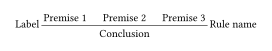
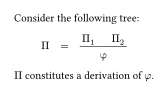
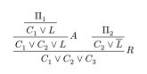
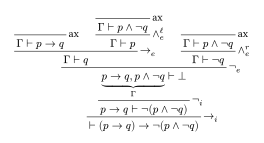
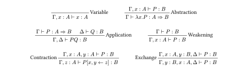

# Curryst

A Typst package for typesetting proof trees.


## Import

You can import the latest version of this package with:

```typst
#import "@preview/curryst:0.6.0": rule, prooftree, rule-set
```

## Basic usage

To display a proof tree, you first need to create a tree, using the `rule` function. Its first argument is the conclusion, and the other positional arguments are the premises. It also accepts a `name` for the rule name, displayed on the right of the bar, as well as a `label`, displayed on the left of the bar.

```typ
#let tree = rule(
  label: [Label],
  name: [Rule name],
  [Premise 1],
  [Premise 2],
  [Premise 3],
  [Conclusion],
)
```

Then, you can display the tree with the `prooftree` function:

```typ
#prooftree(tree)
```

In this case, we get the following result:



Proof trees can be part of mathematical formulas:

```typ
Consider the following tree:
$
  Pi quad = quad prooftree(
    rule(
      Pi_1,
      Pi_2,
      phi,
    )
  )
$
$Pi$ constitutes a derivation of $phi$.
```



You can specify a rule as the premises of a rule in order to create a tree:

```typ
#prooftree(
  rule(
    name: $R$,
    rule(
      name: $A$,
      rule(
        $Pi_1$,
        $C_1 or L$,
      ),
      $C_1 or C_2 or L$,
    ),
    rule(
      $Pi_2$,
      $C_2 or overline(L)$,
    ),
    $C_1 or C_2 or C_3$,
  )
)
```



As an example, here is a natural deduction proof tree generated with Curryst:



<details>
  <summary>Show code</summary>

  ```typ
  #let ax = rule.with(name: [ax])
  #let and-el = rule.with(name: $and_e^ell$)
  #let and-er = rule.with(name: $and_e^r$)
  #let impl-i = rule.with(name: $scripts(->)_i$)
  #let impl-e = rule.with(name: $scripts(->)_e$)
  #let not-i = rule.with(name: $not_i$)
  #let not-e = rule.with(name: $not_e$)

  #prooftree(
    impl-i(
      not-i(
        not-e(
          impl-e(
            ax($Gamma tack p -> q$),
            and-el(
              ax($Gamma tack p and not q$),
              $Gamma tack p$,
            ),
            $Gamma tack q$,
          ),
          and-er(
            ax($Gamma tack p and not q$),
            $Gamma tack not q$,
          ),
          $ underbrace(p -> q\, p and not q, Gamma) tack bot $,
        ),
        $p -> q tack  not (p and not q)$,
      ),
      $tack (p -> q) -> not (p and not q)$,
    )
  )
  ```
</details>


## Advanced usage

The `prooftree` function accepts multiple named arguments that let you customize the tree:

<dl>
  <dt><code>min-premise-spacing</code></dt>
  <dd>The minimum amount of space between two premises.</dd>

  <dt><code>title-inset</code></dt>
  <dd>The amount to extend the horizontal bar beyond the content. Also determines how far from the bar labels and names are displayed.</dd>

  <dt><code>stroke</code></dt>
  <dd>The stroke to use for the horizontal bars.</dd>

  <dt><code>vertical-spacing</code></dt>
  <dd>The space between the bottom of the bar and the conclusion, and between the top of the bar and the premises.</dd>

  <dt><code>min-bar-height</code></dt>
  <dd>The minimum height of the box containing the horizontal bar.</dd>

  <dt><code>dir</code></dt>
  <dd>The orientation of the proof tree (either <code>btt</code> or <code>ttb</code>, <code>btt</code> being the default).</dd>
</dl>

For more information, please refer to the documentation in [`curryst.typ`](curryst.typ).

## Layout Multiple Rules (a simple way)

Here we show a way to typeset multiple rules at one time :


<details>
  <summary>Show code</summary>

  ```typ
  #let variable = prooftree(rule(
    name: [Variable],
    $Gamma, x : A tack x : A$,
  ))
  #let abstraction = prooftree(rule(
    name: [Abstraction],
    $Gamma, x: A tack P : B$,
    $Gamma tack lambda x . P : A => B$,
  ))

  #let application = prooftree(rule(
    name: [Application],
    $Gamma tack P : A => B$,
    $Delta tack Q : B$,
    $Gamma, Delta tack P Q : B$,
  ))

  #let weakening = prooftree(rule(
    name: [Weakening],
    $Gamma tack P : B$,
    $Gamma, x : A tack P : B$,
  ))

  #let contraction = prooftree(rule(
    label: [Contraction],
    $Gamma, x : A, y : A tack P : B$,
    $Gamma, z : A tack P[x, y <- z]: B$,
  ))

  #let exchange = prooftree(rule(
    label: [Exchange],
    $Gamma, x : A, y: B, Delta tack P : B$,
    $Gamma, y : B, x: A, Delta tack P : B$,
  ))

  #align(center, rule-set(
    variable,
    abstraction,
    application,
    weakening,
    contraction,
    exchange
  ))
  ```
</details>


The function `rule-set` is very simple and is implemented this way :

```typ
#let rule-set(column-gutter: 3em, row-gutter: 2em, ..rules) = {
  set par(leading: row-gutter)
  block(rules.pos().map(box).join(h(column-gutter, weak: true)))
}
```

To have more complex layout you can modify this piece of code at your linking.
However the `curryst` package is not meant right now for layout of arbritary content
and other packages do it better for more fine grained customization.
