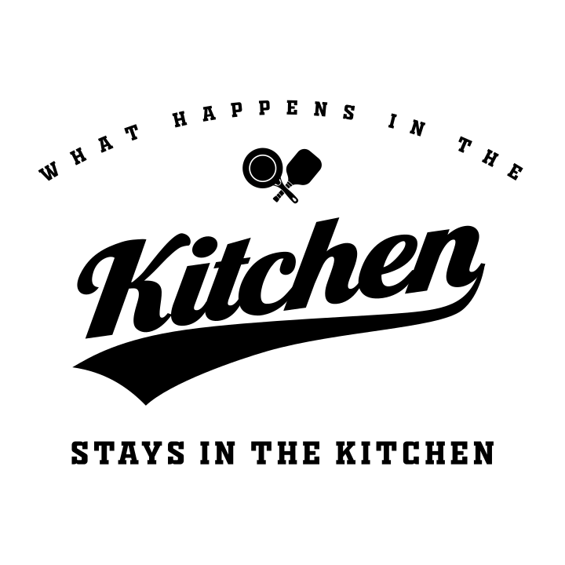
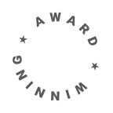

This is a [Typst](https://github.com/typst/typst) package to position text around an arc or circle.

# Demo

<p float="left">
    
    
    <br>
    
    
</p>

# Usage

## text-on-arc

```typst
#text-on-arc(str, width, degrees,
             rotate-letters:true,
             equidistant: false,
             show-design-aids:false,
             font-letter-spacing: 0pt)
```

Positions text on the top portion of a circle.  Height increases as required given font and degrees.

 * **str**: String to display
 * **width**: Total width of the containing block
 * **degrees**: Range of the top of the circle to place text
 * **rotate-letters**: rotate letters to match tangent of the circle
 * **equidistant**: Separate characters evenly rather than account for char widths
 * **show-design-aids**: Shows design aids when true
 * **font-letter-spacing**: Manual adjustment for letter spacing built into font

**Example Usage**:

```typst
#set text(15pt, font:"Oswald")
#text-on-arc("LIVE FIT", 105pt, 43deg)
```

## text-on-circle

```typst
#text-on-circle(top-str, bottom-str, width, top-degrees, bottom-degrees,
                circle-background:black,
                circle-fill:none,
                circle-margin:0pt,
                equidistant: false,
                show-design-aids:false)
```

Positions text on the top portion of a circle.  Height increases as required
given font and degrees.

 * **top-str**: String to display at the top of the circle
 * **bottom-str**: String to display at the bottom of the circle
 * **width**: Total width of the containing block
 * **top-degrees**: Range of the top of the circle to place text
 * **bottom-degrees**: Range of the bottom of the circle to place text
 * **equidistant**: Separate characters evenly rather than account for char widths
 * **show-design-aids**: Shows design aids when true

**Example Usage**:

```typst
#set text(white, 13pt, font:"Helvetica Neue", weight:900)
#text-on-circle("UNITED STATES", "AIR FORCE", 1.8in, 145deg, 90deg,
                circle-fill:rgb("#00529b"),
                circle-margin:.3em)
```

# Notes

Letters are positioned via `place()` inside of a block container.  The block container has a width and height so that it affects the position of adjacent markup.

The block container will be the size of the circle when using `text-on-circle()`, but will only include the text when using `text-on-arc()`.  This allows you to have a large circle on which the text is placed but not affect the flow.
