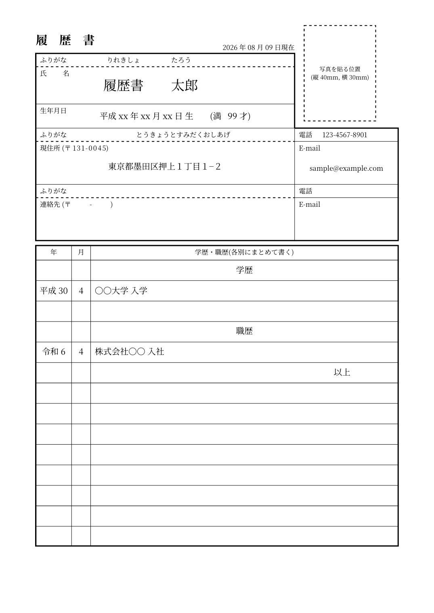

# cv-ja

日本で一般的に使われている形式（市販の履歴書用紙に近いレイアウト）の履歴書を作成する[Typst](https://typst.app/)パッケージです。



## インストール・使い方

新規プロジェクトをテンプレートから作成します。

```sh
typst init @preview/cv-ja:0.1.0 my-resume
```

または、既存プロジェクトから `履歴書` 関数を直接インポートし、`#show` ルールでドキュメントに適用することもできます。

```typ
#import "@preview/cv-ja:0.1.0": 履歴書

#show: 履歴書.with(
  姓読み: "りれきしょ",
  名読み: "たろう",
  姓: "履歴書",
  名: "太郎",
  生年月日: "平成xx年xx月xx日",
  年齢: 99,
  // 写真: "photo.png", // 証明写真を貼る場合はパスを指定する
  現住所: (
    ふりがな: "とうきょうとすみだくおしあげ",
    住所: "東京都墨田区押上１丁目１−２",
    郵便番号: "131-0045",
    電話: "123-4567-8901",
    email: "sample@example.com",
  ),
  連絡先: (
    ふりがな: "",
    住所: "",
    郵便番号: "",
    電話: "",
    email: "",
  ),
  学歴: (
    (年: "平成30", 月: "4", 内容: "〇〇大学 入学"),
  ),
  職歴: (
    (年: "令和6", 月: "4", 内容: "株式会社〇〇 入社"),
  ),
  資格: (
    (年: "平成1", 月: "12", 内容: "普通自動車免許 取得"),
  ),
  志望動機: [私がこの職に応募する理由は、],
  本人希望: [],
  // false にすると右下の "Made with Typst" を非表示にする
  クレジット: true,
)
```

`学歴` / `職歴` / `資格` は `(年, 月, 内容)` を持つ辞書の配列で指定します。見出し行・区切りの空行・「以上」の挿入、1枚目/2枚目への分割は自動で行われます。

- `学歴` と `職歴` は合わせて最大19行（1枚目14行 + 2枚目5行。見出し行・空行・「以上」も1行ずつ消費します）
- `資格` は最大7行

超過した分は枠外にはみ出して表示されます。

## 日本語フォントについて

このパッケージはフォントを指定しないため、システムに入っている日本語フォントがそのまま使われます。表示が崩れる場合は [Noto Serif JP](https://fonts.google.com/noto/specimen/Noto+Serif+JP) などのインストールをお勧めします。特定のフォントを使いたい場合は、`#show: 履歴書.with(...)` の前に `#set text(font: "好きなフォント名")` を書いてください。

## 参考にした書式

- [rireki-style](https://github.com/shigio/rireki-style)
- [doda履歴書テンプレート](https://doda.jp/guide/rireki/template/)

## ソースコード

開発用リポジトリ: [Nikudanngo/typst-ja-resume-template](https://github.com/Nikudanngo/typst-ja-resume-template)
