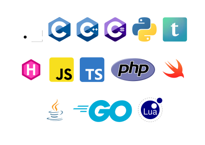

# cv-soft-and-hard
A CV template written in Typst which keeps it minimalistic.
It was designed with software and hardware people in mind (hence the name).


## Predefined styling scheme
```typst
#import "@preview/cv-soft-and-hard:0.1.0": styling, section, entry

#set document(author: "Jonas Pleyer", title: "CV Jonas Pleyer")
#show: styling
```

## Section labels & Entries
```typst
#align(center)[
  = Jonas Pleyer - Curriculum Vitae\
  Stefan-Meier Str. 30, 79104 Freiburg\
  #link("https://jonas.pleyer.org", "jonas.pleyer.org") |
  #link("https://www.github.com/jonaspleyer", "github.com/jonaspleyer") |
  #link("mailto:jonas.dev@pleyer.org", "jonas.dev@pleyer.org") |
]

#section("Profile")
Software engineer and computational scientist with expertise in Rust and Python.
I build high-quality software for scientific computing and contribute actively to the Rust
open-source ecosystem.
I enjoy working in teams that emphasize functionality and reliability and use excellent tooling.

#section("Experience")
#entry(
  [
    *Doctoral Candidate* (_University of Freiburg_)
    - Study of cellular systems via computational models
    - Developed and maintained agent-based simulation framework `cellular_raza`
    - Contributed to Open Source projects
    - Published peer-reviewed software and scientific papers and reviewed papers
  ],
  [_since 08/2021_]
)

// ..

#section("Education")
#entry(
  [
    *University of Freiburg*\
    Doctoral Candidate (Computational Systems Biology)\
    // #text([Thesis: "_Agent-based Models in Cellular Systems_" (Christian Fleck)], size: 9pt)\
    MSc. Physics (Theoretical Physics & Mathematics),\
    #text([Thesis: "_Zero Values of the TOV Equation_" (Prof. Nadine Große)], size: 9pt)
  ],
  [\
    _since 08/2021\ \
    04/2020-07/2021_
  ],
)

// ..
```

## Icons for Programming Languages and other Tools
```typst
#import "@preview/cv-soft-and-hard:0.1.0": rust, cpp, python, hugo

#section("Selected Projects")
#entry(
  [
    *#link("https://cellular-raza.com", `cellular_raza`)* -
    _Agent-based Simulation Framework_ #rust #python #hugo\
    - Written with generics and custom templates for performance and flexibility
    - Dedicated documentation, examples & guides
      (#link("https://cellular-raza.com", "cellular-raza.com"))
    - Peer-reviewed and published @Pleyer2025
  ],
  [_08/2022_]
)
```

### List of all currently supported Icons

