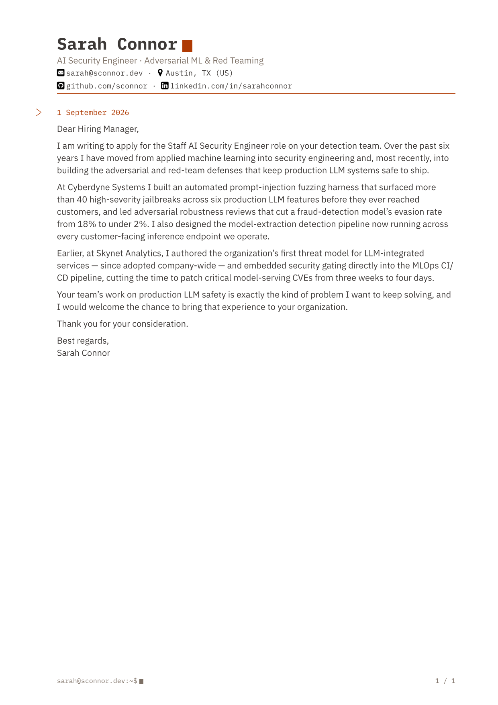
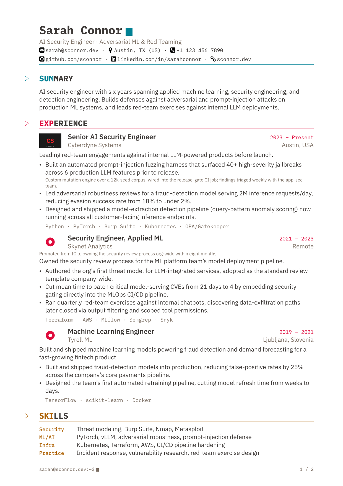

# cyber-cv-letter

[Typst](https://typst.app) and Markdown template for a professional
cyber/terminal-themed CV and cover-letter. Modern and clean design optimized for
ATS text-extractors and human reviewers. Targets PDF/UA-1, text colors clear
WCAG AA contrast, and togglable style vaiants (icons, footer, accent colors,
logos, section notes).

Inspired by [brilliant-cv](https://github.com/yunanwg/brilliant-CV) and
[friggeri-cv-letter](https://github.com/gw0/friggeri-cv-letter).

## Preview

| CV | Letter |
|:---:|:---:|
|  |  |

| CV (plain) | CV (friggeri) |
|:---:|:---:|
|  |  |

## Usage

### Install dependencies

Install Typst and Pandoc system-wide, or in local `.venv/` dir:

```bash
$ git clone https://github.com/gw0/cyber-cv-letter.git
$ cd cyber-cv-letter
$ make setup      # creates .venv/, vendors pandoc + typst into it
$ . .venv/bin/activate # puts typst/pandoc/python3 on PATH
```

### Typst Workflow

Basic example CV (full example in `examples/typst/cv.typ`):

```typst
#import "@preview/cyber-cv-letter:0.1.0": cv

#show: cv.with(
  author: (
    name: "Sarah Connor",
    tagline: "AI Security Engineer · Adversarial ML & Red Teaming",
    email: "sarah@example.com",
    location: "Austin, USA",
    links: ("github.com/sconnor",),
  ),
)

= EXPERIENCE

== Senior AI Security Engineer | 2023 -- Present

_Cyberdyne Systems | Austin, USA_

Leading red-team engagements against internal LLM-powered products.

- Built a prompt-injection fuzzing harness that surfaced 40+ jailbreaks pre-release.
  #quote(block: true)[Custom mutation engine, wired into the release-gate CI job.]

`[Python · PyTorch · Kubernetes]`

/ Security: Threat modeling, Burp Suite, Nmap
```

Compile your CV via Typst CLI:

```bash
$ typst compile mycv.typ
```

See complete reference examples `examples/typst/cv.typ` and
`examples/typst/letter.typ` for available options.

Alternatively, use a local copy of this repo: register it under a local
`preview/` package path and point `--package-path`/`--font-path` at it. The
import stays identical to the published one above:

```bash
$ mkdir -p .typst-packages/preview/cyber-cv-letter
$ ln -sfn /path/to/cyber-cv-letter .typst-packages/preview/cyber-cv-letter/0.1.0
$ typst compile mycv.typ --package-path .typst-packages \
  --font-path .typst-packages/preview/cyber-cv-letter/0.1.0/fonts
```

```typst
#import "@preview/cyber-cv-letter:0.1.0": cv
```

### Markdown Workflow

Basic example CV (full example in `examples/markdown/cv.md`):

```markdown
---
name: Sarah Connor
tagline: AI Security Engineer · Adversarial ML & Red Teaming
email: sarah@example.com
location: Austin, USA
links:
  - github.com/sconnor
---

# EXPERIENCE

## Senior AI Security Engineer | 2023 -- Present

*Cyberdyne Systems | Austin, USA*

Leading red-team engagements against internal LLM-powered products.

- Built a prompt-injection fuzzing harness that surfaced 40+ jailbreaks pre-release.
> Custom mutation engine, wired into the release-gate CI job.

`[Python · PyTorch · Kubernetes]`

Security
: Threat modeling, Burp Suite, Nmap
```

Adjust Pandoc settings to your environment (paths are resolved relative to
working directory, so prefix `template`, `resource-path`, `pdf-engine`,
`--package-path`, and `--font-path` accordingly):

```bash
$ cp /path/to/cyber-cv-letter/pandoc/cv.yaml pandoc-cv.yaml
$ cp /path/to/cyber-cv-letter/pandoc/letter.yaml pandoc-letter.yaml
$ sed -i 's| ./| /path/to/cyber-cv-letter/|' pandoc-cv.yaml pandoc-letter.yaml
```

Compile your CV via Pandoc CLI:

```bash
$ pandoc -d pandoc-cv.yaml mycv.md -o mycv.pdf
```

See complete reference examples `examples/markdown/cv.md` and
`examples/markdown/letter.md` for available options.

Alternatively, compile your CV without adjusting Pandoc settings:

```bash
$ cd /path/to/cyber-cv-letter
$ pandoc -d pandoc/cv.yaml --resource-path /path/to /path/to/mycv.md -o /path/to/mycv.pdf
```

## Development

This repo builds and tests its own examples locally; nothing is installed
system-wide:

```bash
$ make setup      # creates .venv/, vendors pandoc + typst into it
$ . .venv/bin/activate # puts typst/pandoc/python3 on PATH
$ make examples   # builds the 8-PDF example matrix (cv/cv-plain/cv-friggeri/letter × typst/markdown)
$ make test       # contrast, spacing, ATS-extraction, and rendered-layout checks (tests/)
$ make thumbnails # renders the preview PNGs above
$ make publish    # stages a Typst Universe submission and prints the remaining steps
```

`make publish` prints the exact remaining steps to submit the staged package
to [typst/packages](https://github.com/typst/packages)
([submission guidelines](https://github.com/typst/packages/blob/main/docs/README.md)).

## Known limitations

- No cross-page "keep together" grouping: a section header or skills row
  can split across a page boundary from its first entry/row.
- A published package can't bundle its own fonts (IBM Plex Mono/Sans) onto
  a consumer's font search path — without them installed, Typst falls back
  to automatic substitution. Install IBM Plex Mono and IBM Plex Sans
  system-wide (e.g. from [Google Fonts](https://fonts.google.com)), or
  clone this repo and pass `--font-path fonts` to `typst compile`, the same
  way this repo's own build does.

## License

AGPL-3.0-or-later — see `LICENSE`. Bundled fonts (`fonts/`) and icons
(`icons/`) carry their own licenses in the same directories.
