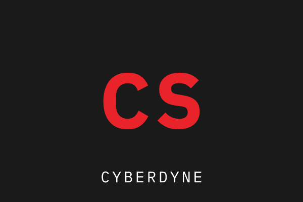

# SUMMARY

AI security engineer with six years spanning applied machine learning, security engineering, and detection engineering. Builds defenses against adversarial and prompt-injection attacks on production ML systems, and leads red-team exercises against internal LLM deployments.

# EXPERIENCE

## Senior AI Security Engineer | 2023 -- Present

* Cyberdyne Systems | Austin, USA*

Leading red-team engagements against internal LLM-powered products before launch.

- Built an automated prompt-injection fuzzing harness that surfaced 40+ high-severity jailbreaks across 6 production LLM features prior to release.
> Custom mutation engine over a 12k-seed corpus, wired into the release-gate CI job; findings triaged weekly with the app-sec team.
- Led adversarial robustness reviews for a fraud-detection model serving 2M inference requests/day, reducing evasion success rate from 18% to under 2%.
- Designed and shipped a model-extraction detection pipeline (query-pattern anomaly scoring) now running across all customer-facing inference endpoints.

`Python · PyTorch · Burp Suite · Kubernetes · OPA/Gatekeeper`

## Security Engineer, Applied ML | 2021 -- 2023

*Skynet Analytics | Remote*

> Promoted from IC to owning the security review process org-wide within eight months.

Owned the security review process for the ML platform team's model deployment pipeline.

- Authored the org's first threat model for LLM-integrated services, adopted as the standard review template company-wide.
- Cut mean time to patch critical model-serving CVEs from 21 days to 4 by embedding security gating directly into the MLOps CI/CD pipeline.
- Ran quarterly red-team exercises against internal chatbots, discovering data-exfiltration paths later closed via output filtering and scoped tool permissions.

`Terraform · AWS · MLflow · Semgrep · Snyk`

## Machine Learning Engineer | 2019 -- 2021

*Tyrell ML | Ljubljana, Slovenia*

Built and shipped machine learning models powering fraud detection and demand forecasting for a fast-growing fintech product.

- Built and shipped fraud-detection models into production, reducing false-positive rates by 25% across the company's core payments pipeline.
- Designed the team's first automated retraining pipeline, cutting model refresh time from weeks to days.

`TensorFlow · scikit-learn · Docker`

# SKILLS

Security
: Threat modeling, Burp Suite, Nmap, Metasploit

ML/AI
: PyTorch, vLLM, adversarial robustness, prompt-injection defense

Infra
: Kubernetes, Terraform, AWS, CI/CD pipeline hardening

Practice
: Incident response, vulnerability research, red-team exercise design

# EDUCATION

## M.S. Computer Security | 2023

* Stanford University | Stanford, USA*

## B.S. Computer Science | 2019

*University of Ljubljana | Ljubljana, Slovenia*

# PROJECTS

## promptfirewall | 2023

*github.com/sconnor/promptfirewall*

# CERTIFICATIONS, AWARDS & PUBLICATIONS

## OSCP -- Offensive Security Certified Professional | 2019

*Offensive Security*

## AI Village CTF -- 1st Place | 2024

*DEF CON*

## Detecting Prompt Injection at Scale | 2024

*arxiv.org/abs/2403.09217*
