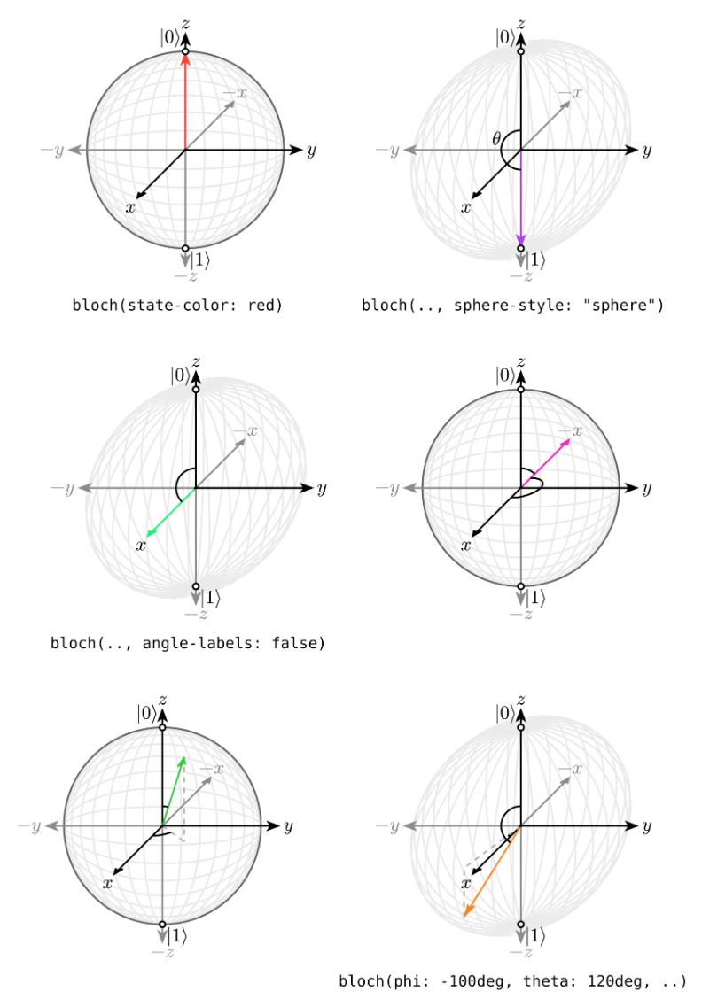

# czbloch

Draw Bloch spheres in Typst with configurable state vectors, axes, angle annotations, and sphere styles.



## Quick Start

```typst
#import "@preview/czbloch:0.1.0"

#set page(width: auto, height: auto, margin: 8pt)

= Basic States

#stack(
	dir: ltr,
	spacing: 16pt,
	czbloch.bloch(..czbloch.zero),
	czbloch.bloch(..czbloch.one),
	czbloch.bloch(..czbloch.plus),
	czbloch.bloch(..czbloch.minus),
)
```

## API

### `bloch(...)`

Main drawing function.

```typst
#czbloch.bloch(
	length: 2cm,
	radius: 1,
	debug: false,
	padding: none,
	show-axis: true,
	phi: 0deg,
	theta: 0deg,
	state-color: rgb("#ae3fee"),
	sphere-style: "circle",
	angle-labels: true,
	polar-labels: true,
)
```

Parameters:

- `length`: Final rendered canvas size.
- `radius`: Logical radius of the Bloch sphere inside the canvas.
- `debug`: Enables CeTZ debug rendering.
- `padding`: CeTZ canvas padding.
- `show-axis`: Draw Cartesian axes and labels.
- `phi`: Azimuthal angle of the state vector.
- `theta`: Polar angle of the state vector.
- `state-color`: Stroke/fill color for the state arrow.
- `sphere-style`: `"circle"`, `"sphere"`, or `none`.
- `angle-labels`: Show `phi` and `theta` labels.
- `polar-labels`: Show `|0>` and `|1>` pole labels.

### Presets

Useful preset states exported by the package:

- `czbloch.zero`: `(phi: 0deg, theta: 0deg)`
- `czbloch.one`: `(phi: 0deg, theta: 180deg)`
- `czbloch.plus`: `(phi: 0deg, theta: 90deg)`
- `czbloch.minus`: `(phi: 180deg, theta: 90deg)`

Use with argument spread:

```typst
#czbloch.bloch(..czbloch.plus, state-color: green)
```

## More Examples

```typst
#import "@preview/czbloch:0.1.0" as czbloch

#stack(
	dir: ttb,
	spacing: 12pt,

	// Sphere-style shading
	czbloch.bloch(..czbloch.one, sphere-style: "sphere"),

	// Custom state
	czbloch.bloch(
		phi: 50deg,
		theta: 30deg,
		state-color: orange,
		angle-labels: false,
	),

	// Wrapped angles are supported
	czbloch.bloch(
		phi: -10deg,
		theta: 240deg,
		sphere-style: "sphere",
	),
)
```
