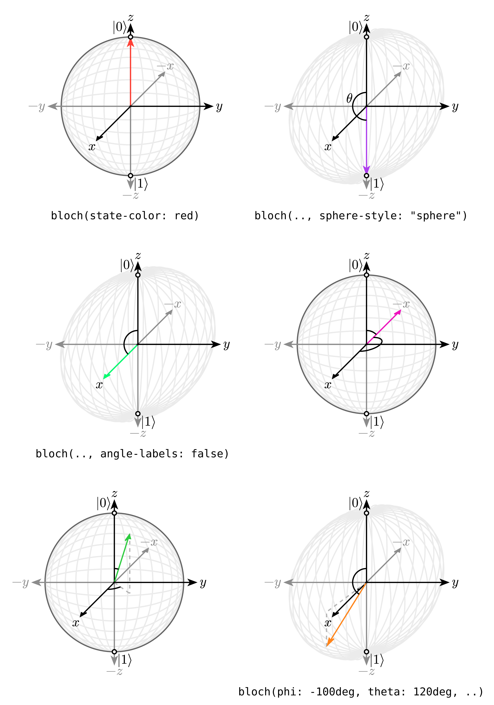

# CZBloch - Bloch Sphere Package for Typst

A Typst package for drawing Bloch spheres with ease. The Bloch sphere is a geometrical representation of the pure state space of a two-level quantum mechanical system (qubit).



## Installation

Add the package to your Typst project:

```typst
#import "@preview/czbloch:0.1.0" as czbloch
```

## Quick Start

```typst
#import "@preview/czbloch:0.1.0" as czbloch

#czbloch.bloch(
  phi: 45deg,
  theta: 60deg,
  state-color: blue,
  sphere-style: "sphere"
)
```

## Basic Usage

### Drawing Basic Bloch Spheres

```typst
#import "@preview/czbloch:0.1.0" as czbloch

// Draw |0⟩ state
#czbloch.bloch(..czbloch.zero)

// Draw |1⟩ state
#czbloch.bloch(..czbloch.one)

// Draw |+⟩ state
#czbloch.bloch(..czbloch.plus)

// Draw |-⟩ state
#czbloch.bloch(..czbloch.minus)
```

### Custom Quantum States

```typst
#import "@preview/czbloch:0.1.0" as czbloch

// Custom quantum state with specific angles
#czbloch.bloch(
  phi: 30deg,    // azimuthal angle (0 to 360°)
  theta: 45deg,  // polar angle (0 to 180°)
  state-color: red,
  length: 3cm
)
```

## API Reference

### Main Function

#### `bloch(...params)`

Draws a Bloch sphere with the specified parameters.

**Parameters:**

| Parameter      | Type               | Default          | Description                               |
| -------------- | ------------------ | ---------------- | ----------------------------------------- | --- | --- | --- | --------- |
| `length`       | `length`           | `2cm`            | Overall size of the Bloch sphere drawing  |
| `radius`       | `float`            | `1`              | Relative radius of the sphere             |
| `show-axis`    | `bool`             | `true`           | Whether to show the X, Y, Z axes          |
| `phi`          | `angle`            | `0deg`           | Azimuthal angle (0 to 360°)               |
| `theta`        | `angle`            | `0deg`           | Polar angle (0 to 180°)                   |
| `state-color`  | `color`            | `rgb("#ae3fee")` | Color of the quantum state vector         |
| `sphere-style` | `str`              | `"circle"`       | Style of sphere: `"circle"` or `"sphere"` |
| `angle-labels` | `bool`             | `true`           | Whether to show angle labels (φ, θ)       |
| `polar-labels` | `bool`             | `true`           | Whether to show polar labels (            | 0⟩, | 1⟩, | +⟩, | -⟩, etc.) |
| `debug`        | `bool`             | `false`          | Enable debug mode                         |
| `padding`      | `length` or `none` | `none`           | Padding around the drawing                |

### Predefined States

The package provides convenient predefined quantum states:

| Variable | Description | Angles   |
| -------- | ----------- | -------- | ----------------------------- |
| `zero`   |             | 0⟩ state | `(phi: 0deg, theta: 0deg)`    |
| `one`    |             | 1⟩ state | `(phi: 0deg, theta: 180deg)`  |
| `plus`   |             | +⟩ state | `(phi: 0deg, theta: 90deg)`   |
| `minus`  |             | -⟩ state | `(phi: 180deg, theta: 90deg)` |

Use them like this:

```typst
#czbloch.bloch(..czbloch.plus, state-color: green)
```

## Examples

### Different Sphere Styles

```typst
#import "@preview/czbloch:0.1.0" as czbloch

#czbloch.bloch(sphere-style: "circle")  // 2D circle representation
#czbloch.bloch(sphere-style: "sphere")   // 3D sphere representation
```

### Customizing Appearance

```typst
#import "@preview/czbloch:0.1.0" as czbloch

#czbloch.bloch(
  phi: 120deg,
  theta: 75deg,
  state-color: rgb("#ff6b6b"),
  sphere-style: "sphere",
  length: 4cm,
  show-axis: false,
  angle-labels: false
)
```

### Multiple Bloch Spheres

```typst
#import "@preview/czbloch:0.1.0" as czbloch

#grid(
  columns: 2,
  gutter: 1cm,
  [
    #czbloch.bloch(..czbloch.zero, state-color: blue)
    #czbloch.bloch(phi: 90deg, theta: 45deg, state-color: green)
  ],
  [
    #czbloch.bloch(..czbloch.plus, sphere-style: "sphere")
    #czbloch.bloch(phi: 270deg, theta: 135deg, state-color: orange)
  ]
)
```

## Advanced Usage

### Creating Custom State Helpers

```typst
#import "@preview/czbloch:0.1.0" as czbloch

#let my-state = (phi: 60deg, theta: 30deg)
#let excited-state = (phi: 180deg, theta: 120deg)

#czbloch.bloch(..my-state, state-color: purple)
#czbloch.bloch(..excited-state, state-color: teal)
```

### Integration with Quantum Circuit Diagrams

```typst
#import "@preview/czbloch:0.1.0" as czbloch
#import "@preview/quantikz:0.1.0"

#set text(size: 10pt)
#set align(center)

#block[
  #quantikz.circuit(
    (("X", 1), ("H", 1)),
    wire-style: (count: 1)
  )

  #v(1em)
  #text(weight: "bold")[Quantum State Evolution]
  #v(0.5em)

  #grid(
    columns: 3,
    gutter: 0.5cm,
    [Initial: #czbloch.bloch(..czbloch.zero, length: 1.5cm)],
    [After X: #czbloch.bloch(..czbloch.one, length: 1.5cm)],
    [After H: #czbloch.bloch(..czbloch.plus, length: 1.5cm)]
  )
]
```

## Physics Background

The Bloch sphere represents the state of a qubit as a point on the surface of a unit sphere. The state is parameterized by two angles:

- **θ (theta)**: Polar angle (0 to π), represents the probability amplitudes
- **φ (phi)**: Azimuthal angle (0 to 2π), represents the relative phase

The quantum state |ψ⟩ is given by:
|ψ⟩ = cos(θ/2)|0⟩ + e^(iφ) sin(θ/2)|1⟩

## Common Quantum States on the Bloch Sphere

- **North Pole (θ=0)**: |0⟩ state
- **South Pole (θ=π)**: |1⟩ state
- **Equator (θ=π/2)**:
  - φ=0: |+⟩ = (|0⟩ + |1⟩)/√2
  - φ=π: |-⟩ = (|0⟩ - |1⟩)/√2
  - φ=π/2: |i⟩ = (|0⟩ + i|1⟩)/√2
  - φ=3π/2: |-i⟩ = (|0⟩ - i|1⟩)/√2

## Dependencies

This package depends on:

- `@preview/cetz:0.4.2` - for drawing capabilities

## Development

### Project Structure

```
czbloch/
├── lib.typ              # Main library file
├── worker.typ           # Core drawing logic
├── components/          # Component modules
│   ├── lib.typ          # Component exports
│   ├── angles.typ       # Angle drawing
│   ├── axis.typ         # Axis drawing
│   ├── dashed.typ       # Dashed lines
│   ├── ellipses.typ     # Sphere/ellipse drawing
│   ├── helpers.typ      # Helper functions
│   ├── poles.typ        # Pole labels
│   └── state.typ        # State vector drawing
├── example.typ          # Usage examples
├── typst.toml           # Package manifest
└── README.md            # This file
```

### Building Examples

```bash
# Generate example PDF
typst compile example.typ example.pdf

# Generate example PNG
typst compile example.typ example.png --format png
```

## License

MIT License - see [LICENSE](LICENSE) file for details.

## Contributing

Contributions are welcome! Please feel free to submit a Pull Request.

1. Fork the repository
2. Create your feature branch (`git checkout -b feature/amazing-feature`)
3. Commit your changes (`git commit -m 'Add some amazing feature'`)
4. Push to the branch (`git push origin feature/amazing-feature`)
5. Open a Pull Request

## Acknowledgments

- https://github.com/ibnz36/czbloch
- Built with [Typst](https://typst.app/)
- Uses [cetz](https://typst.app/universe/package/cetz) for drawing capabilities
