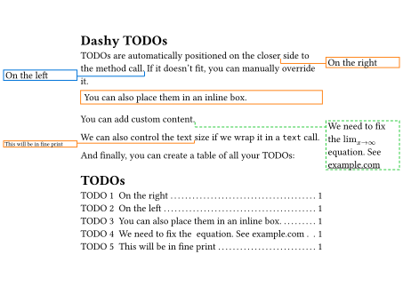

# Dashy TODO

Create simple TODO comments, which are displayed at the sides of the page.

I suggest to also take a look at the [drafting package](https://typst.app/universe/package/drafting), which is a more feature-complete annotation library, but also suitable for simple TODO comments.



## Usage

The package provides a `todo(message, position: auto | left | right)` method. Call it anywhere you need a todo message.

```typst
#import "@preview/dashy-todo:0.1.3": todo

// It automatically goes to the closer side (left or right)
A todo on the left #todo[On the left].

// You can specify a position if you want to (auto, left, right or "inline")
#todo(position: right)[Also right]

// You can add arbitrary content
#todo[We need to fix the $lim_(x -> oo)$ equation. See #link("https://example.com")[example.com]]

// And you can create an outline for the TODOs
#outline(title: "TODOs", target: figure.where(kind: "todo"))
```

## Styling

You can change the border color with any [stroke](https://typst.app/docs/reference/visualize/stroke/) type:

```
#todo(stroke: blue)[This is in blue!]

#let blue-todo = todo.with(stroke: blue)
#blue-todo[This is also in blue!]
```

You can modify the text by wrapping it, e.g.:

```
#let small-todo = (..args) => text(size: 0.6em)[#todo(..args)]

#small-todo[This will be in fine print]
```

## Contributing

See https://github.com/Otto-AA/dashy-todo/blob/main/CONTRIBUTING.md.
