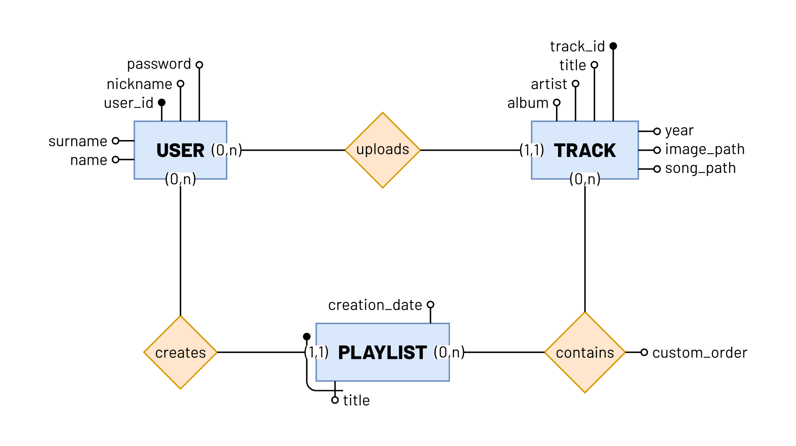
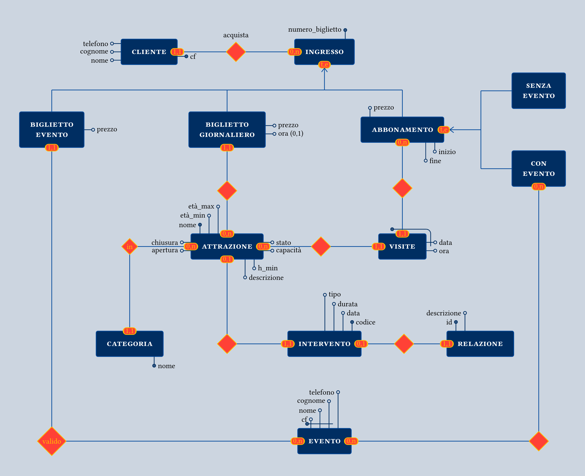
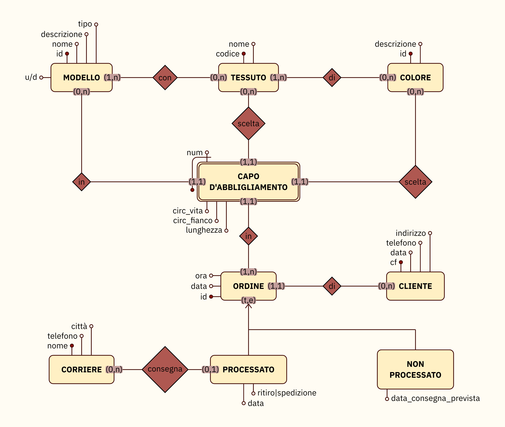
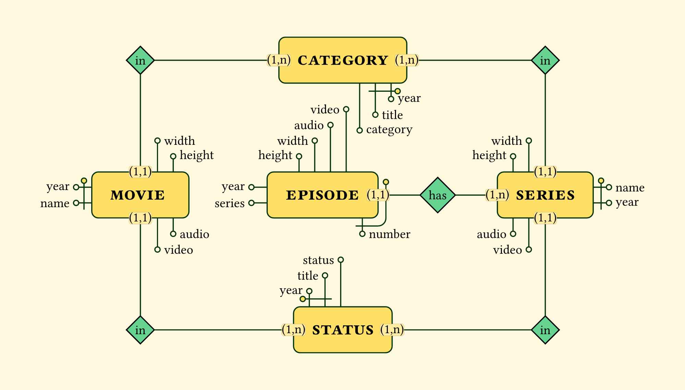
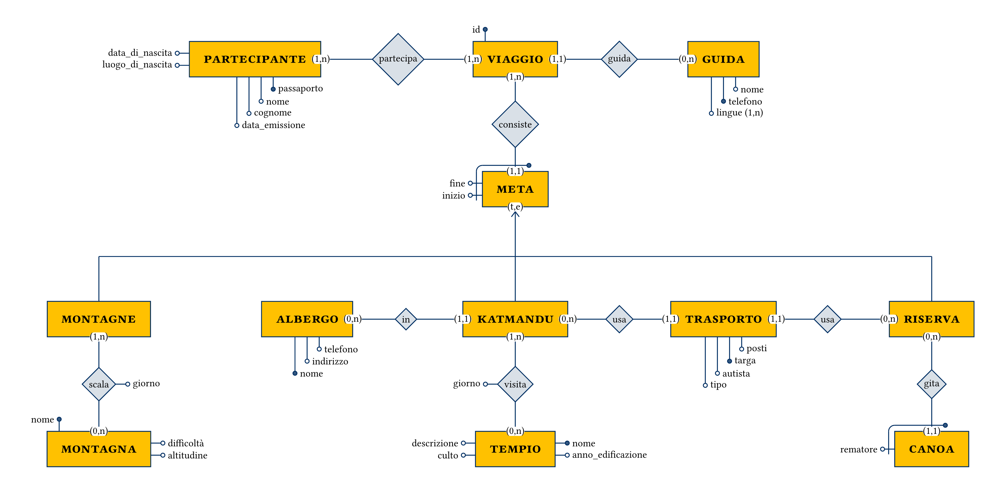
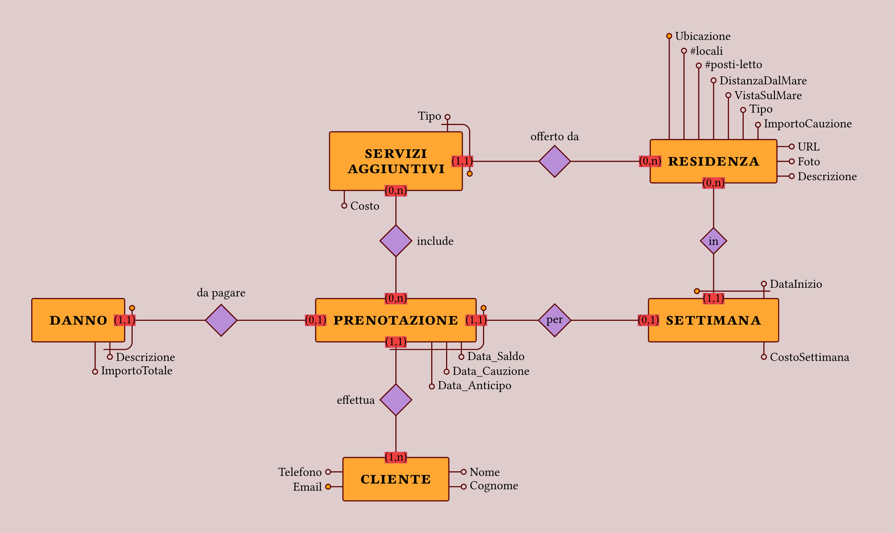
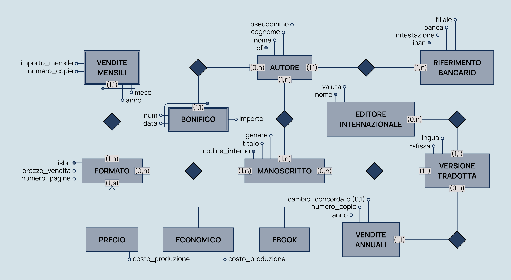

# Dati basati


[](https://github.com/victuarvi/dati-basati.git)

[](docs/manual.pdf?raw=true)

_Dati basati_ ("_Based Data_" in Italian) is a [Typst](https://typst.app/) package, built on [CeTZ](https://github.com/cetz-package/cetz), to draw ER-diagrams as I did during university. I was never able to find a software that did it, so why not do it myself?

See the `/docs` directory for the [manual](/docs/manual.pdf) and the [documentation](/docs/docs.pdf).

# Usage 🖋

See [this](/examples/example_quick.typ) for a quick start. You need to import the package into your project:

```typ
#import "@preview/dati-basati:0.1.0" as db
```

<p align="center">
  
</p>
<details>
  <summary>See the source code</summary>
  
```typ
// tiw

#set page(width: auto, height: auto, margin: 1cm)

#import "@preview/dati-basati:0.1.0" as db

#set text(font: "Barlow")

#show: db.dati-basati.with(..db.themes.tiw)

#let entities = (
  "user": (
    coordinates: (0, 0),
    attributes: (
      "north": ("user_id", "nickname", "password"),
      "west": ("name", "surname"),
    ),
    attributes-position: (
      north: (alignment: center),
    ),
    primary-key: "user_id",
    label: "user",
    name: "user",
  ),
  "playlist": (
    coordinates: (5, -5),
    attributes: (
      "south": ("title",),
      "north": ("creation_date",),
    ),
    attributes-position: (
      "north": (alignment: right),
      "south": (alignment: left),
    ),
    weak-entity: ("title", "west"),
    label: "playlist",
    name: "playlist",
  ),
  "track": (
    coordinates: (10, 0),
    attributes: (
      "north": ("track_id", "title", "artist", "album").rev(),
      "east": ("year", "image_path", "song_path"),
    ),
    attributes-position: (
      "north": (
        alignment: center,
        dir: "ltr",
      ),
    ),
    primary-key: "track_id",
    label: "track",
    name: "track",
  ),
)

#let relations = (
  "user-playlist": (
    coordinates: (0, -5),
    entities: ("user", "playlist"),
    label: "creates",
    name: "user-playlist",
    cardinality: ("(0,n)", "(1,1)"),
  ),
  "user-track": (
    entities: ("user", "track"),
    label: "uploads",
    name: "user-track",
    cardinality: ("(0,n)", "(1,1)"),
  ),
  "playlist-track": (
    coordinates: (10, -5),
    entities: ("playlist", "track"),
    label: "contains",
    name: "playlist-track",
    cardinality: ("(0,n)", "(0,n)"),
    attributes: ("east": ("custom_order",)),
  ),
)

#db.er-diagram({
  for entity in entities.values() {
    db.entity(
      entity.coordinates,
      label: entity.label,
      name: entity.name,
      attributes: entity.attributes,
      attributes-position: entity.at("attributes-position", default: none),
      primary-key: entity.at("primary-key", default: none),
      weak-entity: entity.at("weak-entity", default: none),
      misc: entity.at("misc", default: none),
    )
  }

  for relation in relations.values() {
    db.relation(
      coordinates: relation.at("coordinates", default: none),
      entities: relation.entities,
      label: relation.at("label", default: none),
      name: relation.name,
      cardinality: relation.cardinality,
      attributes: relation.at("attributes", default: none),
    )
  }
})
```
</details>

# Showcase ✨

If you click on the images you can check the source code.
<!--
<table width=100% align="center">
  <tr>
    <td>
      <a href="/examples/example_12.typ">
      <br></a>
      <div align="center"><em>C62-48</em></div>
    </td>
    <td>
      <a href="/examples/example_7.typ"></a>
      <br>
      <div align="center"><em>Tiramisu</em></div>
    </td>
  </tr>
  <tr>
    <td>
      <a href="/examples/example_14.typ">
      <br></a>
      <div align="center"><em>Ghibli</em></div>
    </td>
    <td>
      <a href="/examples/example_9.typ"></a>
      <br>
      <div align="center"><em>C62-50</em></div>
    </td>
  <tr>
  <tr>
    <td>
      <a href="/examples/example_11.typ">
      <br /></a>
      <div align="center"><em>Futurama</em></div>
    </td>
    <td>
      <a href="/examples/example_10.typ"></a>
      <br />
      <div align="center"><em>Polimi</em></div>
    </td>
  </tr>
</table> -->

<p align="center">
  <a href="/examples/example_12.typ"></a>
  <!-- <div align="center"><em>C62-48</em></div> -->
</p>

<p align="center">
  <a href="/examples/example_7.typ"></a>
  <!-- <div align="center"><em>Tiramisu</em></div> -->
</p>

<p align="center">
  <a href="/examples/example_14.typ"></a>
  <!-- <div align="center"><em>Ghibli</em></div> -->
</p>

<p align="center">
  <a href="/examples/example_9.typ"></a>
  <!-- <div align="center"><em>C62-50</em></div> -->
</p>
<p align="center">
  <a href="/examples/example_10.typ"></a>
  <!-- <div align="center"><em>Polimi</em></div> -->
</p>

<p align="center">
  <a href="/examples/example_11.typ"></a>
  <!-- <div align="center"><em>Futurama</em></div> -->
</p>

See the [examples](/examples) directory for many exceptions and particular cases. Note that those files serve the _only_ purpose to illustrate how the package works: as such, they may contain errors and are NOT intended to be applied for database development.

# Roadmap 📝

- Type checking using [valkyrie](https://typst.app/universe/package/valkyrie)
- Better options coordination (in order to avoid visual errors)
- Local theming as opposed to the current global one

# Contributing 🚀

If you happen to have suggestions, ideas or anything else feel free to open issues and pull requests or contact me.
