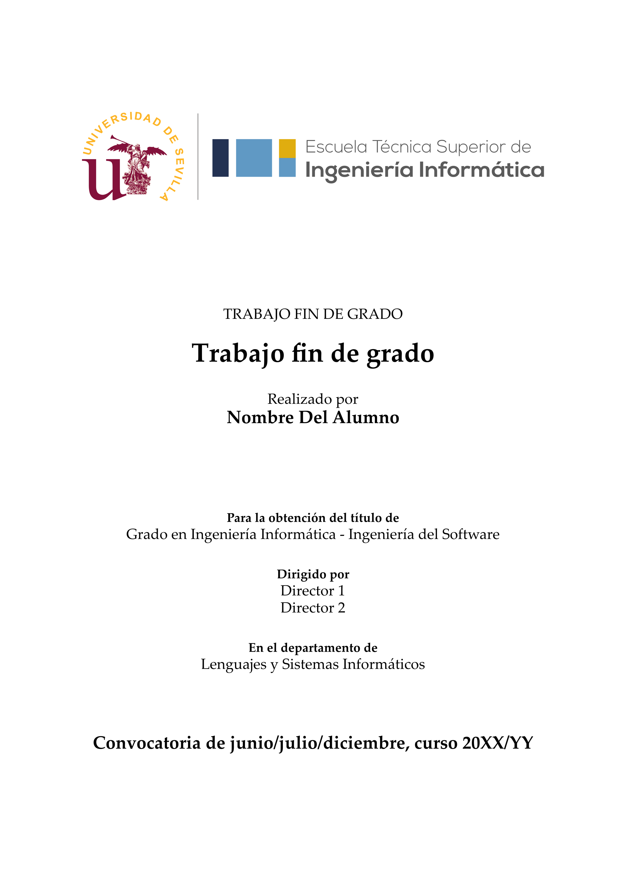

# Template for final degree projects

This template has been developed to facilitate the creation of final degree projects (TFC) at the Escuela Técnica Superior de Ingeniería Informática (ETSII) of the University of Seville. It provides a standardized and professional format for the presentation of these works.

It is based on the original LaTeX template created by Agustín Borrego and Inmaculada Hernández.

# Plantilla para trabajos de fin de carrera

Esta plantilla ha sido desarrollada para facilitar la creación de trabajos de fin de carrera (TFC) en la Escuela Técnica Superior de Ingeniería Informática (ETSII) de la Universidad de Sevilla. Proporciona un formato estandarizado y profesional para la presentación de estos trabajos.

Está basada en la plantilla original realizada en LaTeX por Agustín Borrego e Inmaculada Hernández.

# Use example / Ejemplo de uso

```typ

#import "@local/deal-us-template:1.0.0": *

#show: TFC.with(
  titulo: "Trabajo fin de grado",
  alumno: "Nombre Del Alumno",
  titulacion: "Grado en Ingeniería Informática - Ingeniería del Software",
  director: [Director 1 \ Director 2],
  departamento: "Lenguajes y Sistemas Informáticos",
  convocatoria: "Convocatoria de junio/julio/diciembre, curso 20XX/YY",
  dedicatoria: "Aquí la dedicatoria del trabajo",
  agradecimientos: [
    Quiero agradecer a X por...

    También quiero agradecer a Y por...
  ],
  resumen: [
    Incluya aquí un resumen de los aspectos generales de su trabajo, en español
  ],
  palabras-clave: (
    "palabra clave 1", 
    "palabra clave 2", 
    "...", 
    "palabra clave N"
  ),
  abstract: [
    This section should contain an English version of the Spanish abstract.
  ],
  keywords: (
    "keyword 1", 
    "keyword 2", 
    "...", 
    "keyword N"
  )
)

#include "sections/section1.typ"
#include "sections/section2.typ"
#include "sections/section3.typ"

#bibliography("/bibliografia.bib")
```



# About fonts / Sobre las fuentes

This template uses the "Palatino Linotype" font by default, so make sure it is installed in your computer or available in the root folder. If you want to use a different font, you can change it by modifying the `font` parameter in the `#show: TFC.with(...)` command. Make sure that the font you choose is installed on your system and is compatible with Typst.

Esta plantilla utiliza la fuente "Palatino Linotype" por defecto, así que asegúrese de que está instalada o disponible en la carpeta raíz. Si desea utilizar una fuente diferente, puede cambiarla modificando el parámetro `font` en el comando `#show: TFC.with(...)`. Asegúrese de que la fuente que elija esté instalada en su sistema y sea compatible con Typst.