# typst-debug-cite

When adding an atypical bibliography entry, it can be challenging to predict what its type and properties end up in the citation style (CSL).

To help you with it, this package provides a `debug-cite` function to show what CSL actually receives.

## Usage

```typst
#import "@preview/debug-cite:0.0.2": debug-cite

#debug-cite(<key>)

#bibliography("path/to/your.bib") // or *.yaml
```

<details>
<summary>Full code</summary>

````typst
#set page(height: auto, width: 300pt, margin: 15pt)

#import "@preview/debug-cite:0.0.2": debug-cite

#debug-cite(<key>)

#bibliography(bytes(
  ```yaml
  key:
    type: video
    title: Title of Episode
    author:
      - Creator
      - Another contributor
    director: Director
    date: 2161
    note: Season 1, Episode 1.
    archive: Streaming Platform
    url: https://example.com
    parent:
      title: Title of TV Series
      author: Production company
  ```.text,
))
````

</details>

Output:

```typc
(
  type: ("broadcast",),
  non-number-standard-variable: (
    annote: "Season 1, Episode 1.",
    archive: "Streaming Platform",
    citation-key: "key",
    citation-label: "C61",
    note: "Season 1, Episode 1.",
    title: "Title of Episode",
    title-short: "Title of Episode",
    URL: "https://example.com/",
  ),
  number-standard-variable: (citation-number: "1"),
  date-variable: (issued: "2161"),
  name-variable: (author: "Creator, Another contributor "),
)

Bibliography
[1] Creator and Another contributor, “Title of Episode,” 2161. [Online]. Available: https://example.com/
```

By default, the result is displayed as a highlighted Typst dictionary. It is achieved via JSON under the hood. If you meet `error: failed to parse JSON`, you can disable pretty-print:

```typst
#debug-cite(<key>, pretty-print: false)
```

<details>
<summary>Details on pretty-print</summary>

`debug-cite` uses a special CSL to retrieve the type and variables as JSON, and parses it in a show rule to pretty-print.

However:

- CSL is designed for formatting citations, notes and bibliographies, but not for generating JSON. For example, [repeated suffixes may get trimmed](https://github.com/typst/hayagriva/issues/411). It makes sense for human-readable text, but breaks JSON.

  If the entry has a field containing special characters like `"},`, then pretty-printing is likely to fail.

- Show rules do not match multi-paragraph content.

  If the entry has a multi-line `note`, then it may trigger the following error:

  ```log
  error: failed to parse JSON (EOF while parsing a string at …)
  ```

</details>

## How Typst interprets bibliography sources

Bibliography sources will be converted multiple times. This makes it difficult to predict which type and what variables the CSL style will receive.

Therefore, it would be helpful if we can inspect intermediate steps.
The [citegeist package](https://typst.app/universe/package/citegeist) tells you what biblatex thinks, and `debug-cite` provided by this package tells you what citationberg thinks.

Let’s take the entry type for an example.

```mermaid
flowchart TB

subgraph source
  bib
  yaml
end

subgraph typst
  biblatex
  hayagriva
  citationberg
end

bib["“@type” in *.bib file"]
-->|🔍 citegeist| biblatex["biblatex::EntryType<br>(33 types + 1 Unknown)"]
--> hayagriva["hayagriva::types::EntryType<br>(30 types)"]
-->|🔍 debug-cite| citationberg["citationberg::taxonomy::Kind<br>(45 CSL types)"]
--> output["Output<br>(PDF/SVG/PNG/HTML)"]

yaml["“type: …” in *.yaml file"] <-->|identical| hayagriva
csl[CSL style] --> output
```



1. We write a certain type in a BibLaTeX `*.bib` file.

   Say, `@video`.

2. When typst loads the `*.bib` file using the `biblatex` crate, the type is classified into one of the [34 `biblatex::EntryType`s](https://github.com/typst/biblatex/blob/4ed6a780d878e76512e41ccfaa899e34f5589f04/src/mechanics.rs#L19).

   In this case, `@video` becomes `biblatex::EntryType::Unknown("video")`.

3. Now typst uses the `hayagriva` crate to manage bibliography, and further converts it to one of the [30 `hayagriva::types::EntryType`s](https://github.com/typst/hayagriva/blob/799cfdcc5811894f62949a63b155878e2f30b879/src/types/mod.rs#L143).

   Here, [all biblatex’s unknown type turn into hayagriva’s `EntryType::Misc`](https://github.com/typst/hayagriva/blob/799cfdcc5811894f62949a63b155878e2f30b879/src/interop.rs#L215). Although hayagriva does have a `EntryType::Video` variant, `Unknown("video")` is no exception.

4. Finally typst passes data to the `citationberg` crate, and typesets the bibliography with a CSL style. The CSL file might leverage `<if type="…">` for conditional rendering. [The CSL specification defines 45 types](https://docs.citationstyles.org/en/stable/specification.html#appendix-iii-types), so `citationberg::taxonomy::Kind` has 45 variants.

   Guess which citationberg’s type will match hayagriva’s `EntryType::Misc`? [`Kind::Document`](https://github.com/typst/hayagriva/blob/799cfdcc5811894f62949a63b155878e2f30b879/src/csl/taxonomy.rs#L697), and _also_ [`Kind::Webpage` if it has `url`](https://github.com/typst/hayagriva/blob/799cfdcc5811894f62949a63b155878e2f30b879/src/csl/taxonomy.rs#L676).

   Note that the above only applies to `*.bib`. If we use `*.yaml` instead, then there’s always a single match, which is

   - `Kind::MotionPicture` if the video does not have a parent (not an episode in a series), or

   - `Kind::Broadcast` if it has.

`(@_@)`

> The above behaviour was tested in 2025-10. The code can be found at [`uncertain.typ`](https://github.com/YDX-2147483647/typst-debug-cite/blob/main/tests/uncertain.typ).

## Links

This package is inspired by the snippet in [How to parse BibTex `@incollection` or Hayagriva `type: anthos, parent-type: anthology` entry in CSL? - #3 by DiegoCasas](https://forum.typst.app/t/how-to-parse-bibtex-incollection-or-hayagriva-type-anthos-parent-type-anthology-entry-in-csl/2997/3).

It was originally developed while I was debugging [How do I determine which type a legislation bibentry will have in CSL?](https://forum.typst.app/t/how-do-i-determine-which-type-a-legislation-bibentry-will-have-in-csl/6481) and [Is there a way to cite TV Shows and Episodes with the MLA style?](https://forum.typst.app/t/is-there-a-way-to-cite-tv-shows-and-episodes-with-the-mla-style/6522).

## Changelog

### 0.0.2

- Support specifying extra variables in `extra-{vars,dates,names}`.
- Rename `*-standard-variables` (plural) to `*-standard-variable` (singular) in the output, making it consistent with other fields.

### 0.0.1

Initial version [posted on the forum](https://forum.typst.app/t/a-snippet-to-debug-bibliography-entries-by-showing-what-csl-receives/6539). It was never published to the Typst Universe.
