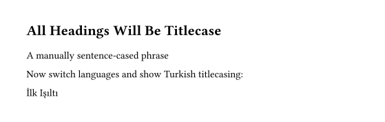
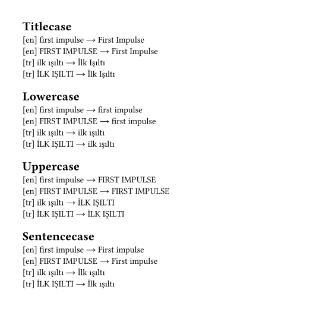
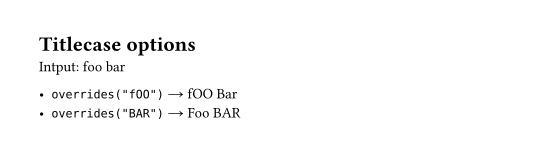

# Decasify Package for Typst

A thin wrapper around the [decasify](https://github.com/alerque/decasify) library providing Typst functions for locale and style guide aware text casing functions.
Provides functions for title-case (and other cases) that adapt to the language of the current document context.
Includes support for Turkish and multiple style guides.

## Example One

* The heading in this example will automatically be converted to title case.
* The body text is untouched, but a manual command is used to sentence case a whole phrase.
* Changing the text language, we show using the functions again will follow the new language rules.

```typst
#import "@preview/decasify:0.10.1": *

#set page(width: 148mm, height: auto, margin: 1cm)

#set text(lang: "en")

#show heading: it => [
  #titlecase(it.body)
]

= all headings will be titlecase

#sentencecase("a manually sentence-cased phrase")

Now switch languages and show Turkish titlecasing:

#set text(lang: "tr")

#titlecase("ilk ışıltı")
```



## Example Two

* Using the same input samples, iterate all four possible output cases.
* Use language specific rules for each sample highlighting how character handling is different.

```typst
#import "@preview/decasify:0.10.1": *

#set page(width: 148mm, height: auto, margin: 1cm)

#let examples = (
  (str: "first impulse", lang: "en"),
  (str: "FIRST IMPULSE", lang: "en"),
  (str: "ilk ışıltı", lang: "tr"),
  (str: "İLK IŞILTI", lang: "tr"),
)

= Titlecase

#for s in examples [
  #set text(lang: s.lang)
  [#context(text.lang)] #s.str → #titlecase(s.str) \
]

= Lowercase

#for s in examples [
  #set text(lang: s.lang)
  [#context(text.lang)] #s.str → #lowercase(s.str) \
]

= Uppercase

#for s in examples [
  #set text(lang: s.lang)
  [#context(text.lang)] #s.str → #uppercase(s.str) \
]

= Sentencecase

#for s in examples [
  #set text(lang: s.lang)
  [#context(text.lang)] #s.str → #sentencecase(s.str) \
]
```



## Style Options

Extra options can be passed to modify the case transformation style.
For example you can pass an array of words in the exact case you want them output to override the normal casing rules.

```typst
#import "@preview/decasify:0.10.1": *

#set page(width: 148mm, height: auto, margin: 1cm)

#let input = "foo bar"

= Titlecase options

Intput: #input

- `overrides("fOO")` → #titlecase(input, overrides: ("fOO",))
- `overrides("BAR")` → #titlecase(input, overrides: ("BAR",))
```


