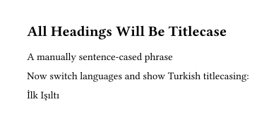
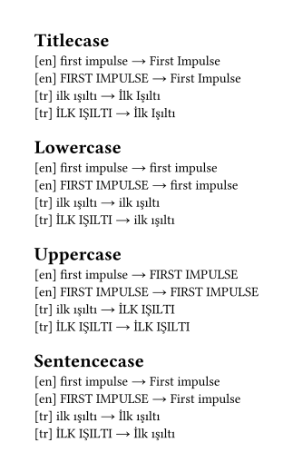

# Decasify package for Typst

A thin wrapper around the [decasify](https://github.com/alerque/decasify) library providing Typst functions for locale and style guide aware text casing functions.
Provides functionns for title-case (and other cases) that adapt to the language of the current document context.
Includes support for Turkish and multiple style guides.

```typst
#import "@preview/decasify:0.9.0": *

#set page(width: auto, height: auto, margin: 1cm)

#set text(lang: "en")

#show heading: it => [
  #titlecase(it.body)
]

= all headings will be titlecase

#sentencecase("a manually sentence-cased phrase")

Now switch languages and show Turkish titlecasing:

#set text(lang: "tr")

#titlecase("ilk ışıltı")
```



```typst
#import "@preview/decasify:0.9.0": *

#set page(width: auto, height: auto, margin: 1cm)

#let examples = (
  (str: "first impulse", lang: "en"),
  (str: "FIRST IMPULSE", lang: "en"),
  (str: "ilk ışıltı", lang: "tr"),
  (str: "İLK IŞILTI", lang: "tr"),
)

= Titlecase

#for s in examples [
  #set text(lang: s.lang)
  [#context(text.lang)] #s.str → #titlecase(s.str) \
]

= Lowercase

#for s in examples [
  #set text(lang: s.lang)
  [#context(text.lang)] #s.str → #lowercase(s.str) \
]

= Uppercase

#for s in examples [
  #set text(lang: s.lang)
  [#context(text.lang)] #s.str → #uppercase(s.str) \
]

= Sentencecase

#for s in examples [
  #set text(lang: s.lang)
  [#context(text.lang)] #s.str → #sentencecase(s.str) \
]
```


