# Deckz

<a href="https://github.com/typst/packages/tree/main/packages/preview/deckz" style="text-decoration: none;"></a>
<a href="https://www.gnu.org/licenses/gpl-3.0.en.html" style="text-decoration: none;"></a>

A flexible and customizable package to **render and display poker-style playing cards** in [Typst](https://typst.app/).

Use **Deckz** to visualize individual cards, create stylish examples in documents, or build full decks and hands for games and illustrations. ♠️♦️♣️♥️

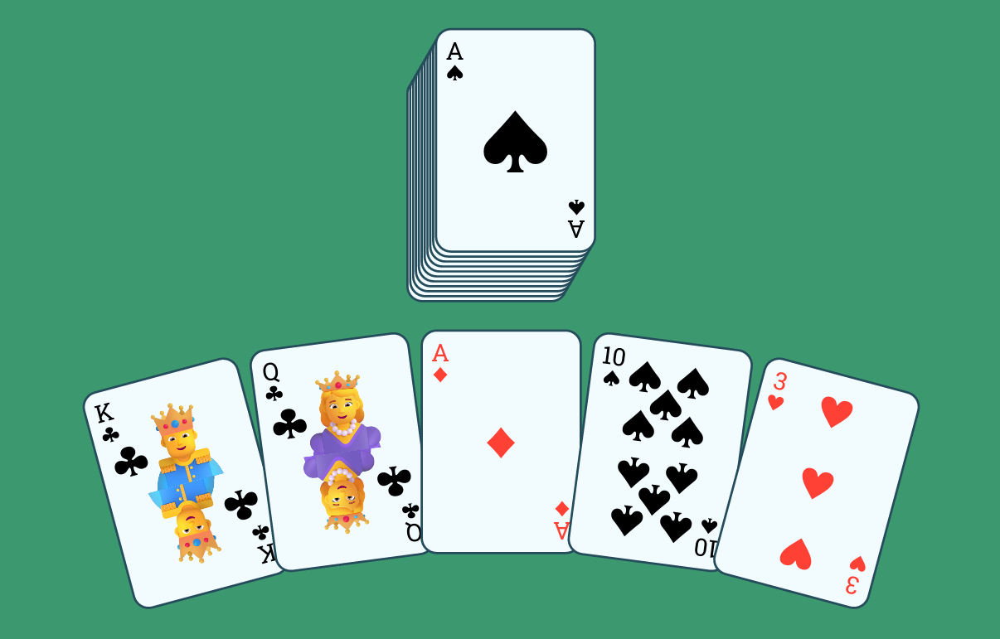
<details>
  <summary><i><u>See the code for this example</u></i></summary>

```typ
#import "@preview/deckz:0.1.0" as deckz: *

#set text(font: "Roboto Slab")

#align(center)[
  #box(fill: olive, width: 100%, inset: 5mm)[
    #deckz.deck("AS")
    #deckz.hand("KC", "QC", "AD", "10S", "3H")
  ]
]
```
</details>

The name is inspired by Typst’s drawing package [CeTZ](https://typst.app/universe/package/cetz) — it mirrors its sound while hinting at its own purpose: rendering card decks.
In fact, _Deckz_ also relies on _CeTZ_ internally to position elements precisely.


## Quick Example
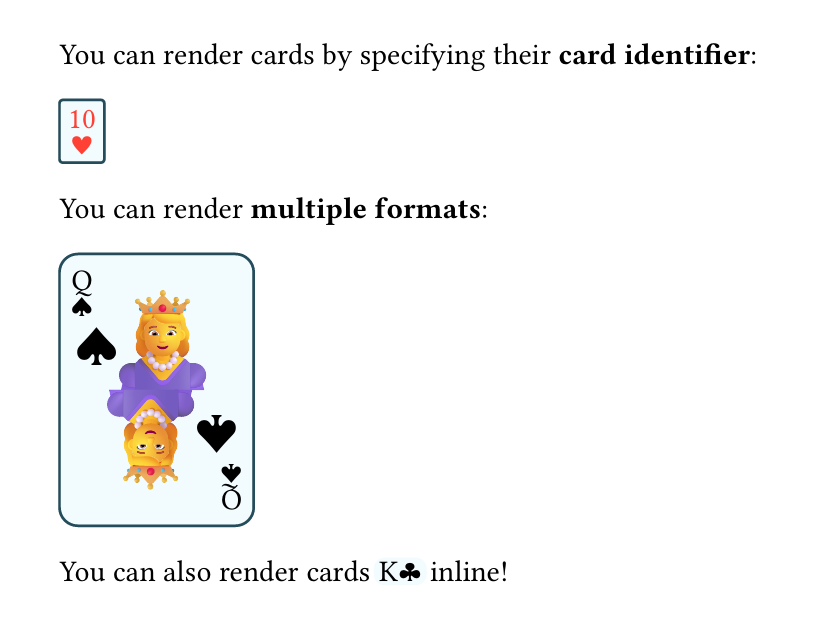

```typ
#import "@preview/deckz:0.1.0" as deckz

You can render cards by specifying their *card identifier*:

#deckz.render("10H", format: "mini")

You can render *multiple formats*:

#deckz.render("QS", format: "medium")

You can also render cards #deckz.inline("KC") inline!
```

## Importing the Package
To start using Deckz functionalities, import the package in your _Typst_ document with:

```typ
#import "@preview/deckz:0.1.0" as deckz
```

You can then call any of the rendering functions using the `deckz` namespace.

## Basic Usage – `deckz.render`

The main entry point is the `deckz.render()` function:

```typ
#deckz.render("7D", format: "large")
```

The first argument is the **card identifier** as a string. Use standard short notation like `"AH"`, `"10S"`, `"QC"`, etc., where the first letter(s) indicates the *rank*, and the last letter the *suit*.

- **Available ranks**: `A`, `2`, `3`, `4`, `5`, `6`, `7`, `8`, `9`, `10`, `J`, `Q`, `K`.
- **Available suits**: `H` (Hearts), `D` (Diamonds), `C` (Clubs), `S` (Spades).

> *Note*. Card identifier is case-insensitive, so `"as"` and `"AS"` are equivalent and both represent the Ace of Spades.

The second argument is optional and specifies the **format** of the card display. If not provided, it defaults to `medium`.
See the next section for available formats.

## Formats

Deckz provides multiple display formats to fit different design needs:

| Format | Description |
| --- | --- |
| `inline` | A minimal format where the rank and suit are shown directly inline with text — perfect for references like *"you drew a #deckz.inline("KH")"*. |
| `mini`   | The smallest visual format: a tiny rectangle with the rank on top and the suit at the bottom. |
| `small`  | A compact but clearer card with rank in opposite corners and the suit centered. |
| `medium` | A full, structured card with proper layout, two corner summaries, and realistic suit placement. |
| `large`  | An expanded version of `medium` with corner summaries on all four sides for maximum readability. |
| `square` | A balanced 1:1 format with summaries in all corners and the main figure centered — great for grid layouts. |

Here's an example of how the same card looks in different formats:

```typ
#deckz.render("5S", format: "inline") #h(1fr)
#deckz.render("5S", format: "mini") #h(1fr)
#deckz.render("5S", format: "small") #h(1fr)
#deckz.render("5S", format: "medium") #h(1fr)
#deckz.render("5S", format: "large") #h(1fr)
#deckz.render("5S", format: "square")
``` 

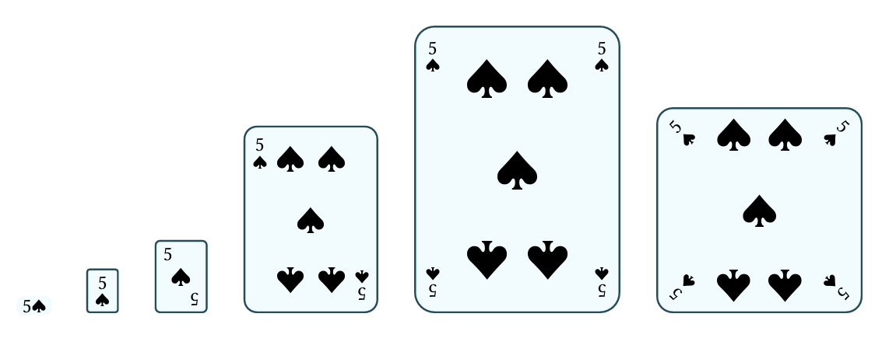

You can use any of these with the `deckz.render()` function, or directly via specific calls:

```typ
#deckz.mini("2C")
#deckz.large("JH")
#deckz.square("AD")

are equivalent to

#deckz.render("2C", format: "mini")
#deckz.render("JH", format: "large")
#deckz.render("AD", format: "square")
```

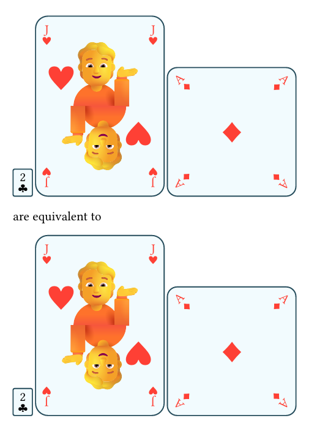

> *Note*. All formats are responsive to the current text size — they scale proportionally using `em` units, making them adaptable to different layouts and styles.

If you want more examples of how to use these formats, check out the examples at the end of this document.

## Decks & Hands
Deckz also provides convenient functions to render **entire decks** or **hands of cards**. Both functions produce a _CeTZ_ canvas, which can be used in any context where you need to display multiple cards together.

### Decks
The deck visualization is created with the `deckz.deck()` function, which takes a card identifier as an argument. It renders a full deck of cards, with the specified card on top.

<p align="center">
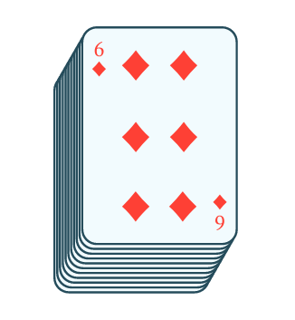
</p>

```typ
#deckz.deck("6D")
```

In the `deck` function, you can also specify different parameters:
- `angle`: The direction towards which the cards are shifted. If equal to `0deg`, the cards will be stacked to the right; if equal to `180deg`, they will be stacked to the left. The default value of `90deg` stacks the cards upwards, whereas `270deg` stacks them downwards. Intermediate values will create a diagonal stack. Default is `60deg`.
- `height`: The height of the deck (default is `1cm`). This determines for how much space the cards will be shifted in the specified direction.
- `noise`: a number between `0` and `1` that determines how much the cards are scattered in random directions. A value of `0` means no noise, while a value of `1` means maximum noise. Higher values are permitted, but they will result in a more chaotic distribution of cards. Default is `none`, which corresponds to `0` (no random displacement).
- `format`: the format of the cards in the deck. It can be any of the formats described above, such as `inline`, `mini`, `small`, `medium`, `large`, or `square`. The default is `medium`.

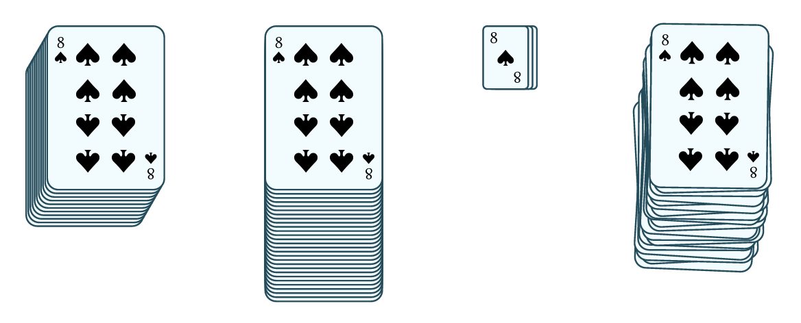

```typ
#stack(
  dir: ltr,
  spacing: 1fr,
  deckz.deck("8S"),
  deckz.deck("8S", angle: 90deg, height: 2.5cm),
  deckz.deck("8S", angle: 180deg, height: 8pt, format: "small"),
  deckz.deck("8S", angle: 80deg, height: 18mm, noise: 0.5)
)
```

### Hands
The hand visualization is created with the `deckz.hand()` function, which takes a variable number of card identifiers as arguments. It renders a hand of cards, with the specified cards displayed side by side.

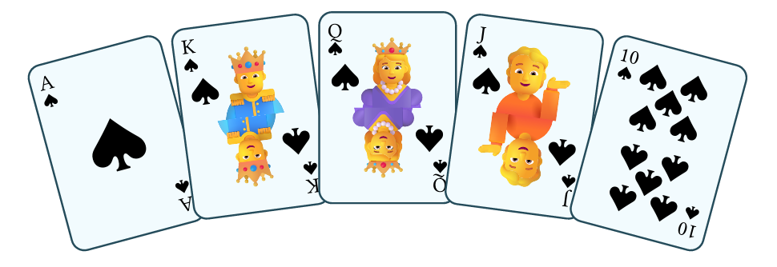

```typ
#deckz.hand("AS", "KS", "QS", "JS", "10S")
```

As can be seen in the example above, the cards are displayed in an arc shape, with the first card on the left and the last card on the right. To customize such display, you can use the following parameters:
- `angle`: The angle of the arc in degrees. The default is `30deg`, which creates a gentle arc. Higher values will create a wider arc, while lower values will create a tighter arc.
- `width`: The width of the hand in centimeters. This determines how far apart the cards will be spaced. The default is `10cm`. More precisely, the width is the distance between the centers of the first and last card in the hand.
- `noise`: a number between `0` and `1` that determines how much the cards are scattered in random directions. A value of `0` means no noise, while a value of `1` means maximum noise. Higher values are permitted, but they will result in a more chaotic distribution of cards. Default is `none`, which corresponds to `0` (no random displacement).
- `format`: the format of the cards in the deck. It can be any of the formats described above, such as `inline`, `mini`, `small`, `medium`, `large`, or `square`. The default is `medium`.

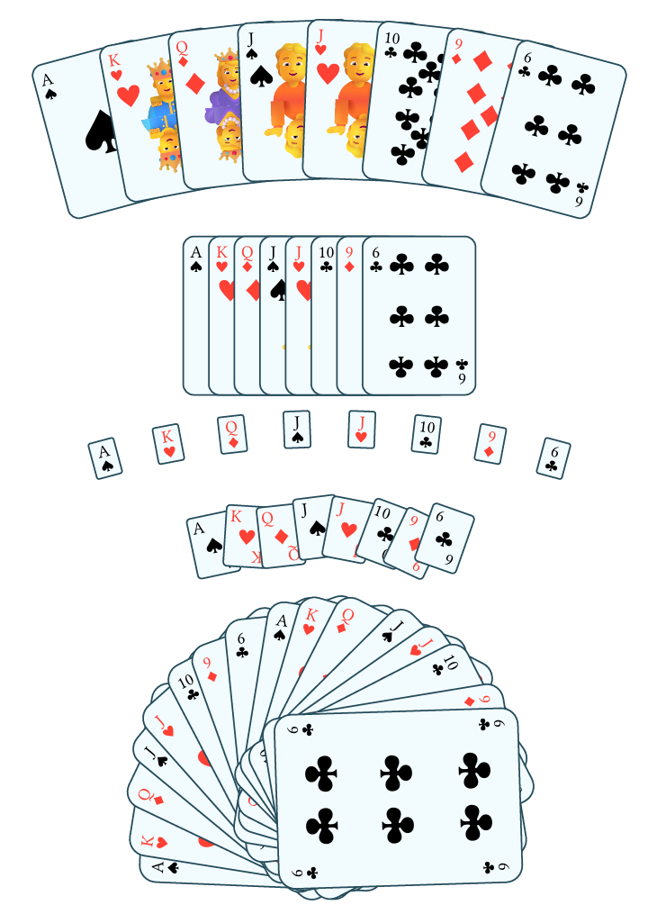

```typ
#let my-hand = ("AS", "KH", "QD", "JS", "JH", "10C", "9D", "6C")

#table(
  columns: (1fr),
  align: center,
  stroke: none,
  deckz.hand(..my-hand),
  deckz.hand(angle: 0deg, width: 4cm, ..my-hand),
  deckz.hand(format: "mini", ..my-hand),
  deckz.hand(width: 5cm, noise: 2, format: "small", ..my-hand),
  deckz.hand(angle: 180deg, width: 3cm, noise: 0.5, format: "large", ..(my-hand + my-hand)),
)
```

## Card Customization *(COMING SOON)*
Deckz allows for some customization of the card appearance, such as colors and styles. However, this feature is still under development and will be available in future releases.

**Variant Colors**: to better distinguish same-color suits, Deckz will support variant colors for each suit.

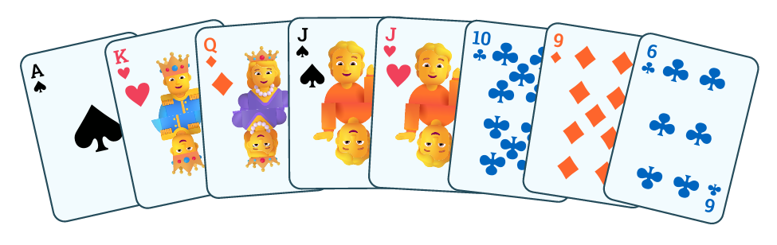

> *Note*. The color scheme shown above is inspired by the game *Balatro*. The hand displayed is the initial hand from a game started with the seed "DECKZ" — not a bad opening, huh? 😉

**Custom Suits**: Deckz will also allow you to define custom suits, so you can use your own symbols or images instead of the standard hearts, diamonds, clubs, and spades.

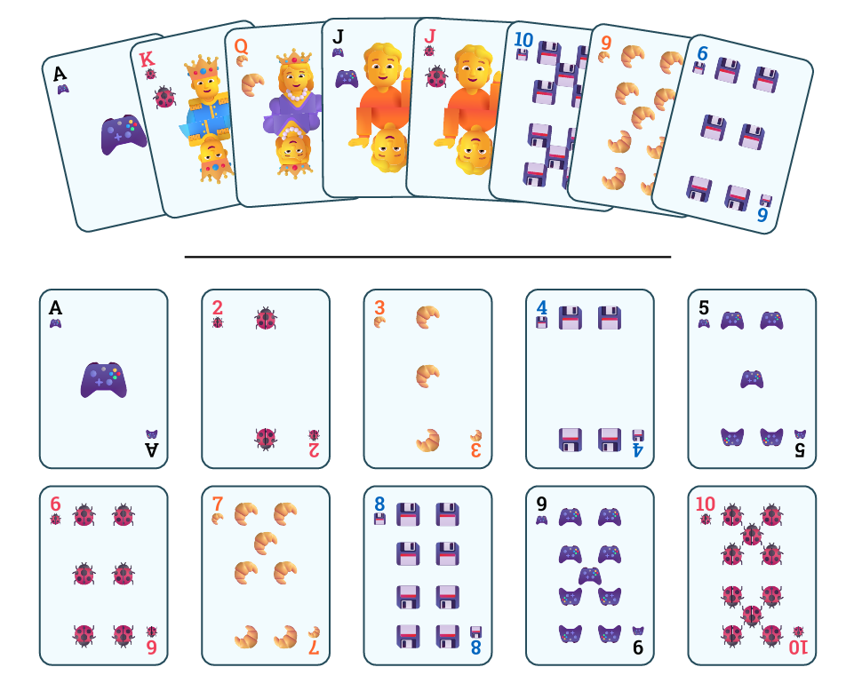

Even though this feature is not yet implemented, you can still use custom suits by defining your own `show` rule for the emoji suits. In fact, Deckz uses the `emoji.suit.*` symbols to render the standard suits, so you can override them with your own definitions.

For example, if you want to use a croissant emoji as a custom suit for diamonds, you can define it like this:

```typ
#show emoji.suit.diamond: text(size: 0.7em, emoji.croissant)
```

> *Note*. The resizing of the emoji is used to make it fit better in the card layout. You can adjust the size as needed.

## Final Examples

### Displaying the current state of a game
You can use Deckz to display the **current state of a game**, such as the cards in hand, the cards on the table, and the deck.

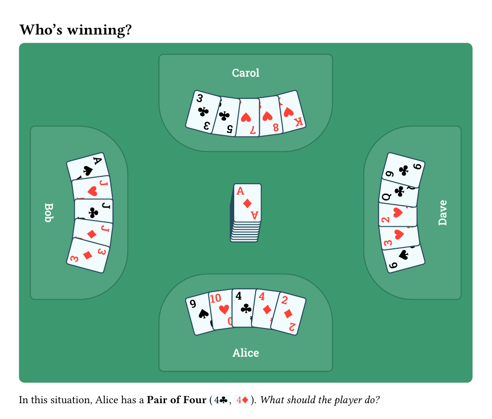

<details>
  <summary><i><u>See the code for this example</u></i></summary>

```typ
#import "@preview/deckz:0.1.0" as deckz

#let player-mat(body) = box(
  stroke: olive.darken(20%),
  fill: olive.lighten(10%),
  radius: (top: 50%, bottom: 5%), 
  inset: 15%,
  body
)

= Who's winning?

#text(white, font: "Roboto Slab", weight: "semibold")[

  #box(fill: olive, 
    width: 100%, height: 12cm, 
    inset: 4mm, radius: 2mm
  )[

    #place(center + bottom)[
      #player-mat[
        #deckz.hand(format: "small", width: 3cm, "9S", "10H", "4C", "4D", "2D")
        Alice
      ]
    ]

    #place(left + horizon)[
      #rotate(90deg, reflow: true)[
        #player-mat[
          #deckz.hand(format: "small", width: 3cm, "AS", "JH", "JC", "JD", "3D")
          #align(center)[Bob]
        ]
      ]
    ]

    #place(center + top)[
      #rotate(180deg, reflow: true)[
        #player-mat[
          #deckz.hand(format: "small", width: 3cm, "KH", "8H", "7H", "5C", "3C")
          #rotate(180deg)[Carol]
        ]
      ]
      
    ]

    #place(right + horizon)[
      #rotate(-90deg, reflow: true)[
        #player-mat[
          #deckz.hand(format: "small", width: 3cm, "6S", "3H", "2H", "QC", "9C")
          #align(center)[Dave]
        ]
      ]
    ]

    #place(center + horizon)[
      #deckz.deck(format: "small", angle: 80deg, height: 8mm, "AD")
    ]
  ]
]

In this situation, Alice has a *Pair of Four* (#deckz.inline("4C"), #deckz.inline("4D")). _What should the player do?_
```
</details>

### Comparing different formats
You can use Deckz to **compare different formats** of the same card, or to show how a card looks in different contexts.

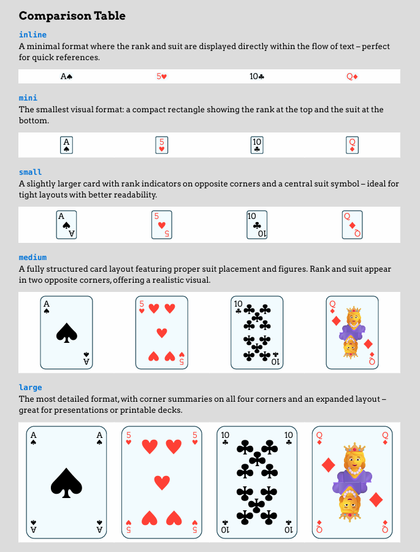
<details>
  <summary><i><u>See the code for this example</u></i></summary>

```typ
#import "@preview/deckz:0.1.0" as deckz

#set page(margin: 0.5in, fill: gray.lighten(60%))
#set table(stroke: 1pt + white, fill: white)
#set text(font: "Arvo")

= Comparison Table

== #text(blue)[`inline`]
A minimal format where the rank and suit are displayed directly within the flow of text -- perfect for quick references.
#table(align: center, columns: (1fr,) * 4, 
  deckz.inline("AS"),
  deckz.inline("5H"),
  deckz.inline("10C"),
  deckz.inline("QD")
)

== #text(blue)[`mini`] 
The smallest visual format: a compact rectangle showing the rank at the top and the suit at the bottom.
#table(align: center, columns: (1fr,) * 4, 
  deckz.mini("AS"),
  deckz.mini("5H"),
  deckz.mini("10C"),
  deckz.mini("QD")
)

== #text(blue)[`small`]
A slightly larger card with rank indicators on opposite corners and a central suit symbol -- ideal for tight layouts with better readability.
#table(align: center, columns: (1fr,) * 4, 
  deckz.small("AS"),
  deckz.small("5H"),
  deckz.small("10C"),
  deckz.small("QD")
)

== #text(blue)[`medium`]
A fully structured card layout featuring proper suit placement and figures. Rank and suit appear in two opposite corners, offering a realistic visual.
#table(align: center, columns: (1fr,) * 4, 
  deckz.medium("AS"),
  deckz.medium("5H"),
  deckz.medium("10C"),
  deckz.medium("QD")
)

== #text(blue)[`large`]
The most detailed format, with corner summaries on all four corners and an expanded layout -- great for presentations or printable decks.
#table(align: center, columns: (1fr,) * 4, 
  deckz.large("AS"),
  deckz.large("5H"),
  deckz.large("10C"),
  deckz.large("QD")
)

== #text(blue)[`square`]
A balanced 1:1 card format with rank and suit shown in all four corners and a central figure -- designed for symmetry and visual clarity.
#table(align: center, columns: (1fr,) * 4, 
  deckz.square("AS"),
  deckz.square("5H"),
  deckz.square("10C"),
  deckz.square("KD")
)
```
</details>

### Displaying a full deck
You can use Deckz to display a **full deck of cards**, simply by retrieving the `deckz.deck52` array, which contains all 52 standard playing cards.


<details>
  <summary><i><u>See the code for this example</u></i></summary>

```typ
#import "@preview/deckz:0.1.0" as deckz

#set page(margin: 5mm)

#text(white, font: "Oldenburg")[

  #box(fill: aqua.darken(40%), 
    inset: 4mm, radius: 2mm
  )[
    #deckz.hand(angle: 270deg, width: 8cm, format: "large", noise: 0.35, ..deckz.deck52)

    #place(center + horizon)[
      #text(size: 30pt)[Deckz]
    ]
  ]
]
```
</details>

## Contributing
Found a bug, have an idea, or want to contribute?
Feel free to open an **issue** or **pull request** on the [GitHub repository](https://github.com/micheledusi/Deckz).

Made something cool with Deckz? Let me know — I’d love to feature your work!

### Credits
This package is created by [Michele Dusi](https://github.com/micheledusi) and is licensed under the [GNU General Public License v3.0](https://www.gnu.org/licenses/gpl-3.0.en.html).

All fonts used in this package are licensed under the [SIL Open Font License, Version 1.1](https://openfontlicense.org) 
([*Oldenburg*](https://fonts.google.com/specimen/Oldenburg), [*Arvo*](https://fonts.google.com/specimen/Arvo))
or the [Apache License, Version 2.0](http://www.apache.org/licenses/)
([*Roboto Slab*](https://fonts.google.com/specimen/Roboto+Slab)).

The card designs are inspired by the standard playing cards, with suit symbols taken from the [emoji library of Typst](https://typst.app/docs/reference/symbols/emoji/).
This project works thanks to the following Typst packages: [CeTZ](https://typst.app/universe/package/cetz) and [Suiji](https://typst.app/universe/package/suiji).