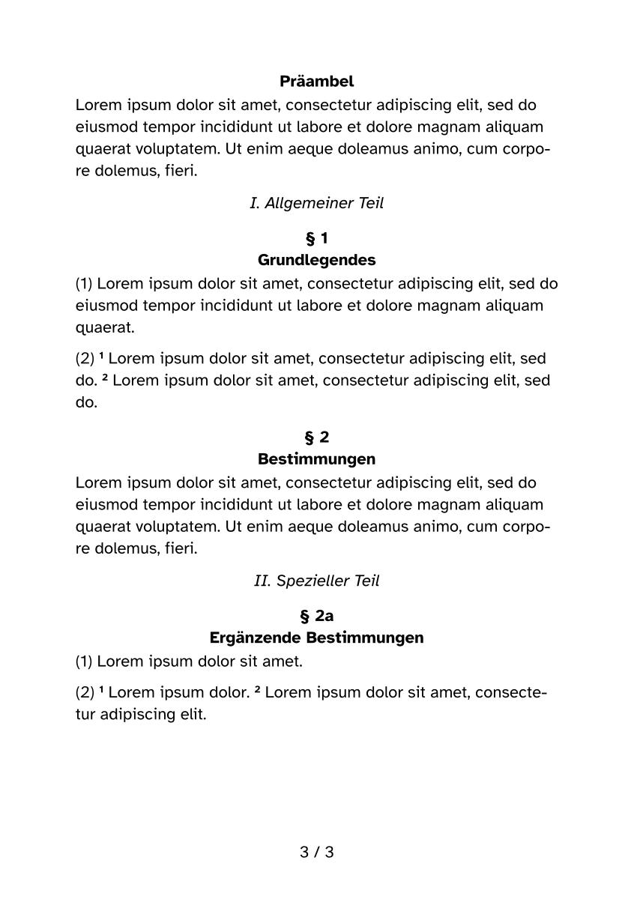

# delegis



A package and template for drafting legislative content in a German-style structuring, such as for bylaws, etc.

While the template is designed to be used in German documents, all strings are customizable. You can have a look at the `delegis.typ` to see all available parameters.

## General Usage

While this `README.md` gives you a brief overview of the package's usage, we recommend that you use the template (in the `template` folder) as a starting point instead.

### Importing the Package

```typst
#import "@preview/delegis:0.2.0": *
```

### Initializing the template

```typst
#show: it => delegis(
  // Metadata
  title: "Vereinsordnung zu ABCDEF", // title of the law/bylaw/...
  abbreviation: "ABCDEFVO", // abbreviation of the law/bylaw/...
  resolution: "3. Beschluss des Vorstands vom 24.01.2024", // resolution number and date
  in-effect: "24.01.2024", // date when it comes into effect
  draft: false, // whether this is a draft
  // Template
  logo: image("wuespace.jpg", alt: "WüSpace e. V."), // logo of the organization, shown on the first page
  // Content
  it
)
```

### Sections

Sections are auto-detected as long as they follow the pattern `§ 1 ...` or `§ 1a ...` in its own paragraph:

```typst
§ 1 Geltungsbereich

(1) 
Diese Ordnung gilt für alle Mitglieder des Vereins.

(2) 
Sie regelt die Mitgliedschaft im Verein.

§ 2 Mitgliedschaft

(1) 
Die Mitgliedschaft im Verein ist freiwillig.

(2) 
Sie kann jederzeit gekündigt werden.

§ 2a Ehrenmitgliedschaft

(1) 
Die Ehrenmitgliedschaft wird durch den Vorstand verliehen.
```

Alternatively (or if you want to use special characters otherwise not supported, such as `*`), you can also use the `#section[number][title]` function:

```typst
#section[§ 3][Administrator*innen]
```

### Overarching Sections

If you want to add more structure to your sections, you can use normal Typst headings. Note that only the level 6 headings are reserved for the section numbers:

```typst
= Allgemeine Bestimmungen

§ 1 ABC

§ 2 DEF

= Besondere Bestimmungen

§ 3 GHI

§ 4 JKL
```

### Sentence Numbering

If a paragraph contains multiple sentences, you can number them by adding a `#s~` at the beginning of the sentences:

```typst
§ 3 Mitgliedsbeiträge

#s~Die Mitgliedsbeiträge sind monatlich zu entrichten.
#s~Sie sind bis zum 5. des Folgemonats zu zahlen.
```

This automatically adds corresponding sentence numbers in superscript.

### Referencing other Sections

Referencing works manually by specifying the section number. While automations would be feasible, we have found that in practice, they're not as useful as they might seem for legislative documents.

In some cases, referencing sections using `§ X` could be mis-interpreted as a new section. To avoid this, use the non-breaking space character `~` between the `§` and the number:

```typst
§ 5 Inkrafttreten

Diese Ordnung tritt am 24.01.2024 in Kraft. §~4 bleibt unberührt.
```

## Changelog

### v0.2.0

#### Features
- Add `#metadata` fields for usage with `typst query`. You can now use `typst query file.typ "<field>" --field value --one` with `<field>` being one of the following to query metadata fields in the command line:
  - `<title>`
  - `<abbreviation>`
  - `<resolution>`
  - `<in-effect>`
- Add `#section[§ 1][ABC]` function to enable previously unsupported special chars (such as `*`) in section headings. Note that this was previously possible using `#unnumbered[§ 1\ ABC]`, but the new function adds a semantically better-fitting alternative to this fix.
- Improve heading style rules. This also fixes an incompatibility with `pandoc`, meaning it's now possible to use `pandoc` to convert delegis documents to HTML, etc.
- Set the footnote numbering to `[1]` to not collide with sentence numbers.
#### Bug Fixes
- Fix a typo in the `str-draft` variable name that lead to draft documents resulting in a syntax error.
- Fix hyphenation issues with the abbreviation on the title page (hyphenation between the parentheses and the abbreviation itself)

### v0.1.0

Initial Release
