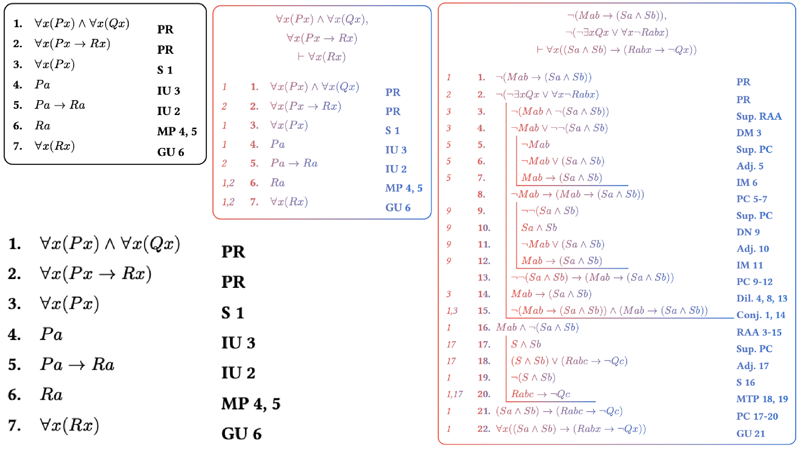

# derive-it

A Typst package to create Fitch-style natural deductions. Available on [Typst Universe](https://typst.app/universe/package/derive-it).



## Usage

This package provides two functions:

`ded-nat` is a function that expects:
- `stcolor`: the stroke color of the indentation guides. Optional: Default is `black`.
- `arr`: an array with the shape, it can be provided in two shapes.
    - 4 items: (dependency: text content, indentation: integer starting from 0, formula: text content, rule: text content).
    - 3 items: the same as above, but without the dependency.
- `style-dep`: the styling function that will be applied to the dependencies. Optional: Default is `content => text(style: "italic", content)`.
- `style-formula`: the styling function that will be applied to the formula. Optional: Default is `content => content`.
- `style-rule`: the styling function that will be applied to the rule. Optional: Default is `content => text(style: "bold", content)`.
- `nested-boxes`: instead of using indentation lines, use nested boxes. Optional: Default is `false`.

`ded-nat-boxed` is a function that returns the deduction in a `box` and expects:
- `stcolor`: the stroke color of the indentation guides. Optional: Default is `black`.
- `premises-and-conclusion`: bool, whether to automatically insert or not the premises and conclusion of the derivation above the lines. Optional: Default is `true`.
- `premise-rule-text`: text content, used for finding the premises' formulas when `premises-and-conclusion` is set to `true`. Optional: Default is `"PR"`.
- `arr`: an array with the shape, it can be provided in two shapes.
    - 4 items: (dependency: text content, indentation: integer starting from 0, formula: text content, rule: text content).
    - 3 items: the same as above, but without the dependency.
- `style-dep`: the styling function that will be applied to the dependencies. Optional: Default is `content => text(style: "italic", content)`.
- `style-formula`: the styling function that will be applied to the formula. Optional: Default is `content => content`.
- `style-rule`: the styling function that will be applied to the rule. Optional: Default is `content => text(style: "bold", content)`.
- `nested-boxes`: instead of using indentation lines, use nested boxes. Optional: Default is `false`.


> Note: depending on your layout, this functions may fail to compile due to a high enough amount of indentation (due to the recursive implementation of the layout).
> In my tests, depending on the content of the line, the compiler will panic at around 15-20 indentation levels.
> ```typst
>     ("1", 16, $forall y ((Q y a and R y a) -> not Q a y)$, "TEST")
> ```
> 


### Example

```typ
#import "@preview/derive-it:1.1.0": *

#ded-nat(stcolor: black, arr:(
    ("1", 0, $forall x (P x) and forall x (Q x)$, "PR"),
    ("2", 0, $forall x (P x -> R x)$, "PR"),
  
    ("1", 0, $forall x (P x)$, "S 1"),
    ("1", 0, $P a$, "IU 3"),
    ("2", 0, $P a -> R a$, "IU 2"),
    ("1,2", 0, $R a$, "MP 4, 5"),
  
    ("1,2", 0, $forall x (R x)$, "GU 6"),
))

#ded-nat-boxed(stcolor: black, premises-and-conclusion: false, arr: (
  ("1", 0, $forall x (S x b) and not forall y (P y -> Q b y)$, "PR"),
  ("2", 0, $forall x forall y (Q x y -> not Q y x)$, "PR"),
    ("3", 1, $not forall x (not P x) -> forall y (S y b -> Q b y)$, "Sup. RAA"),
    ("1", 1, $not forall y (P y -> Q b y)$, "S 1"),
    ("1", 1, $exists y not (P y -> Q b y)$, "EMC 4"),
      ("6", 2, $not (P a -> Q b a)$, "Sup. IE 5"),
        ("7", 3, $not (P a and not Q b a)$, "Sup. RAA"),
        ("7", 3, $not P a or not not Q  b a$, "DM 7"),
          ("9", 4, $not P a$, "Sup. PC"),
          ("9", 4, $not P a or Q b a$, "Disy. 9"),
        ("", 3, $not P a -> (not P a or Q b a)$, "PC 9-10"),
          ("12", 4, $not  not Q b a$, "Sup. PC"),
          ("12", 4, $Q b a$, "DN 12"),
          ("12", 4, $not P a or Q b a$, "Disy. 13"),
        ("", 3, $not not Q b a -> (not P a or Q b a)$, "PC 12-14"),
        ("7", 3, $not P a or Q b a$, "Dil. 8,11,15"),
        ("7", 3, $P a -> Q b a$, "IM 16"),
        ("6,7", 3, $(P a -> Q b a) and not (P a -> Q b a)$, "Conj. 6, 17"),
      ("6", 2, $P a and not Q b a$, "RAA 7-18"),
      ("6", 2, $P a$, "S 19"),
      ("6", 2, $exists x (P x)$, "GE 20"),
      ("6", 2, $not forall x (not P x)$, "EMC 21"),
      ("3,6", 2, $forall y (S y b -> Q b y)$, "MP 3, 22"),
      ("3,6", 2, $S a b -> Q b a$, "IU 23"),
      ("1", 2, $forall x (S x b)$, "S 1"),
      ("1", 2, $S a b$, "IU 25"),
      ("1,3,6", 2, $Q b a$, "MP 24, 25"),
      ("6", 2, $not Q b a$, "S 19"),
      ("1,3,6", 2, $Q b a or not exists y not (P y -> Q b y)$, "Disy. 27"),
      ("1,3,6", 2, $not exists y not (P y -> Q b y)$, "MTP 28, 29"),
    ("1,3", 1, $not exists y not (P y -> Q b y)$, "IE 5, 6, 30"),
    ("1,3", 1, $not exists y not (P y -> Q b y) and exists y not (P y -> Q b y)$, "Conj. 5, 31"),

  ("1", 0, $not (not forall x (not P x) -> forall y ( S y b -> Q b y))$, "RAA 3-32"),
))
```

# Development

In order to compile locally `examples/example.typ` the command is:

```sh
typst compile examples/example.typ --root .
```
