# [Devicon](https://github.com/bernsteining/devicon)

A Typst plugin providing easy access to developer-focused icons from the [devicon](https://devicon.dev/) collection.

## Usage

```typst
#import "@preview/devicon:0.1.0": devicon

#devicon("python-original")
#devicon("lua-original", size: 42pt)
```

## What Icons Are Available?

Each icon typically comes in multiple variants:
- `original`: The original colored icon
- `plain`: Simplified monochrome version
- `line`: Line art version
- `original-wordmark`: Icon with accompanying text/logo

Here's the full list

| Name | Icon |
|------|------|
| `gitlab-original-wordmark` |  |
| `gitlab-original` |  |
| `gitlab-plain-wordmark` |  |
| `gitlab-plain` |  |
| `cypressio-line` |  |
| `cypressio-original` |  |
| `cypressio-plain` |  |
| `cypressio-line-wordmark` |  |
| `cypressio-plain-wordmark` |  |
| `cypressio-original-wordmark` |  |
| `webstorm-original` |  |
| `webstorm-original-wordmark` |  |
| `webstorm-plain` |  |
| `webstorm-plain-wordmark` |  |
| `premierepro-plain` |  |
| `premierepro-original` |  |
| `detaspace-line` | 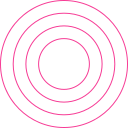 |
| `detaspace-original` |  |
| `detaspace-line-wordmark` |  |
| `detaspace-original-wordmark` |  |
| `rocksdb-original` |  |
| `rocksdb-plain` |  |
| `rocksdb-line` |  |
| `inkscape-plain` |  |
| `inkscape-original` |  |
| `inkscape-original-wordmark` |  |
| `inkscape-plain-wordmark` |  |
| `ansible-original` |  |
| `ansible-original-wordmark` |  |
| `ansible-plain-wordmark` | 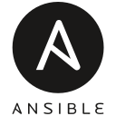 |
| `ansible-plain` |  |
| `sulu-line-wordmark` |  |
| `sulu-original-wordmark` |  |
| `sulu-original` |  |
| `sulu-line` |  |
| `gentoo-line-wordmark` |  |
| `gentoo-line` | 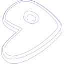 |
| `gentoo-original` |  |
| `gentoo-plain-wordmark` |  |
| `gentoo-original-wordmark` |  |
| `gentoo-plain` |  |
| `primeng-plain` |  |
| `primeng-original` |  |
| `tauri-original` |  |
| `tauri-plain` |  |
| `tauri-plain-wordmark` |  |
| `tauri-original-wordmark` |  |
| `streamlit-plain-wordmark` |  |
| `streamlit-plain` |  |
| `streamlit-original-wordmark` |  |
| `streamlit-original` |  |
| `htmx-original` |  |
| `htmx-plain-wordmark` |  |
| `htmx-line` | 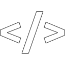 |
| `htmx-original-wordmark` |  |
| `htmx-plain` |  |
| `htmx-line-wordmark` |  |
| `shopware-original` |  |
| `shopware-original-wordmark` |  |
| `twilio-original-wordmark` |  |
| `twilio-original` |  |
| `arduino-original` |  |
| `arduino-plain-wordmark` |  |
| `arduino-plain` |  |
| `arduino-original-wordmark` |  |
| `reflex-plain` |  |
| `reflex-original-wordmark` |  |
| `reflex-plain-wordmark` |  |
| `reflex-original` |  |
| `bevyengine-plain` |  |
| `bevyengine-original-wordmark` |  |
| `bevyengine-line-wordmark` |  |
| `bevyengine-plain-wordmark` |  |
| `bevyengine-original` |  |
| `bevyengine-line` | 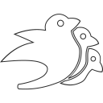 |
| `opentelemetry-plain` |  |
| `opentelemetry-original-wordmark` |  |
| `opentelemetry-plain-wordmark` |  |
| `opentelemetry-original` |  |
| `stackblitz-original-wordmark` | 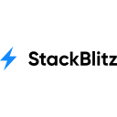 |
| `stackblitz-original` |  |
| `stackblitz-plain-wordmark` |  |
| `stackblitz-line-wordmark` |  |
| `stackblitz-line` | 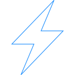 |
| `quasar-plain-wordmark` |  |
| `quasar-original` |  |
| `quasar-original-wordmark` |  |
| `quasar-plain` |  |
| `couchdb-plain` |  |
| `couchdb-original-wordmark` |  |
| `couchdb-plain-wordmark` |  |
| `couchdb-original` |  |
| `githubactions-original-wordmark` |  |
| `githubactions-plain-wordmark` |  |
| `githubactions-original` |  |
| `githubactions-plain` |  |
| `polygon-original` |  |
| `polygon-plain-wordmark` |  |
| `polygon-original-wordmark` |  |
| `polygon-plain` |  |
| `junit-plain-wordmark` |  |
| `junit-line-wordmark` |  |
| `junit-plain` |  |
| `junit-original` |  |
| `junit-line` |  |
| `junit-original-wordmark` |  |
| `neo4j-plain` |  |
| `neo4j-original` |  |
| `neo4j-original-wordmark` | 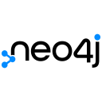 |
| `neo4j-plain-wordmark` |  |
| `jamstack-original-wordmark` |  |
| `jamstack-plain-wordmark` |  |
| `jamstack-original` |  |
| `debian-plain` |  |
| `debian-plain-wordmark` | 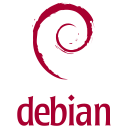 |
| `debian-original` |  |
| `debian-original-wordmark` |  |
| `appwrite-original-wordmark` |  |
| `appwrite-plain-wordmark` |  |
| `appwrite-original` |  |
| `akka-original-wordmark` |  |
| `akka-plain-wordmark` |  |
| `akka-plain` |  |
| `akka-original` |  |
| `swift-plain-wordmark` |  |
| `swift-original` |  |
| `swift-plain` |  |
| `swift-original-wordmark` |  |
| `safari-plain-wordmark` |  |
| `safari-line-wordmark` |  |
| `safari-line` |  |
| `safari-original-wordmark` |  |
| `safari-original` |  |
| `safari-plain` |  |
| `apollographql-line-wordmark` |  |
| `apollographql-line` |  |
| `apollographql-original` |  |
| `apollographql-original-wordmark` |  |
| `ocaml-original` |  |
| `ocaml-plain` |  |
| `ocaml-plain-wordmark` |  |
| `ocaml-original-wordmark` |  |
| `hibernate-original` |  |
| `hibernate-plain` |  |
| `hibernate-original-wordmark` |  |
| `hibernate-plain-wordmark` |  |
| `canva-original` |  |
| `opera-original-wordmark` |  |
| `opera-plain-wordmark` |  |
| `opera-plain` |  |
| `opera-original` |  |
| `java-plain-wordmark` |  |
| `java-original` |  |
| `java-plain` |  |
| `java-original-wordmark` |  |
| `swiper-original` |  |
| `aftereffects-plain` |  |
| `aftereffects-original` |  |
| `surrealdb-original-wordmark` |  |
| `surrealdb-plain` |  |
| `surrealdb-plain-wordmark` |  |
| `surrealdb-original` |  |
| `netbeans-original` |  |
| `netbeans-original-wordmark` |  |
| `netbeans-plain-wordmark` |  |
| `netbeans-plain` |  |
| `xcode-original` |  |
| `xcode-plain` |  |
| `jest-plain` |  |
| `jeet-plain-wordmark` |  |
| `jeet-original-wordmark` |  |
| `jeet-original` |  |
| `jeet-plain` |  |
| `jhipster-original` |  |
| `jhipster-plain` |  |
| `jhipster-original-wordmark` |  |
| `jhipster-plain-wordmark` |  |
| `libgdx-plain` |  |
| `libgdx-original` |  |
| `libgdx-line` |  |
| `forgejo-line-wordmark` |  |
| `forgejo-original` |  |
| `forgejo-plain-wordmark` |  |
| `forgejo-original-wordmark` |  |
| `forgejo-plain` |  |
| `forgejo-line` |  |
| `dynamodb-plain` |  |
| `dynamodb-original` |  |
| `maya-plain` |  |
| `maya-original` |  |
| `maya-plain-wordmark` |  |
| `maya-original-wordmark` |  |
| `teleport-original` |  |
| `teleport-line` |  |
| `teleport-original-wordmark` |  |
| `teleport-line-wordmark` |  |
| `angularmaterial-plain` |  |
| `angularmaterial-original` |  |
| `meteor-plain-wordmark` |  |
| `meteor-original-wordmark` |  |
| `meteor-original` |  |
| `meteor-plain` |  |
| `poetry-original` |  |
| `poetry-plain` |  |
| `subversion-original-wordmark` |  |
| `subversion-original` |  |
| `subversion-plain-wordmark` |  |
| `mongoose-original` |  |
| `mongoose-original-wordmark` |  |
| `less-plain-wordmark` |  |
| `feathersjs-original` |  |
| `flask-original-wordmark` |  |
| `flask-original` |  |
| `veevalidate-original` |  |
| `veevalidate-line` |  |
| `materialui-original` |  |
| `materialui-plain` |  |
| `playwright-plain` |  |
| `playwright-original` |  |
| `opensuse-original` |  |
| `opensuse-original-wordmark` |  |
| `photoshop-line` |  |
| `photoshop-original` |  |
| `photoshop-plain` |  |
| `proxmox-plain-wordmark` |  |
| `proxmox-plain` |  |
| `proxmox-original` | 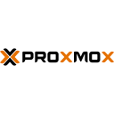 |
| `proxmox-original-wordmark` |  |
| `twitter-original` |  |
| `atom-original` |  |
| `atom-original-wordmark` |  |
| `nano-plain-wordmark` |  |
| `nano-plain` | 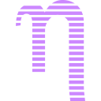 |
| `nano-original` |  |
| `nano-original-wordmark` |  |
| `spicedb-line` | 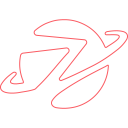 |
| `spicedb-original` |  |
| `spicedb-plain` |  |
| `lodash-plain` |  |
| `lodash-original` |  |
| `zsh-line-wordmark` |  |
| `zsh-line` |  |
| `zsh-plain-wordmark` |  |
| `zsh-original` |  |
| `zsh-original-wordmark` | 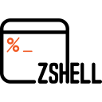 |
| `zsh-plain` |  |
| `godot-original` |  |
| `godot-plain-wordmark` |  |
| `godot-original-wordmark` |  |
| `godot-plain` |  |
| `latex-original` |  |
| `v8-plain` |  |
| `v8-original` |  |
| `pandas-original-wordmark` |  |
| `pandas-plain-wordmark` |  |
| `pandas-line` | 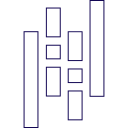 |
| `pandas-plain` |  |
| `pandas-original` |  |
| `pandas-line-wordmark` |  |
| `vite-original` |  |
| `vite-original-wordmark` |  |
| `artixlinux-original-wordmark` |  |
| `artixlinux-plain` |  |
| `artixlinux-original` |  |
| `artixlinux-plain-wordmark` |  |
| `elasticsearch-plain-wordmark` |  |
| `elasticsearch-plain` |  |
| `elasticsearch-original` |  |
| `elasticsearch-original-wordmark` |  |
| `inertiajs-plain` |  |
| `inertiajs-plain-wordmark` |  |
| `inertiajs-original-wordmark` |  |
| `inertiajs-original` |  |
| `sqlite-plain-wordmark` |  |
| `sqlite-original-wordmark` |  |
| `sqlite-plain` |  |
| `sqlite-original` |  |
| `unity-plain` |  |
| `unity-line-wordmark` |  |
| `unity-line` |  |
| `unity-original-wordmark` |  |
| `unity-original` |  |
| `unity-plain-wordmark` |  |
| `lumen-original` |  |
| `emacs-original` |  |
| `digitalocean-original` |  |
| `digitalocean-original-wordmark` |  |
| `gitpod-plain` |  |
| `gitpod-plain-wordmark` |  |
| `gitpod-original` |  |
| `gitpod-original-wordmark` |  |
| `heroku-original-wordmark` |  |
| `heroku-plain` |  |
| `heroku-plain-wordmark` |  |
| `heroku-original` |  |
| `awk-plain-wordmark` |  |
| `awk-original` |  |
| `awk-original-wordmark` |  |
| `erlang-original-wordmark` |  |
| `erlang-original` |  |
| `erlang-plain` |  |
| `erlang-plain-wordmark` |  |
| `behance-plain` |  |
| `behance-original-wordmark` |  |
| `behance-original` |  |
| `behance-plain-wordmark` |  |
| `pixijs-plain-wordmark` |  |
| `pixijs-plain` |  |
| `pixijs-original-wordmark` |  |
| `pixijs-original` |  |
| `vault-plain-wordmark` |  |
| `vault-original-wordmark` |  |
| `vault-original` |  |
| `fsharp-plain` |  |
| `fsharp-original` |  |
| `windows11-original` |  |
| `windows11-original-wordmark` |  |
| `firefox-original-wordmark` |  |
| `firefox-original` |  |
| `firefox-plain-wordmark` |  |
| `firefox-plain` |  |
| `eleventy-plain` |  |
| `eleventy-original` |  |
| `plotly-original-wordmark` |  |
| `plotly-plain-wordmark` |  |
| `plotly-plain` |  |
| `plotly-original` |  |
| `devicon-line-wordmark` |  |
| `devicon-line` |  |
| `devicon-plain` |  |
| `devicon-original` |  |
| `devicon-original-wordmark` |  |
| `devicon-plain-wordmark` |  |
| `sketch-original-wordmark` |  |
| `sketch-plain-wordmark` |  |
| `sketch-original` |  |
| `sketch-line` | 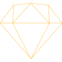 |
| `sketch-plain` | 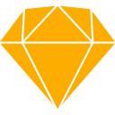 |
| `sketch-line-wordmark` |  |
| `typo3-line` |  |
| `typo3-line-wordmark` |  |
| `typo3-original` |  |
| `typo3-plain-wordmark` |  |
| `typo3-original-wordmark` |  |
| `storybook-plain` |  |
| `storybook-original` |  |
| `storybook-plain-wordmark` |  |
| `storybook-original-wordmark` |  |
| `dot-net-plain` |  |
| `dot-net-plain-wordmark` |  |
| `dot-net-original` |  |
| `dot-net-original-wordmark` |  |
| `bulma-plain` |  |
| `threedsmax-original` |  |
| `threedsmax-plain` |  |
| `maven-original` |  |
| `maven-original-wordmark` |  |
| `maven-plain` |  |
| `maven-plain-wordmark` |  |
| `clojure-line` |  |
| `clojure-original` |  |
| `apache-line-wordmark` |  |
| `apache-original` |  |
| `apache-original-wordmark` |  |
| `apache-line` |  |
| `apache-plain-wordmark` |  |
| `apache-plain` |  |
| `nodewebkit-original-wordmark` |  |
| `nodewebkit-line` | 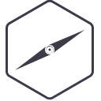 |
| `nodewebkit-line-wordmark` |  |
| `nodewebkit-plain-wordmark` |  |
| `nodewebkit-original` |  |
| `nodewebkit-plain` |  |
| `dropwizard-plain` | 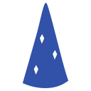 |
| `dropwizard-original` |  |
| `aarch64-original` |  |
| `aarch64-line` |  |
| `aarch64-plain` |  |
| `neovim-plain` |  |
| `neovim-line-wordmark` |  |
| `neovim-line` |  |
| `neovim-original-wordmark` |  |
| `neovim-plain-wordmark` |  |
| `neovim-original` |  |
| `zustand-plain` |  |
| `zustand-original` |  |
| `angular-plain-wordmark` |  |
| `angular-original` |  |
| `angular-plain` |  |
| `angular-original-wordmark` |  |
| `eclipse-plain-wordmark` |  |
| `eclipse-original-wordmark` |  |
| `eclipse-original` |  |
| `eclipse-plain` |  |
| `doctrine-original` |  |
| `doctrine-plain-wordmark` |  |
| `doctrine-original-wordmark` |  |
| `doctrine-line-wordmark` |  |
| `doctrine-plain` |  |
| `doctrine-line` |  |
| `postcss-original-wordmark` |  |
| `postcss-original` | 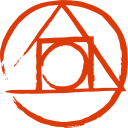 |
| `postcss-plain-wordmark` |  |
| `openstack-original-wordmark` |  |
| `openstack-original` |  |
| `openstack-plain-wordmark` |  |
| `css3-plain-wordmark` |  |
| `css3-original` |  |
| `css3-original-wordmark` |  |
| `css3-plain` |  |
| `shotgrid-original-wordmark` |  |
| `shotgrid-plain` |  |
| `shotgrid-original` |  |
| `kubeflow-plain-wordmark` |  |
| `kubeflow-line-wordmark` |  |
| `kubeflow-plain` |  |
| `kubeflow-original` |  |
| `kubeflow-line` |  |
| `kubeflow-original-wordmark` |  |
| `swagger-plain-wordmark` |  |
| `swagger-original-wordmark` |  |
| `swagger-plain` |  |
| `swagger-original` |  |
| `yii-original` |  |
| `yii-plain` |  |
| `yii-original-wordmark` |  |
| `yii-plain-wordmark` |  |
| `nuget-original-wordmark` |  |
| `nuget-original` |  |
| `firebird-original` |  |
| `firebird-plain` |  |
| `linkedin-plain-wordmark` |  |
| `linkedin-plain` |  |
| `linkedin-original` |  |
| `linkedin-original-wordmark` |  |
| `spyder-original-wordmark` |  |
| `spyder-plain-wordmark` |  |
| `spyder-original` |  |
| `spyder-plain` |  |
| `nim-line` | 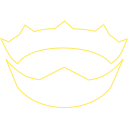 |
| `nim-original-wordmark` |  |
| `nim-plain` |  |
| `nim-original` |  |
| `nim-plain-wordmark` |  |
| `nim-line-wordmark` | 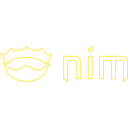 |
| `kibana-plain` |  |
| `kibana-original` |  |
| `kibana-original-wordmark` |  |
| `kibana-plain-wordmark` |  |
| `apl-original` |  |
| `apl-plain` |  |
| `salesforce-original` |  |
| `salesforce-plain` |  |
| `openal-plain` |  |
| `openal-original` |  |
| `datagrip-original` |  |
| `datagrip-plain-wordmark` |  |
| `datagrip-plain` | 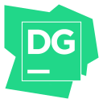 |
| `sdl-plain` |  |
| `sdl-original` |  |
| `ngrok-original` |  |
| `ngrok-line` |  |
| `opencl-original` |  |
| `opencl-line` |  |
| `opencl-plain` |  |
| `faunadb-original` |  |
| `faunadb-line` | 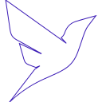 |
| `faunadb-line-wordmark` |  |
| `faunadb-original-wordmark` |  |
| `linuxmint-original` |  |
| `linuxmint-plain-wordmark` |  |
| `linuxmint-plain` |  |
| `linuxmint-original-wordmark` |  |
| `c-original` |  |
| `c-line` |  |
| `lua-plain` |  |
| `lua-line` |  |
| `lua-original` |  |
| `contao-original-wordmark` |  |
| `contao-original` |  |
| `ceylon-plain-wordmark` |  |
| `ceylon-original` |  |
| `ceylon-plain` |  |
| `ceylon-original-wordmark` |  |
| `harbor-line` |  |
| `harbor-original` |  |
| `harbor-line-wordmark` |  |
| `harbor-plain` |  |
| `harbor-plain-wordmark` |  |
| `harbor-original-wordmark` |  |
| `linux-plain` |  |
| `linux-original` |  |
| `knockout-plain-wordmark` |  |
| `sema-original` |  |
| `sema-original-wordmark` |  |
| `datadog-original-wordmark` |  |
| `datadog-original` |  |
| `julia-plain` |  |
| `julia-plain-wordmark` |  |
| `julia-original-wordmark` |  |
| `julia-original` |  |
| `fusion-plain` |  |
| `fusion-original` |  |
| `terraform-plain-wordmark` |  |
| `terraform-original-wordmark` |  |
| `terraform-original` |  |
| `terraform-plain` |  |
| `react-original` |  |
| `react-original-wordmark` |  |
| `k3os-line` |  |
| `k3os-line-wordmark` |  |
| `k3os-plain-wordmark` |  |
| `k3os-original-wordmark` |  |
| `k3os-original` |  |
| `rabbitmq-original-wordmark` |  |
| `rabbitmq-original` |  |
| `rabbitmq-plain-wordmark` |  |
| `slack-plain-wordmark` |  |
| `slack-plain` |  |
| `slack-original` |  |
| `slack-original-wordmark` |  |
| `nodered-original` |  |
| `nodered-line` | 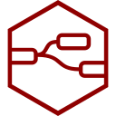 |
| `nodered-plain` | 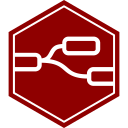 |
| `backbonejs-plain-wordmark` |  |
| `backbonejs-original` |  |
| `backbonejs-plain` |  |
| `backbonejs-original-wordmark` |  |
| `portainer-original-wordmark` |  |
| `portainer-original` |  |
| `fastapi-plain` |  |
| `fastapi-original-wordmark` |  |
| `fastapi-original` |  |
| `fastapi-plain-wordmark` |  |
| `circleci-plain-wordmark` |  |
| `circleci-plain` |  |
| `bootstrap-plain-wordmark` |  |
| `bootstrap-plain` |  |
| `bootstrap-original` |  |
| `bootstrap-original-wordmark` |  |
| `minitab-original` |  |
| `minitab-plain` |  |
| `bitbucket-original-wordmark` |  |
| `bitbucket-original` |  |
| `sanity-plain` |  |
| `sanity-original` |  |
| `couchbase-original-wordmark` |  |
| `couchbase-plain-wordmark` |  |
| `couchbase-original` |  |
| `turbo-original` |  |
| `turbo-original-wordmark` |  |
| `turbo-plain-wordmark` |  |
| `mariadb-original` |  |
| `mariadb-original-wordmark` |  |
| `handlebars-original-wordmark` |  |
| `handlebars-line-wordmark` |  |
| `handlebars-line` |  |
| `handlebars-original` |  |
| `yugabytedb-plain-wordmark` |  |
| `yugabytedb-plain` |  |
| `yugabytedb-original-wordmark` |  |
| `yugabytedb-original` |  |
| `titaniumsdk-original` |  |
| `gimp-original-wordmark` |  |
| `gimp-line` | 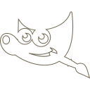 |
| `gimp-plain` |  |
| `gimp-plain-wordmark` |  |
| `gimp-line-wordmark` |  |
| `gimp-original` |  |
| `babylonjs-plain-wordmark` |  |
| `babylonjs-original` |  |
| `babylonjs-plain` |  |
| `babylonjs-original-wordmark` |  |
| `supabase-plain-wordmark` |  |
| `supabase-original-wordmark` |  |
| `supabase-original` |  |
| `supabase-plain` |  |
| `apachekafka-original` |  |
| `apachekafka-original-wordmark` |  |
| `traefikproxy-original-wordmark` |  |
| `traefikproxy-line` |  |
| `traefikproxy-line-wordmark` |  |
| `traefikproxy-original` |  |
| `traefikproxy-plain-wordmark` |  |
| `astro-original-wordmark` |  |
| `astro-plain` |  |
| `astro-plain-wordmark` |  |
| `astro-original` |  |
| `xamarin-original-wordmark` |  |
| `xamarin-original` |  |
| `msdos-original` |  |
| `msdos-plain` |  |
| `msdos-line` |  |
| `confluence-original` |  |
| `confluence-plain` |  |
| `confluence-plain-wordmark` |  |
| `confluence-original-wordmark` |  |
| `confluence-line` | 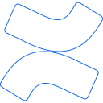 |
| `confluence-line-wordmark` |  |
| `illustrator-line` |  |
| `illustrator-original` |  |
| `illustrator-plain` |  |
| `sass-original` |  |
| `jasmine-original` |  |
| `jasmine-original-wordmark` |  |
| `argocd-original` |  |
| `argocd-plain` |  |
| `argocd-original-wordmark` |  |
| `argocd-plain-wordmark` |  |
| `webflow-original` |  |
| `google-original` |  |
| `google-original-wordmark` |  |
| `google-plain-wordmark` |  |
| `google-plain` |  |
| `ifttt-original` |  |
| `pypi-plain-wordmark` |  |
| `pypi-plain` |  |
| `pypi-original-wordmark` | 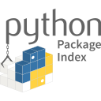 |
| `pypi-original` |  |
| `networkx-original-wordmark` |  |
| `networkx-line` |  |
| `networkx-plain-wordmark` |  |
| `networkx-plain` |  |
| `networkx-original` |  |
| `networkx-line-wordmark` |  |
| `oauth-plain` |  |
| `oauth-original` |  |
| `cloudflare-original-wordmark` |  |
| `cloudflare-plain-wordmark` |  |
| `cloudflare-original` |  |
| `cloudflare-plain` |  |
| `objectivec-plain` |  |
| `web3js-original` |  |
| `web3js-plain` |  |
| `jaegertracing-plain` |  |
| `jaegertracing-original` |  |
| `jaegertracing-plain-wordmark` | 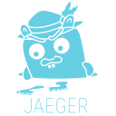 |
| `jaegertracing-original-wordmark` |  |
| `gradle-original` |  |
| `gradle-original-wordmark` |  |
| `phoenix-original` |  |
| `phoenix-original-wordmark` |  |
| `phoenix-plain-wordmark` |  |
| `biome-line` |  |
| `biome-original-wordmark` |  |
| `biome-plain-wordmark` |  |
| `biome-original` |  |
| `biome-line-wordmark` |  |
| `rails-plain-wordmark` |  |
| `rails-plain` |  |
| `rails-original-wordmark` |  |
| `matplotlib-original-wordmark` |  |
| `matplotlib-plain` |  |
| `matplotlib-original` |  |
| `matplotlib-plain-wordmark` |  |
| `reactrouter-original` |  |
| `reactrouter-plain` |  |
| `reactrouter-plain-wordmark` |  |
| `reactrouter-original-wordmark` |  |
| `kaldi-original-wordmark` |  |
| `kaldi-line-wordmark` |  |
| `kaldi-line` |  |
| `kaldi-original` |  |
| `kaldi-plain-wordmark` |  |
| `kaldi-plain` |  |
| `qwik-plain` |  |
| `qwik-original` |  |
| `qwik-plain-wordmark` |  |
| `qwik-original-wordmark` |  |
| `symfony-original` |  |
| `symfony-original-wordmark` |  |
| `codecov-plain` |  |
| `cassandra-original` |  |
| `cassandra-plain-wordmark` |  |
| `cassandra-original-wordmark` | 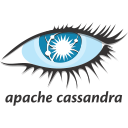 |
| `cassandra-plain` |  |
| `nhibernate-original-wordmark` | 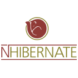 |
| `nhibernate-line-wordmark` |  |
| `nhibernate-plain-wordmark` | 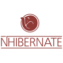 |
| `nhibernate-original` |  |
| `nhibernate-line` | 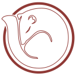 |
| `nhibernate-plain` |  |
| `googlecolab-plain` |  |
| `googlecolab-original` |  |
| `corejs-original-wordmark` |  |
| `corejs-original` |  |
| `protractor-plain-wordmark` |  |
| `protractor-original-wordmark` |  |
| `protractor-original` |  |
| `protractor-line-wordmark` |  |
| `protractor-plain` |  |
| `protractor-line` | 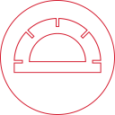 |
| `vim-plain` |  |
| `vim-original` |  |
| `cakephp-plain-wordmark` |  |
| `cakephp-original-wordmark` |  |
| `cakephp-original` |  |
| `cakephp-plain` |  |
| `dovecot-original` |  |
| `dovecot-plain` |  |
| `dovecot-line` |  |
| `express-original-wordmark` |  |
| `express-original` |  |
| `rspec-plain-wordmark` |  |
| `rspec-original-wordmark` |  |
| `rspec-original` |  |
| `rspec-plain` |  |
| `rspec-line` |  |
| `rspec-line-wordmark` |  |
| `fedora-original` |  |
| `fedora-plain` |  |
| `logstash-original-wordmark` |  |
| `logstash-plain-wordmark` |  |
| `logstash-original` |  |
| `logstash-plain` |  |
| `tomcat-original-wordmark` |  |
| `tomcat-line-wordmark` |  |
| `tomcat-original` |  |
| `tomcat-line` |  |
| `pulumi-original-wordmark` |  |
| `pulumi-plain-wordmark` |  |
| `pulumi-original` |  |
| `pulumi-plain` |  |
| `karatelabs-plain-wordmark` |  |
| `karatelabs-original-wordmark` |  |
| `karatelabs-original` |  |
| `karatelabs-plain` |  |
| `html5-original-wordmark` |  |
| `html5-original` |  |
| `html5-plain-wordmark` |  |
| `html5-plain` |  |
| `pytest-original-wordmark` |  |
| `pytest-plain` |  |
| `pytest-plain-wordmark` |  |
| `pytest-original` |  |
| `prometheus-line-wordmark` |  |
| `prometheus-original` |  |
| `prometheus-original-wordmark` |  |
| `prometheus-plain-wordmark` |  |
| `prometheus-line` |  |
| `drupal-plain-wordmark` |  |
| `drupal-plain` |  |
| `drupal-original-wordmark` |  |
| `drupal-original` |  |
| `sqlalchemy-original-wordmark` |  |
| `sqlalchemy-plain` |  |
| `sqlalchemy-original` |  |
| `sqlalchemy-plain-wordmark` |  |
| `ghost-original` |  |
| `ghost-original-wordmark` |  |
| `pycharm-original-wordmark` |  |
| `pycharm-plain` |  |
| `pycharm-plain-wordmark` |  |
| `pycharm-original` |  |
| `framework7-original-wordmark` |  |
| `framework7-original` |  |
| `datatables-original` |  |
| `readthedocs-line` |  |
| `readthedocs-original` |  |
| `readthedocs-original-wordmark` |  |
| `threejs-original-wordmark` |  |
| `threejs-original` |  |
| `adonisjs-original-wordmark` |  |
| `adonisjs-original` |  |
| `vagrant-original-wordmark` |  |
| `vagrant-plain-wordmark` |  |
| `vagrant-original` |  |
| `vagrant-plain` |  |
| `firebase-plain` |  |
| `firebase-original-wordmark` |  |
| `firebase-plain-wordmark` |  |
| `firebase-line-wordmark` |  |
| `firebase-original` |  |
| `firebase-line` | 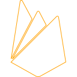 |
| `rect-original` |  |
| `rect-plain` |  |
| `ubuntu-original` |  |
| `ubuntu-plain` |  |
| `ubuntu-original-wordmark` |  |
| `ubuntu-plain-wordmark` |  |
| `oracle-original` |  |
| `stylus-original` |  |
| `nomad-original-wordmark` |  |
| `nomad-original` |  |
| `nomad-plain-wordmark` |  |
| `opengl-plain` |  |
| `opengl-original` |  |
| `hoppscotch-plain` |  |
| `hoppscotch-original` |  |
| `dataspell-plain-wordmark` |  |
| `dataspell-original` |  |
| `dataspell-plain` | 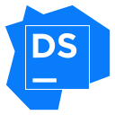 |
| `dataspell-original-wordmark` |  |
| `styledcomponents-plain` | 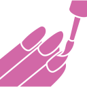 |
| `styledcomponents-plain-wordmark` | 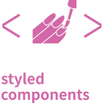 |
| `styledcomponents-original` |  |
| `styledcomponents-original-wordmark` | 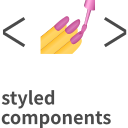 |
| `k3s-plain-wordmark` |  |
| `k3s-original` |  |
| `k3s-original-wordmark` |  |
| `realm-plain-wordmark` |  |
| `realm-plain` |  |
| `realm-original-wordmark` |  |
| `realm-original` |  |
| `azure-plain` |  |
| `azure-original` |  |
| `azure-plain-wordmark` |  |
| `azure-original-wordmark` |  |
| `composer-line-wordmark` |  |
| `composer-line` |  |
| `composer-original` |  |
| `figma-original` |  |
| `figma-plain` |  |
| `moleculer-original` |  |
| `moleculer-original-wordmark` |  |
| `npm-original-wordmark` |  |
| `npm-original` |  |
| `npm-plain` |  |
| `androidstudio-plain-wordmark` |  |
| `androidstudio-original` |  |
| `androidstudio-plain` |  |
| `androidstudio-original-wordmark` |  |
| `photonengine-plain` |  |
| `photonengine-original` |  |
| `almalinux-original` |  |
| `almalinux-plain-wordmark` |  |
| `almalinux-plain` |  |
| `almalinux-original-wordmark` |  |
| `cpanel-original` |  |
| `cpanel-original-wordmark` |  |
| `go-original` |  |
| `go-line` |  |
| `go-plain` |  |
| `go-original-wordmark` |  |
| `eslint-plain` |  |
| `eslint-original-wordmark` |  |
| `eslint-line-wordmark` |  |
| `eslint-plain-wordmark` |  |
| `eslint-line` | 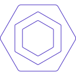 |
| `eslint-original` |  |
| `ie10-original` |  |
| `vitess-original` |  |
| `vitess-plain` |  |
| `vitess-plain-wordmark` |  |
| `vitess-original-wordmark` |  |
| `rstudio-plain` |  |
| `rstudio-original` |  |
| `xd-line` |  |
| `xd-original` |  |
| `xd-plain` |  |
| `javascript-original` |  |
| `javascript-plain` |  |
| `blender-original-wordmark` |  |
| `blender-original` |  |
| `prolog-original` |  |
| `prolog-plain-wordmark` |  |
| `prolog-original-wordmark` |  |
| `prolog-plain` |  |
| `phalcon-original` | 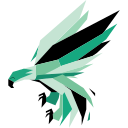 |
| `phalcon-plain` | 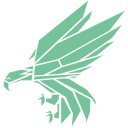 |
| `powershell-original` |  |
| `powershell-plain` |  |
| `electron-original-wordmark` |  |
| `electron-original` |  |
| `fortran-original` |  |
| `moodle-original-wordmark` |  |
| `moodle-plain-wordmark` |  |
| `moodle-original` |  |
| `moodle-plain` |  |
| `svelte-plain` |  |
| `svelte-plain-wordmark` |  |
| `svelte-original-wordmark` |  |
| `svelte-original` |  |
| `purescript-original-wordmark` |  |
| `purescript-original` |  |
| `zig-plain-wordmark` |  |
| `zig-original-wordmark` |  |
| `zig-original` |  |
| `djangorest-line` | 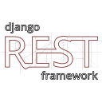 |
| `djangorest-plain` |  |
| `djangorest-original` |  |
| `djangorest-line-wordmark` |  |
| `djangorest-plain-wordmark` |  |
| `djangorest-original-wordmark` |  |
| `liquibase-original` |  |
| `liquibase-original-wordmark` |  |
| `rust-original` |  |
| `rust-line` |  |
| `dotnetcore-original` |  |
| `dotnetcore-plain` |  |
| `cucumber-plain-wordmark` |  |
| `cucumber-plain` |  |
| `trpc-plain` |  |
| `trpc-original-wordmark` |  |
| `trpc-original` |  |
| `trpc-plain-wordmark` |  |
| `vsphere-line` |  |
| `vsphere-line-wordmark` |  |
| `vsphere-original-wordmark` |  |
| `vsphere-original` |  |
| `vsphere-plain-wordmark` |  |
| `vsphere-plain` |  |
| `django-plain-wordmark` |  |
| `django-plain` |  |
| `radstudio-original` |  |
| `radstudio-plain` |  |
| `ionic-original` |  |
| `ionic-original-wordmark` |  |
| `intellij-plain` | 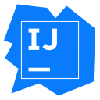 |
| `intellij-original` |  |
| `intellij-plain-wordmark` |  |
| `raspberrypi-line-wordmark` | 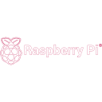 |
| `raspberrypi-original` | 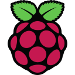 |
| `raspberrypi-plain` |  |
| `raspberrypi-original-wordmark` |  |
| `raspberrypi-plain-wordmark` | 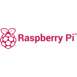 |
| `raspberrypi-line` | 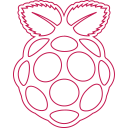 |
| `bash-plain` |  |
| `bash-original` |  |
| `gatsby-original-wordmark` |  |
| `gatsby-original` |  |
| `gatsby-plain-wordmark` |  |
| `insomnia-plain` |  |
| `insomnia-plain-wordmark` |  |
| `insomnia-original-wordmark` |  |
| `insomnia-original` |  |
| `gitkraken-original-wordmark` |  |
| `gitkraken-plain-wordmark` |  |
| `gitkraken-original` |  |
| `cairo-original` |  |
| `cairo-plain-wordmark` |  |
| `cairo-original-wordmark` |  |
| `cairo-plain` |  |
| `typescript-original` |  |
| `typescript-plain` |  |
| `json-original` |  |
| `json-plain` |  |
| `llvm-plain` |  |
| `llvm-original` |  |
| `llvm-line` | 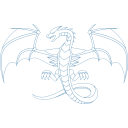 |
| `influxdb-original-wordmark` |  |
| `influxdb-original` | 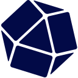 |
| `rockylinux-original-wordmark` |  |
| `rockylinux-plain-wordmark` |  |
| `rockylinux-original` |  |
| `racket-line` |  |
| `racket-plain` |  |
| `racket-original` |  |
| `qt-original` |  |
| `clarity-plain-wordmark` |  |
| `clarity-original` |  |
| `clarity-plain` |  |
| `clarity-original-wordmark` |  |
| `labview-plain-wordmark` |  |
| `labview-original` |  |
| `labview-plain` |  |
| `labview-original-wordmark` |  |
| `ember-original-wordmark` |  |
| `ember-plain` |  |
| `ember-original` |  |
| `uwsgi-original` |  |
| `uwsgi-plain` |  |
| `nodejs-plain-wordmark` |  |
| `nodejs-line` |  |
| `nodejs-line-wordmark` |  |
| `nodejs-plain` |  |
| `nodejs-original-wordmark` |  |
| `nodejs-original` |  |
| `nestjs-line-wordmark` |  |
| `nestjs-line` |  |
| `nestjs-original-wordmark` |  |
| `nestjs-original` |  |
| `sourcetree-original-wordmark` |  |
| `sourcetree-original` |  |
| `terramate-original` |  |
| `terramate-original-wordmark` |  |
| `materializecss-plain` |  |
| `materializecss-original` |  |
| `numpy-plain-wordmark` |  |
| `numpy-plain` |  |
| `numpy-line-wordmark` |  |
| `numpy-original` |  |
| `numpy-line` |  |
| `numpy-original-wordmark` |  |
| `leetcode-plain-wordmark` |  |
| `leetcode-line` |  |
| `leetcode-plain` |  |
| `leetcode-line-wordmark` |  |
| `leetcode-original-wordmark` |  |
| `leetcode-original` |  |
| `capacitor-plain` |  |
| `capacitor-plain-wordmark` |  |
| `capacitor-original` |  |
| `capacitor-original-wordmark` |  |
| `reach-plain` |  |
| `reach-original` |  |
| `stata-original-wordmark` |  |
| `mocha-plain` |  |
| `mocha-original` |  |
| `discordjs-original-wordmark` |  |
| `discordjs-plain` |  |
| `discordjs-original` |  |
| `discordjs-plain-wordmark` |  |
| `gulp-plain` |  |
| `svgo-original` |  |
| `svgo-line-wordmark` |  |
| `svgo-plain-wordmark` |  |
| `svgo-plain` |  |
| `svgo-line` |  |
| `svgo-original-wordmark` |  |
| `graphql-plain` |  |
| `graphql-plain-wordmark` |  |
| `reactnavigation-original` |  |
| `alpinejs-original` |  |
| `alpinejs-original-wordmark` |  |
| `sourceengine-plain-wordmark` |  |
| `sourceengine-original` |  |
| `sourceengine-plain` |  |
| `sourceengine-original-wordmark` |  |
| `spack-original` |  |
| `spack-plain` |  |
| `nixos-original-wordmark` |  |
| `nixos-plain` |  |
| `nixos-original` |  |
| `nixos-plain-wordmark` |  |
| `ohmyzsh-original` |  |
| `ohmyzsh-plain` |  |
| `qtest-original` |  |
| `qtest-original-wordmark` |  |
| `nuxt-plain-wordmark` |  |
| `nuxt-original` |  |
| `nuxt-original-wordmark` |  |
| `r-original` |  |
| `r-line` |  |
| `r-plain` |  |
| `processwire-original` |  |
| `processwire-original-wordmark` |  |
| `processwire-plain-wordmark` |  |
| `nuxtjs-plain` |  |
| `nuxtjs-original-wordmark` |  |
| `nuxtjs-plain-wordmark` |  |
| `nuxtjs-original` |  |
| `nats-plain` |  |
| `nats-original` |  |
| `jiraalign-original-wordmark` |  |
| `jiraalign-plain-wordmark` |  |
| `jiraalign-original` |  |
| `jiraalign-plain` |  |
| `scala-plain` |  |
| `scala-plain-wordmark` |  |
| `scala-original` |  |
| `scala-original-wordmark` |  |
| `laminas-line-wordmark` |  |
| `laminas-line` |  |
| `laminas-original-wordmark` |  |
| `laminas-original` |  |
| `haxe-plain` |  |
| `haxe-original` |  |
| `yaml-plain` |  |
| `yaml-original` |  |
| `webgpu-line-wordmark` |  |
| `webgpu-plain-wordmark` |  |
| `webgpu-original-wordmark` |  |
| `webgpu-original` |  |
| `webgpu-line` |  |
| `webgpu-plain` |  |
| `googlecloud-plain-wordmark` |  |
| `googlecloud-original-wordmark` |  |
| `googlecloud-original` |  |
| `googlecloud-plain` |  |
| `podman-original-wordmark` |  |
| `podman-plain-wordmark` |  |
| `podman-original` |  |
| `podman-plain` |  |
| `jenkins-line` |  |
| `jenkins-original` |  |
| `jenkins-plain` |  |
| `netlify-original` |  |
| `netlify-plain` |  |
| `netlify-plain-wordmark` |  |
| `netlify-original-wordmark` |  |
| `pug-original` |  |
| `pug-line` |  |
| `pug-plain` |  |
| `reactbootstrap-original` |  |
| `p5js-original` |  |
| `vulkan-line` |  |
| `vulkan-original` |  |
| `rexx-original-wordmark` |  |
| `rexx-plain-wordmark` |  |
| `rexx-original` |  |
| `rexx-plain` |  |
| `elixir-original-wordmark` |  |
| `elixir-plain` |  |
| `elixir-original` |  |
| `elixir-plain-wordmark` |  |
| `bun-original` |  |
| `bun-plain` |  |
| `bun-line` |  |
| `azuredevops-plain` |  |
| `azuredevops-original` |  |
| `aframe-plain` |  |
| `aframe-original` |  |
| `aframe-original-wordmark` |  |
| `csharp-plain` |  |
| `csharp-line` |  |
| `csharp-original` |  |
| `rider-original` |  |
| `rider-plain` |  |
| `rider-plain-wordmark` |  |
| `rider-original-wordmark` |  |
| `browserstack-line-wordmark` |  |
| `browserstack-plain-wordmark` |  |
| `browserstack-original` |  |
| `browserstack-plain` |  |
| `browserstack-original-wordmark` |  |
| `browserstack-line` |  |
| `socketio-original` |  |
| `socketio-original-wordmark` |  |
| `grunt-line-wordmark` |  |
| `grunt-line` |  |
| `grunt-plain` |  |
| `grunt-original-wordmark` |  |
| `grunt-plain-wordmark` |  |
| `grunt-original` |  |
| `envoy-plain-wordmark` |  |
| `envoy-plain` |  |
| `envoy-original-wordmark` |  |
| `envoy-original` |  |
| `nginx-original` |  |
| `processing-plain` |  |
| `processing-line` |  |
| `processing-original` |  |
| `magento-line-wordmark` |  |
| `magento-original-wordmark` |  |
| `magento-plain-wordmark` |  |
| `magento-original` |  |
| `magento-line` |  |
| `amazonwebservices-plain-wordmark` |  |
| `amazonwebservices-line-wordmark` |  |
| `amazonwebservices-original-wordmark` |  |
| `pfsense-original` |  |
| `pfsense-original-wordmark` |  |
| `mercurial-plain` |  |
| `mercurial-original` |  |
| `mercurial-plain-wordmark` |  |
| `mercurial-original-wordmark` |  |
| `glitch-original` |  |
| `glitch-plain` |  |
| `openapi-plain-wordmark` |  |
| `openapi-line` |  |
| `openapi-line-wordmark` |  |
| `openapi-plain` |  |
| `openapi-original` |  |
| `openapi-original-wordmark` |  |
| `jira-plain` |  |
| `jira-plain-wordmark` |  |
| `jira-original` |  |
| `jira-original-wordmark` |  |
| `mapbox-original` |  |
| `vertx-original` |  |
| `vertx-original-wordmark` |  |
| `vertx-line-wordmark` |  |
| `vertx-line` |  |
| `vertx-plain` |  |
| `vertx-plain-wordmark` |  |
| `trello-original-wordmark` |  |
| `trello-plain-wordmark` |  |
| `trello-line` |  |
| `trello-plain` |  |
| `trello-original` |  |
| `trello-line-wordmark` |  |
| `apacheairflow-original-wordmark` |  |
| `apacheairflow-original` |  |
| `apacheairflow-plain` |  |
| `apacheairflow-plain-wordmark` |  |
| `wolfram-original` |  |
| `wolfram-plain-wordmark` |  |
| `wolfram-plain` |  |
| `wolfram-original-wordmark` |  |
| `duckdb-original` |  |
| `duckdb-plain` |  |
| `vitest-plain` |  |
| `vitest-original` |  |
| `fastify-plain-wordmark` |  |
| `fastify-original` |  |
| `fastify-original-wordmark` |  |
| `fastify-plain` |  |
| `visualstudio-original-wordmark` |  |
| `visualstudio-plain-wordmark` |  |
| `visualstudio-plain` |  |
| `visualstudio-line-wordmark` |  |
| `visualstudio-original` |  |
| `visualstudio-line` |  |
| `k6-original` |  |
| `algolia-original` |  |
| `algolia-original-wordmark` |  |
| `livewire-plain` |  |
| `livewire-plain-wordmark` |  |
| `livewire-original` |  |
| `livewire-original-wordmark` |  |
| `hyperv-original-wordmark` |  |
| `hyperv-original` |  |
| `hyperv-plain` |  |
| `newrelic-original` |  |
| `newrelic-line` |  |
| `newrelic-plain` |  |
| `clion-plain` |  |
| `clion-plain-wordmark` |  |
| `clion-original-wordmark` |  |
| `clion-original` |  |
| `talos-plain` |  |
| `talos-original` |  |
| `modx-plain-wordmark` |  |
| `modx-original` |  |
| `modx-plain` |  |
| `modx-original-wordmark` |  |
| `hadoop-plain` |  |
| `hadoop-plain-wordmark` |  |
| `hadoop-original-wordmark` |  |
| `hadoop-original` |  |
| `wordpress-plain` |  |
| `wordpress-original` |  |
| `wordpress-plain-wordmark` |  |
| `grafana-original-wordmark` |  |
| `grafana-plain` |  |
| `grafana-line` |  |
| `grafana-original` |  |
| `grafana-plain-wordmark` |  |
| `grafana-line-wordmark` |  |
| `karma-original` |  |
| `karma-plain` |  |
| `qodana-plain` |  |
| `qodana-original` |  |
| `qodana-plain-wordmark` |  |
| `vitejs-plain` |  |
| `vitejs-original` |  |
| `traefikmesh-plain-wordmark` |  |
| `traefikmesh-line-wordmark` |  |
| `traefikmesh-line` |  |
| `traefikmesh-original-wordmark` |  |
| `traefikmesh-original` |  |
| `towergit-original` |  |
| `towergit-plain-wordmark` |  |
| `towergit-original-wordmark` |  |
| `towergit-plain` |  |
| `xml-plain` |  |
| `xml-original` |  |
| `xml-line` |  |
| `pytorch-original-wordmark` |  |
| `pytorch-original` |  |
| `pytorch-plain-wordmark` |  |
| `carbon-original` |  |
| `expo-original-wordmark` |  |
| `expo-line-wordmark` |  |
| `expo-line` |  |
| `expo-original` |  |
| `splunk-original-wordmark` |  |
| `framermotion-original-wordmark` |  |
| `framermotion-original` |  |
| `cmake-plain-wordmark` |  |
| `cmake-original` |  |
| `cmake-original-wordmark` |  |
| `cmake-plain` |  |
| `laravel-line-wordmark` |  |
| `laravel-original-wordmark` |  |
| `laravel-original` |  |
| `laravel-line` |  |
| `discloud-original` |  |
| `discloud-original-wordmark` |  |
| `discloud-plain-wordmark` |  |
| `matlab-line` |  |
| `matlab-plain` |  |
| `matlab-original` |  |
| `blazor-line` |  |
| `blazor-original` |  |
| `centos-original-wordmark` |  |
| `centos-plain` |  |
| `centos-original` |  |
| `centos-plain-wordmark` |  |
| `scalingo-original` |  |
| `scalingo-plain-wordmark` |  |
| `scalingo-line-wordmark` |  |
| `scalingo-original-wordmark` |  |
| `scalingo-line` |  |
| `scalingo-plain` |  |
| `reactnative-original-wordmark` |  |
| `reactnative-original` |  |
| `kalilinux-original-wordmark` |  |
| `kalilinux-line-wordmark` |  |
| `kalilinux-original` |  |
| `kalilinux-plain-wordmark` |  |
| `kalilinux-line` |  |
| `vala-original-wordmark` |  |
| `vala-original` |  |
| `vala-plain` |  |
| `vala-plain-wordmark` |  |
| `flutter-plain` |  |
| `flutter-original` |  |
| `gleam-plain` |  |
| `gleam-original` |  |
| `renpy-plain` |  |
| `renpy-original` |  |
| `webpack-original` |  |
| `webpack-original-wordmark` |  |
| `webpack-plain-wordmark` |  |
| `webpack-plain` |  |
| `redux-original` |  |
| `windows8-original-wordmark` |  |
| `windows8-original` |  |
| `woocommerce-plain` |  |
| `woocommerce-plain-wordmark` |  |
| `woocommerce-original` |  |
| `woocommerce-original-wordmark` |  |
| `ory-original-wordmark` |  |
| `ory-original` |  |
| `krakenjs-plain-wordmark` |  |
| `krakenjs-original-wordmark` |  |
| `krakenjs-original` |  |
| `krakenjs-plain` |  |
| `opencv-plain` |  |
| `opencv-plain-wordmark` |  |
| `opencv-original` |  |
| `opencv-original-wordmark` |  |
| `mysql-plain-wordmark` |  |
| `mysql-original-wordmark` |  |
| `mysql-original` |  |
| `vuestorefront-plain` |  |
| `vuestorefront-original` |  |
| `ktor-plain-wordmark` |  |
| `ktor-original-wordmark` |  |
| `ktor-original` |  |
| `ktor-plain` |  |
| `delphi-original` |  |
| `delphi-plain` |  |
| `chrome-plain-wordmark` |  |
| `chrome-original-wordmark` |  |
| `chrome-plain` |  |
| `chrome-original` |  |
| `facebook-plain` |  |
| `facebook-original` |  |
| `ruby-plain` |  |
| `ruby-original-wordmark` |  |
| `ruby-plain-wordmark` |  |
| `ruby-original` |  |
| `puppeteer-plain` |  |
| `puppeteer-original` |  |
| `gardener-plain` |  |
| `gardener-line` |  |
| `gardener-original` |  |
| `phpstorm-plain` |  |
| `phpstorm-original` |  |
| `phpstorm-plain-wordmark` |  |
| `pulsar-original` |  |
| `pulsar-original-wordmark` |  |
| `cloudrun-plain` |  |
| `cloudrun-line` |  |
| `cloudrun-original` |  |
| `dyalog-original` |  |
| `dyalog-plain` |  |
| `grails-original` |  |
| `grails-plain` |  |
| `git-original-wordmark` |  |
| `git-plain-wordmark` |  |
| `git-plain` |  |
| `git-original` |  |
| `solidjs-plain-wordmark` |  |
| `solidjs-original` |  |
| `solidjs-original-wordmark` |  |
| `solidjs-plain` |  |
| `mongodb-original` |  |
| `mongodb-plain-wordmark` |  |
| `mongodb-original-wordmark` |  |
| `mongodb-plain` |  |
| `bower-plain` |  |
| `bower-plain-wordmark` |  |
| `bower-original` |  |
| `bower-original-wordmark` |  |
| `bower-line-wordmark` |  |
| `bower-line` |  |
| `replit-plain-wordmark` |  |
| `replit-original-wordmark` |  |
| `replit-original` |  |
| `stenciljs-original` |  |
| `stenciljs-plain` |  |
| `stenciljs-plain-wordmark` |  |
| `stenciljs-original-wordmark` |  |
| `thymeleaf-plain` |  |
| `thymeleaf-plain-wordmark` |  |
| `thymeleaf-original` |  |
| `thymeleaf-original-wordmark` |  |
| `jule-original` |  |
| `jule-original-wordmark` |  |
| `sequelize-original` |  |
| `sequelize-plain-wordmark` |  |
| `sequelize-plain` |  |
| `sequelize-original-wordmark` |  |
| `goland-plain` |  |
| `goland-plain-wordmark` |  |
| `goland-original` |  |
| `notion-plain` |  |
| `notion-line` |  |
| `notion-original` |  |
| `laraveljetstream-plain-wordmark` |  |
| `laraveljetstream-original` |  |
| `laraveljetstream-original-wordmark` |  |
| `filamentphp-original` |  |
| `pnpm-original-wordmark` |  |
| `pnpm-original` |  |
| `pnpm-plain` |  |
| `pnpm-plain-wordmark` |  |
| `vuejs-plain` |  |
| `vuejs-line-wordmark` |  |
| `vuejs-original` |  |
| `vuejs-line` |  |
| `vuejs-plain-wordmark` |  |
| `vuejs-original-wordmark` |  |
| `rancher-original-wordmark` |  |
| `rancher-original` |  |
| `rancher-line-wordmark` |  |
| `rancher-plain-wordmark` |  |
| `rancher-line` |  |
| `gitter-plain` |  |
| `gitter-plain-wordmark` |  |
| `codeac-original` |  |
| `nimble-original` |  |
| `nimble-plain` |  |
| `groovy-original` |  |
| `groovy-plain` |  |
| `ros-original-wordmark` |  |
| `ros-original` |  |
| `weblate-plain-wordmark` |  |
| `weblate-original-wordmark` |  |
| `weblate-original` |  |
| `weblate-plain` |  |
| `putty-plain` |  |
| `putty-original` |  |
| `quarkus-original` |  |
| `quarkus-original-wordmark` |  |
| `quarkus-plain` |  |
| `quarkus-plain-wordmark` |  |
| `jetpackcompose-plain-wordmark` |  |
| `jetpackcompose-line-wordmark` |  |
| `jetpackcompose-line` |  |
| `jetpackcompose-original-wordmark` |  |
| `jetpackcompose-plain` |  |
| `jetpackcompose-original` |  |
| `packer-plain` |  |
| `packer-line` |  |
| `packer-original-wordmark` |  |
| `packer-original` |  |
| `packer-plain-wordmark` |  |
| `packer-line-wordmark` |  |
| `monogame-original` |  |
| `monogame-line-wordmark` |  |
| `monogame-plain-wordmark` |  |
| `monogame-original-wordmark` |  |
| `monogame-line` |  |
| `apple-original` |  |
| `homebrew-plain` |  |
| `homebrew-original` |  |
| `homebrew-line-wordmark` |  |
| `homebrew-plain-wordmark` |  |
| `homebrew-line` |  |
| `homebrew-original-wordmark` |  |
| `clickhouse-original` |  |
| `clickhouse-plain` |  |
| `archlinux-plain` |  |
| `archlinux-plain-wordmark` |  |
| `archlinux-original` |  |
| `archlinux-original-wordmark` |  |
| `rollup-original-wordmark` |  |
| `rollup-original` |  |
| `rollup-plain` |  |
| `rollup-plain-wordmark` |  |
| `rollup-line-wordmark` |  |
| `rollup-line` |  |
| `hardhat-plain` |  |
| `hardhat-original-wordmark` |  |
| `hardhat-original` |  |
| `hardhat-plain-wordmark` |  |
| `codeigniter-plain-wordmark` |  |
| `codeigniter-plain` |  |
| `gcc-original` |  |
| `gcc-line` |  |
| `gcc-plain` |  |
| `netbox-original-wordmark` |  |
| `netbox-line-wordmark` |  |
| `netbox-plain` |  |
| `netbox-original` |  |
| `netbox-line` |  |
| `netbox-plain-wordmark` |  |
| `ssh-original` |  |
| `ssh-original-wordmark` |  |
| `npss-original` |  |
| `npss-plain` |  |
| `memcached-line-wordmark` |  |
| `memcached-plain` |  |
| `memcached-original-wordmark` |  |
| `memcached-line` |  |
| `memcached-original` |  |
| `memcached-plain-wordmark` |  |
| `postman-plain` |  |
| `postman-original` |  |
| `postman-plain-wordmark` |  |
| `postman-original-wordmark` |  |
| `vaadin-original-wordmark` |  |
| `vaadin-original` |  |
| `okta-original` |  |
| `okta-plain-wordmark` |  |
| `okta-original-wordmark` |  |
| `okta-plain` |  |
| `hugo-original` |  |
| `hugo-plain` |  |
| `hugo-original-wordmark` |  |
| `hugo-plain-wordmark` |  |
| `spring-original-wordmark` |  |
| `spring-original` |  |
| `elm-original-wordmark` |  |
| `elm-original` |  |
| `elm-plain-wordmark` |  |
| `elm-plain` |  |
| `markdown-original` |  |
| `gitbook-line` |  |
| `gitbook-original-wordmark` |  |
| `gitbook-line-wordmark` |  |
| `gitbook-original` |  |
| `perl-plain` |  |
| `perl-original` |  |
| `kdeneon-plain` |  |
| `kdeneon-original` |  |
| `jetbrains-plain` |  |
| `jetbrains-original` |  |
| `helm-line` |  |
| `helm-original` |  |
| `grpc-plain` |  |
| `grpc-original` |  |
| `babel-plain` |  |
| `babel-original` |  |
| `knexjs-plain-wordmark` |  |
| `knexjs-original-wordmark` |  |
| `knexjs-original` |  |
| `docker-plain-wordmark` |  |
| `docker-plain` |  |
| `docker-original` |  |
| `docker-original-wordmark` |  |
| `apex-original` |  |
| `sentry-original-wordmark` |  |
| `sentry-original` |  |
| `nextjs-line-wordmark` |  |
| `nextjs-original-wordmark` |  |
| `nextjs-line` |  |
| `nextjs-plain` |  |
| `nextjs-original` |  |
| `keras-line-wordmark` |  |
| `keras-plain-wordmark` |  |
| `keras-original-wordmark` |  |
| `keras-plain` |  |
| `keras-original` |  |
| `keras-line` |  |
| `ngrx-original` |  |
| `ngrx-plain` |  |
| `filezilla-line-wordmark` |  |
| `filezilla-plain` |  |
| `filezilla-original-wordmark` |  |
| `filezilla-plain-wordmark` |  |
| `filezilla-line` |  |
| `filezilla-original` |  |
| `visualbasic-plain` |  |
| `visualbasic-line` |  |
| `visualbasic-original` |  |
| `dreamweaver-plain` |  |
| `dreamweaver-original` |  |
| `dreamweaver-line` |  |
| `tortoisegit-original` |  |
| `tortoisegit-plain` |  |
| `tortoisegit-line` |  |
| `mithril-line` |  |
| `mithril-original` |  |
| `zend-line` |  |
| `zend-original` |  |
| `zend-line-wordmark` |  |
| `zend-original-wordmark` |  |
| `stackoverflow-original` |  |
| `stackoverflow-plain-wordmark` |  |
| `stackoverflow-plain` |  |
| `stackoverflow-line` |  |
| `stackoverflow-line-wordmark` |  |
| `stackoverflow-original-wordmark` |  |
| `gatling-line` |  |
| `gatling-original-wordmark` |  |
| `gatling-plain-wordmark` |  |
| `gatling-line-wordmark` |  |
| `gatling-original` |  |
| `clojurescript-original` |  |
| `clojurescript-plain` |  |
| `entityframeworkcore-original` |  |
| `entityframeworkcore-plain` |  |
| `entityframeworkcore-line` |  |
| `yarn-line` |  |
| `yarn-line-wordmark` |  |
| `yarn-original-wordmark` |  |
| `yarn-original` |  |
| `codepen-original` |  |
| `codepen-line` |  |
| `codepen-original-wordmark` |  |
| `codepen-line-wordmark` |  |
| `vyper-original` |  |
| `vyper-original-wordmark` |  |
| `chakraui-plain-wordmark` |  |
| `chakraui-plain` |  |
| `chakraui-original` |  |
| `chakraui-original-wordmark` |  |
| `foundation-original` |  |
| `foundation-plain` |  |
| `foundation-original-wordmark` |  |
| `foundation-plain-wordmark` |  |
| `dynatrace-original-wordmark` |  |
| `dynatrace-line-wordmark` |  |
| `dynatrace-original` |  |
| `dynatrace-plain-wordmark` |  |
| `dynatrace-line` |  |
| `dynatrace-plain` |  |
| `unifiedmodelinglanguage-original-wordmark` |  |
| `unifiedmodelinglanguage-original` |  |
| `unifiedmodelinglanguage-plain` |  |
| `unifiedmodelinglanguage-plain-wordmark` |  |
| `waku-line` |  |
| `waku-plain` |  |
| `waku-original` |  |
| `spss-plain` |  |
| `spss-original` |  |
| `gazebo-original` |  |
| `gazebo-original-wordmark` |  |
| `gazebo-plain-wordmark` |  |
| `gazebo-plain` |  |
| `axios-plain-wordmark` |  |
| `axios-plain` |  |
| `railway-line` |  |
| `railway-original` |  |
| `railway-line-wordmark` |  |
| `railway-original-wordmark` |  |
| `php-plain` |  |
| `php-original` |  |
| `jupyter-plain-wordmark` |  |
| `jupyter-original-wordmark` |  |
| `jupyter-original` |  |
| `jupyter-plain` |  |
| `sonarqube-original-wordmark` |  |
| `sonarqube-line` |  |
| `sonarqube-line-wordmark` |  |
| `sonarqube-plain-wordmark` |  |
| `sonarqube-original` |  |
| `cloudflareworkers-plain-wordmark` |  |
| `cloudflareworkers-original-wordmark` |  |
| `cloudflareworkers-plain` |  |
| `cloudflareworkers-original` |  |
| `cosmosdb-original-wordmark` |  |
| `cosmosdb-original` |  |
| `cosmosdb-plain` |  |
| `cosmosdb-plain-wordmark` |  |
| `crystal-line-wordmark` |  |
| `crystal-original-wordmark` |  |
| `crystal-original` |  |
| `crystal-line` |  |
| `haskell-original-wordmark` |  |
| `haskell-original` |  |
| `haskell-plain` |  |
| `haskell-plain-wordmark` |  |
| `python-plain-wordmark` |  |
| `python-original-wordmark` |  |
| `python-plain` |  |
| `python-original` |  |
| `mobx-plain` |  |
| `mobx-original` |  |
| `ansys-original-wordmark` |  |
| `ansys-original` |  |
| `ansys-plain` |  |
| `ansys-plain-wordmark` |  |
| `cobol-original` |  |
| `beats-original` |  |
| `beats-plain` |  |
| `anaconda-original-wordmark` |  |
| `anaconda-original` |  |
| `azuresqldatabase-plain` |  |
| `azuresqldatabase-original` |  |
| `denojs-original-wordmark` |  |
| `denojs-original` |  |
| `angularjs-plain-wordmark` |  |
| `angularjs-plain` |  |
| `angularjs-original` |  |
| `angularjs-original-wordmark` |  |
| `aerospike-original` |  |
| `aerospike-original-wordmark` |  |
| `pm2-plain` |  |
| `pm2-line` |  |
| `pm2-line-wordmark` |  |
| `pm2-plain-wordmark` |  |
| `pm2-original-wordmark` |  |
| `pm2-original` |  |
| `tmux-plain` |  |
| `tmux-original-wordmark` |  |
| `tmux-plain-wordmark` |  |
| `tmux-original` |  |
| `love2d-plain` |  |
| `love2d-line` |  |
| `love2d-original` |  |
| `kubernetes-plain` |  |
| `kubernetes-original-wordmark` |  |
| `kubernetes-plain-wordmark` |  |
| `kubernetes-original` |  |
| `kubernetes-line` |  |
| `kubernetes-line-wordmark` |  |
| `vuetify-line` |  |
| `vuetify-original` |  |
| `vuetify-plain` |  |
| `tailwindcss-original` |  |
| `tailwindcss-original-wordmark` |  |
| `tailwindcss-plain-wordmark` |  |
| `harvester-plain-wordmark` |  |
| `harvester-original-wordmark` |  |
| `harvester-original` |  |
| `ecto-plain-wordmark` |  |
| `ecto-original` |  |
| `ecto-original-wordmark` |  |
| `ballerina-line-wordmark` |  |
| `ballerina-line` |  |
| `ballerina-original-wordmark` |  |
| `ballerina-original` |  |
| `selenium-original` |  |
| `githubcodespaces-original` |  |
| `githubcodespaces-plain` |  |
| `mattermost-original-wordmark` |  |
| `mattermost-original` |  |
| `consul-original` |  |
| `consul-plain-wordmark` |  |
| `consul-original-wordmark` |  |
| `passport-original-wordmark` |  |
| `passport-original` |  |
| `passport-plain` |  |
| `rubymine-plain` |  |
| `rubymine-original-wordmark` |  |
| `rubymine-original` |  |
| `rubymine-plain-wordmark` |  |
| `jquery-original` |  |
| `jquery-plain-wordmark` |  |
| `jquery-plain` |  |
| `jquery-original-wordmark` |  |
| `jekyll-plain` |  |
| `jekyll-original-wordmark` |  |
| `jekyll-original` |  |
| `jekyll-plain-wordmark` |  |
| `wasm-original` |  |
| `wasm-plain-wordmark` |  |
| `wasm-original-wordmark` |  |
| `github-original-wordmark` |  |
| `github-original` |  |
| `sqldeveloper-plain` |  |
| `sqldeveloper-original` |  |
| `pyscript-original-wordmark` |  |
| `pyscript-plain-wordmark` |  |
| `yunohost-plain` |  |
| `yunohost-original` |  |
| `microsoftsqlserver-plain-wordmark` |  |
| `microsoftsqlserver-line` |  |
| `microsoftsqlserver-original` |  |
| `microsoftsqlserver-plain` |  |
| `microsoftsqlserver-original-wordmark` |  |
| `microsoftsqlserver-line-wordmark` |  |
| `dart-plain` |  |
| `dart-original` |  |
| `dart-plain-wordmark` |  |
| `dart-original-wordmark` |  |
| `bamboo-original-wordmark` |  |
| `bamboo-original` |  |
| `cplusplus-line` |  |
| `cplusplus-original` |  |
| `cplusplus-plain` |  |
| `tensorflow-line-wordmark` |  |
| `tensorflow-line` |  |
| `tensorflow-original` |  |
| `tensorflow-original-wordmark` |  |
| `redis-original` |  |
| `redis-original-wordmark` |  |
| `redis-plain-wordmark` |  |
| `redis-plain` |  |
| `unrealengine-original` |  |
| `unrealengine-original-wordmark` |  |
| `postgresql-original` |  |
| `postgresql-original-wordmark` |  |
| `postgresql-plain-wordmark` |  |
| `postgresql-plain` |  |
| `vercel-line-wordmark` |  |
| `vercel-original-wordmark` |  |
| `vercel-original` |  |
| `vercel-line` |  |
| `bazel-plain-wordmark` |  |
| `bazel-plain` |  |
| `bazel-original` |  |
| `bazel-original-wordmark` |  |
| `android-original` |  |
| `android-plain-wordmark` |  |
| `android-plain` |  |
| `android-original-wordmark` |  |
| `nodemon-line` |  |
| `nodemon-original` |  |
| `nodemon-plain` |  |
| `apachespark-plain-wordmark` |  |
| `apachespark-original` |  |
| `apachespark-original-wordmark` |  |
| `remix-original-wordmark` |  |
| `remix-line` |  |
| `remix-line-wordmark` |  |
| `remix-original` |  |
| `norg-plain` |  |
| `norg-original` |  |
| `rxjs-original` |  |
| `rxjs-plain` |  |
| `prisma-original-wordmark` |  |
| `prisma-original` |  |
| `travis-line-wordmark` |  |
| `travis-original-wordmark` |  |
| `travis-original` |  |
| `travis-plain-wordmark` |  |
| `travis-plain` |  |
| `travis-line` |  |
| `solidity-plain` |  |
| `solidity-original` |  |
| `redhat-original-wordmark` |  |
| `redhat-plain` |  |
| `redhat-original` |  |
| `redhat-plain-wordmark` |  |
| `kaggle-original-wordmark` |  |
| `kaggle-original` |  |
| `embeddedc-original` |  |
| `embeddedc-original-wordmark` |  |
| `embeddedc-plain-wordmark` |  |
| `embeddedc-plain` |  |
| `chartjs-original-wordmark` |  |
| `chartjs-original` |  |
| `chartjs-plain-wordmark` |  |
| `chartjs-plain` |  |
| `d3js-plain` |  |
| `d3js-original` |  |
| `fiber-line` |  |
| `fiber-original` |  |
| `fiber-plain` |  |
| `coffeescript-original` |  |
| `coffeescript-original-wordmark` |  |
| `appcelerator-original-wordmark` |  |
| `appcelerator-original` |  |
| `appcelerator-plain-wordmark` |  |
| `dbeaver-original` |  |
| `dbeaver-plain` |  |
| `vscodium-plain` |  |
| `vscodium-original` |  |
| `kotlin-plain-wordmark` |  |
| `kotlin-original` |  |
| `kotlin-original-wordmark` |  |
| `kotlin-plain` |  |
| `thealgorithms-original-wordmark` |  |
| `thealgorithms-original` |  |
| `thealgorithms-plain` |  |
| `thealgorithms-plain-wordmark` |  |
| `scikitlearn-plain` |  |
| `scikitlearn-original` |  |
| `scikitlearn-line` |  |
| `tex-original` |  |
| `unix-original` |  |
| `vscode-plain` |  |
| `vscode-original-wordmark` |  |
| `vscode-original` |  |
| `vscode-plain-wordmark` |  |
| `antdesign-plain-wordmark` |  |
| `antdesign-original` |  |
| `antdesign-plain` |  |
| `antdesign-original-wordmark` |  |