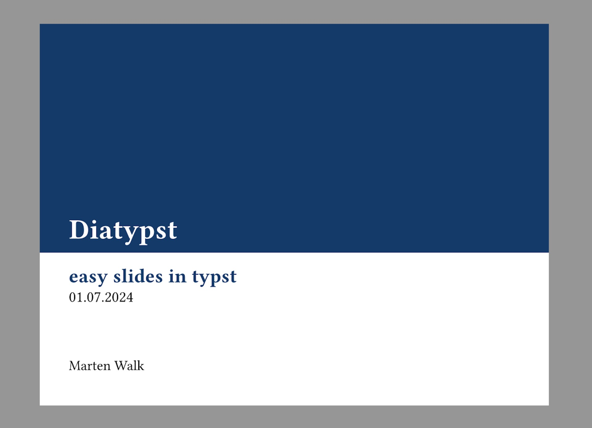
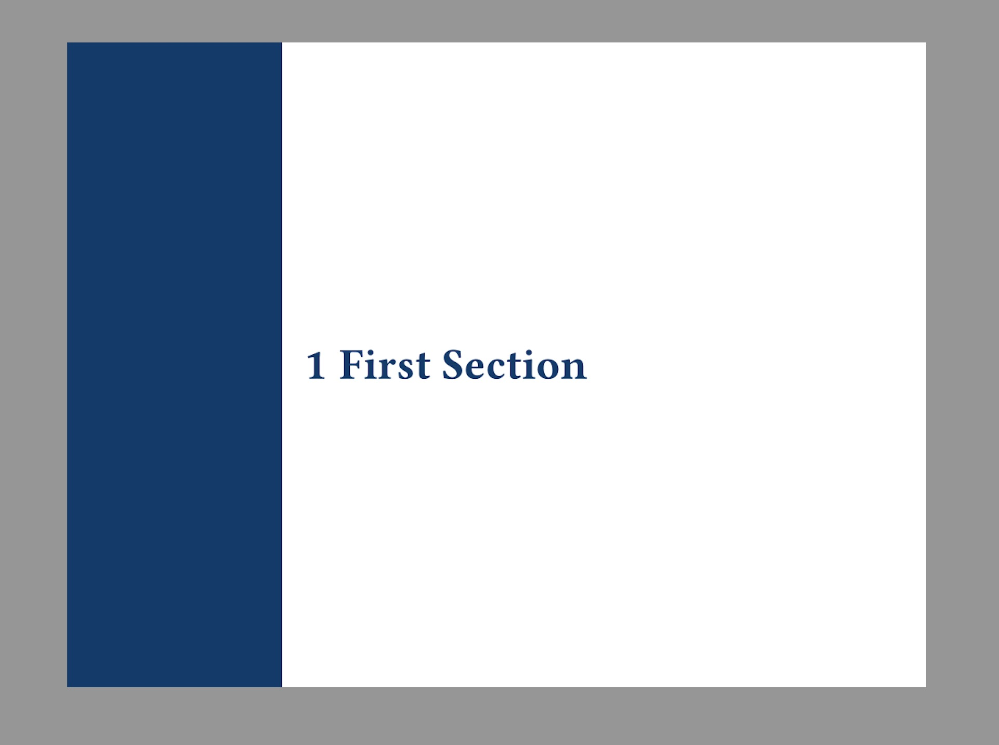

# Diatypst

*easy slides in typst*

Features:

- easy delimiter for slides and sections (just use headings)
- sensible styling
- dot counter in upper right corner (like LaTeX beamer)
- adjustable color-theme
- default show rules for terms, code, lists, ... that match color-theme

Example Presentation

| Title Slide                                     | Section                                             | Content                                         | Outline                                         |
| ----------------------------------------------- | --------------------------------------------------- | ----------------------------------------------- | ----------------------------------------------- |
|  |  |  |  |

can be found in `example/example.typ`in the GitHub Repo


## Usage

To start a presentation, initialize it in your typst document:

```typst
#import "@preview/diatypst:0.2.0": *
#show: slides.with(
  title: "Diatypst", // Required
  subtitle: "easy slides in typst",
  date: "01.07.2024",
  authors: ("John Doe"),
)
...
```

Then, insert your content.

- Level-one headings corresponds to new sections.
- Level-two headings corresponds to new slides.

```typst
...

= First Section

== First Slide

#lorem(20)
```

## Options

all available Options to initialize the template with

| Keyword       | Description                                                  | Default              |
| ------------- | ------------------------------------------------------------ | -------------------- |
| *title*       | Title of your Presentation, visible also in footer           | `none` but required! |
| *subtitle*    | Subtitle, also visible in footer                             | `none`               |
| *date*        | a normal string presenting your date                         | `none`               |
| *authors*     | either string or array of strings                            | `none`               |
| *layout*      | one of "small", "medium", "large", adjusts sizing of the elements on the slides | `"medium"`           |
| *ratio*       | aspect ratio of the slides, e.g 16/9                         | `4/3`                |
| *title-color* | Color to base the Elements of the Presentation on            | `blue.darken(50%)`   |
| *count*       | whether to display the dots for pages in upper right corner  | `true`               |
| *footer*      | whether to display the footer at the bottom                  | `true`               |
| *toc*         | whether to display the table of contents                     | `true`               |
| *code-styling*| whether to style code elements in the presentation           | `true`               |


## Inspiration

this template is inspired by [slydst](https://github.com/glambrechts/slydst), and takes part of the code from it. If you want simpler slides, look here!

The word *Diatypst* is inspired by the ease of use of a [**Dia**-projektor](https://de.wikipedia.org/wiki/Diaprojektor) (German for Slide Projector) and the [Diatype](https://en.wikipedia.org/wiki/Diatype_(machine))