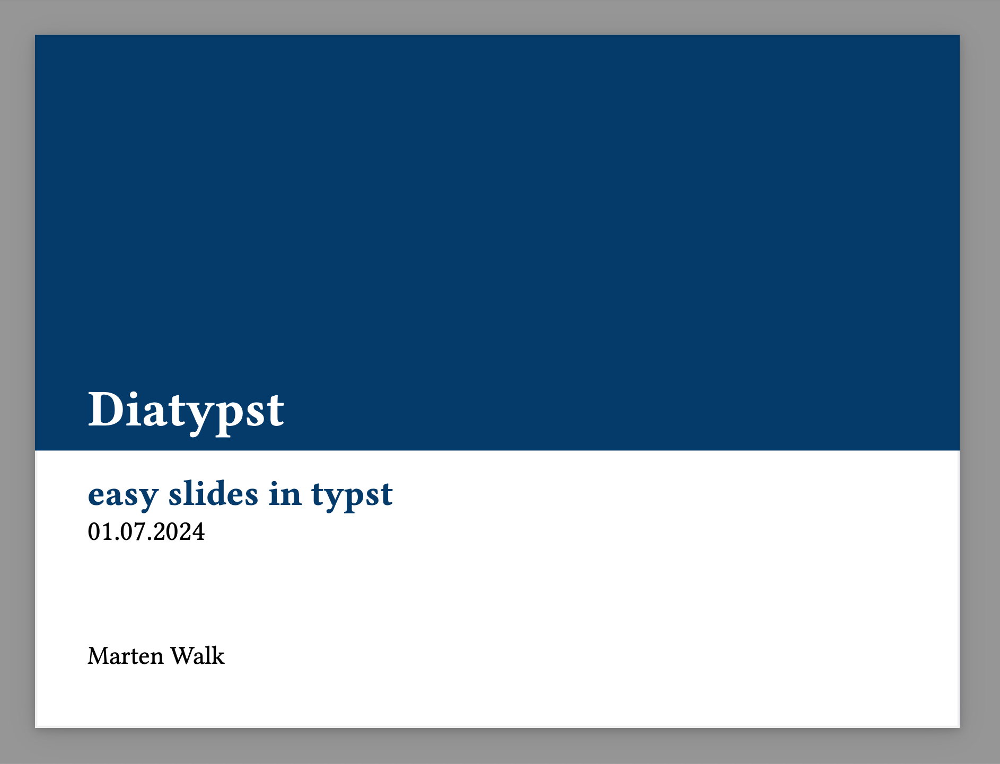
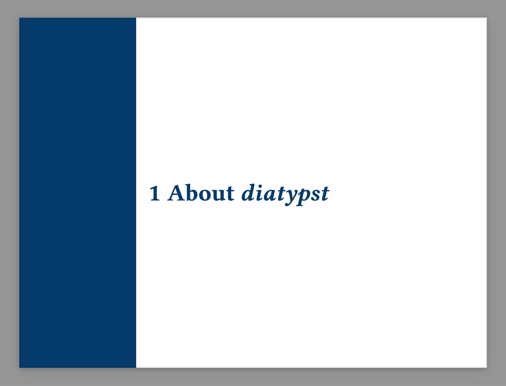
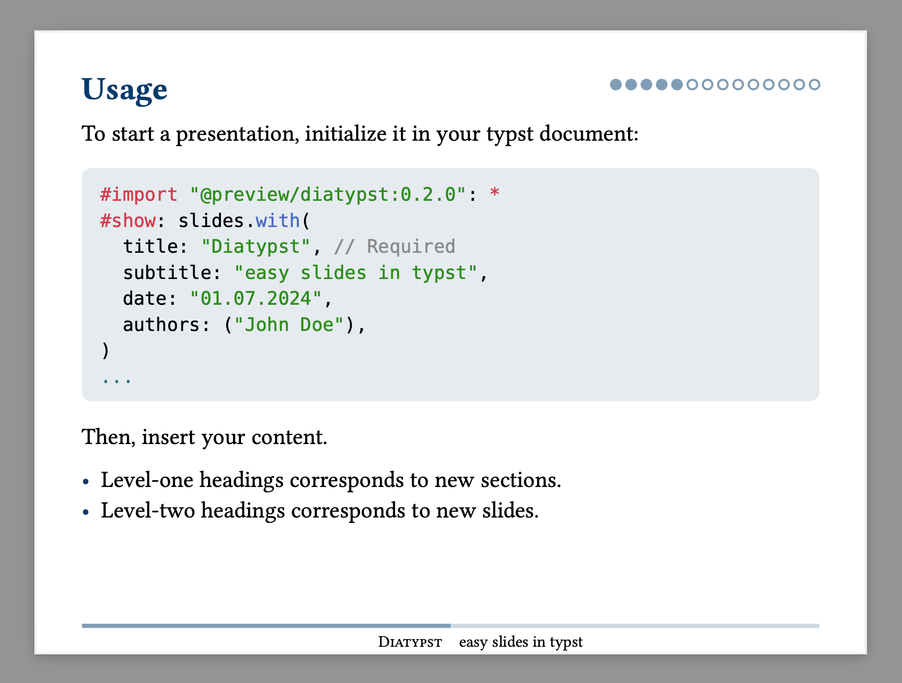
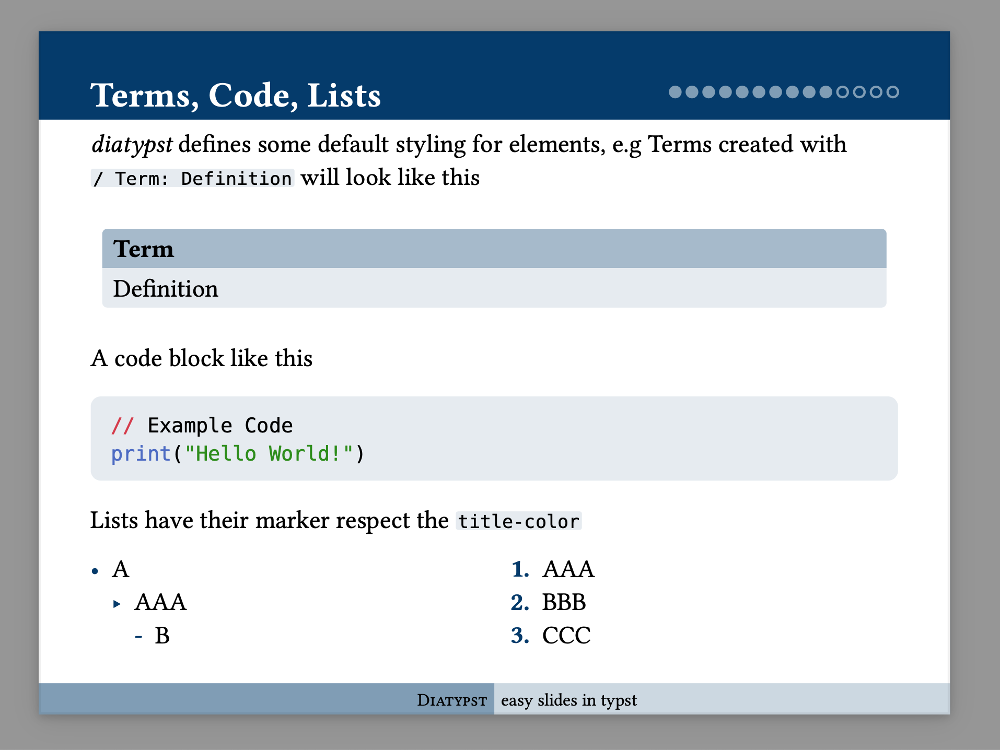

# Diatypst

*easy slides in typst*

Features:

- easy delimiter for slides and sections (just use headings)
- sensible styling
- dot counter in upper right corner (like LaTeX beamer)
- adjustable color-theme
- default show rules for terms, code, lists, ... that match color-theme

Example Presentation

| Title Slide                                     | Section                                             | Content (Normal Theme)                          | Content (Full Theme)                                        |
| ----------------------------------------------- | --------------------------------------------------- | ----------------------------------------------- | ----------------------------------------------------------- |
|  |  |  |  |

These example slides and a usage guide are available in the `example` Folder on GitHub as a [.typ file](https://github.com/skriptum/diatypst/blob/main/example/example.typ) and a compiled PDF ([normal Theme](https://raw.githubusercontent.com/skriptum/diatypst/refs/heads/main/example/example.pdf), [full Theme](https://raw.githubusercontent.com/skriptum/diatypst/refs/heads/main/example/example_full.pdf)). The Full Theme more closely resembles a Beamer Theme, while the normal theme is more reduced.

## Usage

To start a presentation, initialize it in your typst document:

```typst
#import "@preview/diatypst:0.2.0": *
#show: slides.with(
  title: "Diatypst", // Required
  subtitle: "easy slides in typst",
  date: "01.07.2024",
  authors: ("John Doe"),
)
...
```

Then, insert your content.

- Level-one headings corresponds to new sections.
- Level-two headings corresponds to new slides.
- or manually create a new slide with a `#pagebreak()`

```typst
...

= First Section

== First Slide

#lorem(20)
```

*diatypst* is also available on the [Typst Universe](https://typst.app/universe/package/diatypst) for easy importing into a project on typst.app

## Options

all available Options to initialize the template with

| Keyword       | Description                                                  | Default              |
| ------------- | ------------------------------------------------------------ | -------------------- |
| *title*       | Title of your Presentation, visible also in footer           | `none` but required! |
| *subtitle*    | Subtitle, also visible in footer                             | `none`               |
| *date*        | a normal string presenting your date                         | `none`               |
| *authors*     | either string or array of strings                            | `none`               |
| *layout*      | one of "small", "medium", "large", adjusts sizing of the elements on the slides | `"medium"`           |
| *ratio*       | aspect ratio of the slides, e.g 16/9                         | `4/3`                |
| *title-color* | Color to base the Elements of the Presentation on            | `blue.darken(50%)`   |
| *count*       | page counter style, either "dot", "number", or `none`        | `dot`                |
| *footer*      | whether to display the footer at the bottom                  | `true`               |
| *toc*         | whether to display the table of contents                     | `true`               |
| *footer-title*| custom text in the footer title (left)                       | same as *title*      |
| *footer-subtitle*| custom text in the footer subtitle (right)                | same as *subtitle*   |
| *theme*       | slide theme, either "normal" or "full"                       | `normal`             |


## Quarto

This template is also available as a [Quarto](https://quarto.org/) extension. To use it, add it to your project with the following command:

```bash
quarto add skriptum/diatypst/diaquarto
```

Then, create a qmd file with the following YAML frontmatter:

```yaml
title: "Untitled"
...
format:
  diaquarto-typst:
    layout: medium # small, medium, large
    ratio: 16/9 # any ratio possible
    title-color: "013220" # Any Hex code for the title color (without #)
```

## Inspiration

this template is inspired by [slydst](https://github.com/glambrechts/slydst), and takes part of the code from it. If you want simpler slides, look here!

The word *Diatypst* is inspired by the ease of use of a [**Dia**-projektor](https://de.wikipedia.org/wiki/Diaprojektor) (German for Slide Projector) and the [Diatype](https://en.wikipedia.org/wiki/Diatype_(machine))
