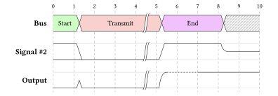

# 

A drawing package to draw digital timing diagrams using the [WaveDrom](https://wavedrom.com/) syntax. Some WaveDrom data are compatible with _Digidraw_ and some are not, but I plan or hope to implement those. Reasonable input/feedback is welcome!

## Features

- Draw wires, buses, clocks and other symbol types 
  - A lot of these elements are 1:1 from WaveDrom, but not everthing is inside!
- Support for inserting labels into buses (similar to Wavedrom)
- Support for typst markup for bus labels, when reading from a json file.`"data": ["#strong([hello])"]` 
- Configurable style settings to change fonts, stroke styling and sizing

## Examples

Click on the image for the source.

<table>
<tbody>
  <tr>
    <td>
       
      Source: <a href="https://wavedrom.com/tutorial.html#spacers-and-gaps">https://wavedrom.com/tutorial.html#spacers-and-gaps</a>
    </td>
  </tr>
  <tr>
    <td>
       
      Source: <a href="https://wavedrom.com/tutorial.html#adding-clock">https://wavedrom.com/tutorial.html#adding-clock</a>
    </td>
  </tr>
  <tr>
    <td>
      
    </td>
  </tr>
  <tr>
    <td>
      
    </td>
  </tr>
</tbody>
</table>

## Things Missing / Not Yet Implemented

Still lots to implement to be on (almost) par with WaveDrom!

- [ ] Write Manual
- [ ] All symbol combinations
  - the most important ones are implemented
- [ ] Improve Line rendering
  - Instead of stitching everything together, a system where one long line is drawn using `cetz.draw.merge-path`. Exception would transition edges which would break up the line. Buses would consist of two parts: the upper and lower "lip".
  - Line Merging would separate the primary lines from secondary lines + some fancy layer working could be done:
    1. Layer `-1`: Background elements such as ticks and guide lines
    2. Layer `0`: Filled areas such as buses
    3. Layer `1`: Strokes and Labels
    4. Layer `2`: The fancy SS / aka. decorations
- [ ] Get closer to WaveDrom syntax (see below)

### WaveDrom based

- [ ] `period` and `phase` parameter
- [ ] `head` and `foot` with `tick`, `tock`, `every` and `text` parameter
- [ ] Arrows & Sharp lines
- [ ] Groups
