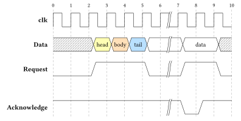
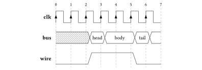
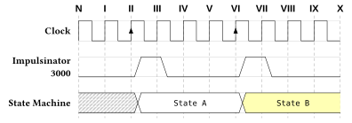
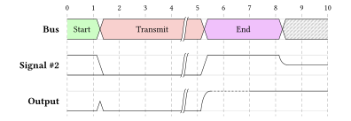
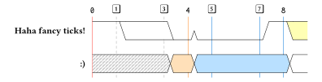

A drawing package to draw digital timing diagrams using the [WaveDrom](https://wavedrom.com/) syntax. Some WaveDrom data are compatible with _Digidraw_ and some are not, but I plan or hope to implement those. Reasonable input/feedback is welcome!

## Features

- Draw wires, buses, clocks and other symbol types 
  - A lot of these elements are 1:1 from WaveDrom, but not everthing is inside!
- Support for inserting labels into buses (similar to Wavedrom)
- Support for typst markup for bus labels, when reading from a json file.`"data": ["#strong([hello])"]` 
- Configurable style settings to change fonts, stroke styling and sizing

## Examples

Click on the image for the source.

<table>
<tbody>
  <tr>
    <td>
       
      Source: <a href="https://wavedrom.com/tutorial.html#spacers-and-gaps">https://wavedrom.com/tutorial.html#spacers-and-gaps</a> 
      example's JSON file: <a href="examples/example1.json">
        examples/example1.json
      </a>
    </td>
  </tr>
  <tr>
    <td>
       
      Source: <a href="https://wavedrom.com/tutorial.html#adding-clock">https://wavedrom.com/tutorial.html#adding-clock</a> 
      example's JSON file: <a href="examples/example2.json">
        examples/example2.json
      </a>
    </td>
  </tr>
  <tr>
    <td>
      
    </td>
  </tr>
  <tr>
    <td>
      
    </td>
  </tr>
  <tr>
    <td>
      
    </td>
  </tr>
</tbody>
</table>

# Changelog

See [CHANGELOG.md](./CHANGELOG.md)

# ToDo

See [TODO.md](https://codeberg.org/joelvonrotz/typst-digidraw/src/branch/main/TODO.md) in the Codeberg repository
