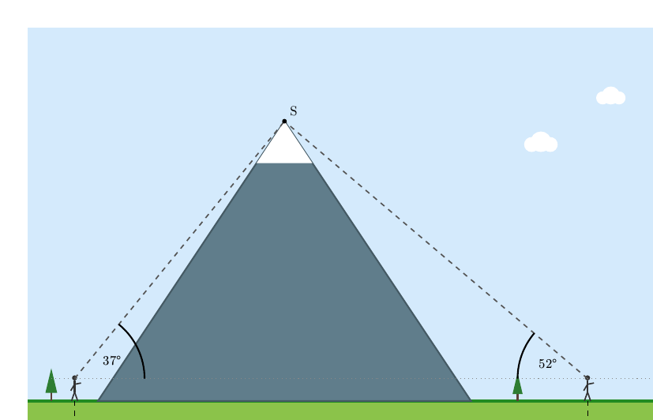
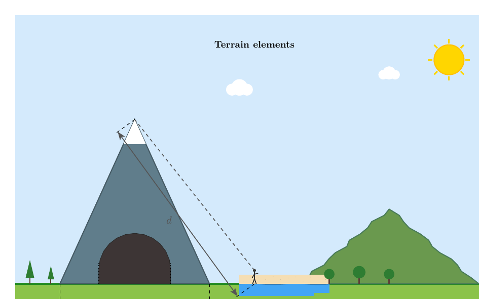
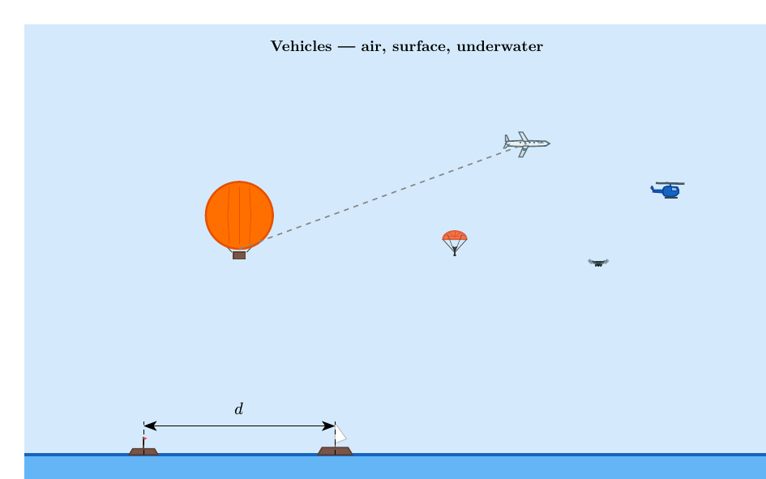
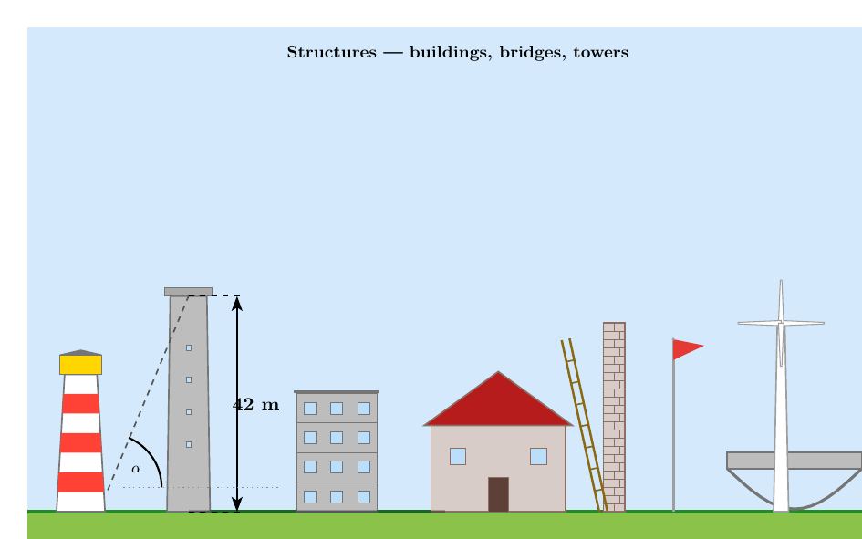
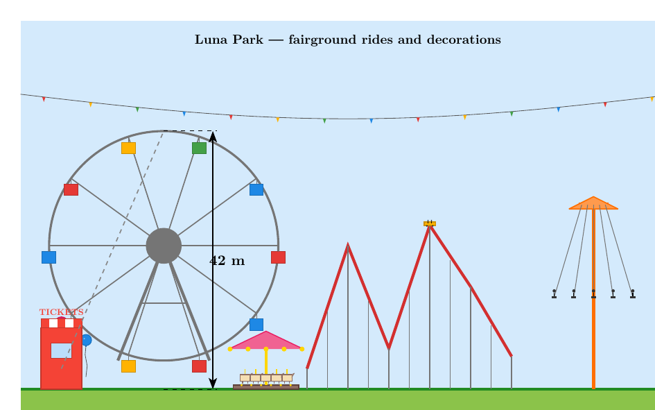

# diorama

A library of illustrated [CeTZ](https://typst.app/universe/package/cetz) scene elements for building word problem figures. Draw mountains, tunnels, lakes, buildings, vehicles, creatures, fairground rides, and geometric annotations — all composable inside a single `cetz.canvas`.

Designed for mathematics teachers who need clear, consistent figures for trigonometry and geometry word problems.

[Full manual](https://github.com/nathan-ed/typst-package-diorama/blob/7e3c2372dacb312b1f0fc2b5185d26b073b0abaa/docs/manual.pdf)

## Gallery

Click on an image to see the source code.

| | | | | |
|:---:|:---:|:---:|:---:|:---:|
| [](https://github.com/nathan-ed/typst-package-diorama/blob/7e3c2372dacb312b1f0fc2b5185d26b073b0abaa/gallery/quickstart.typ) | [](https://github.com/nathan-ed/typst-package-diorama/blob/7e3c2372dacb312b1f0fc2b5185d26b073b0abaa/gallery/terrain.typ) | [](https://github.com/nathan-ed/typst-package-diorama/blob/7e3c2372dacb312b1f0fc2b5185d26b073b0abaa/gallery/vehicles.typ) | [](https://github.com/nathan-ed/typst-package-diorama/blob/7e3c2372dacb312b1f0fc2b5185d26b073b0abaa/gallery/structures.typ) | [](https://github.com/nathan-ed/typst-package-diorama/blob/7e3c2372dacb312b1f0fc2b5185d26b073b0abaa/gallery/lunapark.typ) |
| Quick Start | Terrain | Vehicles | Structures | Luna Park |

## Features

- **Terrain** — mountain (with snow, smoothness), tunnel, lake, river, hill, cliff, valley, beach, cave, island, road
- **Nature** — tree (pine/oak/palm), group of trees, cloud, sun, moon, stars, rain, snow, lightning, bush, rock, flower, seaweed
- **Vehicles** — hot-air balloon, airplane, helicopter, drone, rocket, parachute, cable car, boat (rowboat/sailboat), submarine, mine cart, car
- **Creatures** — person (standing/pointing/anchored), bird, fish, dog, butterfly, crab
- **Structures** — house, building, tower, lighthouse, wall (plain/brick), ladder, bridge (beam/arch), pole, box, windmill, crane, kite, antenna, telescope, stairs, ramp, rope, fence, slide, shadow projection
- **Luna Park** — ferris wheel, roller coaster + cart, carousel, swing ride, ticket booth, party balloon, bunting
- **Annotations** — dimension arrow, sight line, horizontal reference, angle arc, right-angle mark, dashed line, brace, point mark, label
- **Theme** — consistent colour palette via `scene-theme`, overridable per element with `bg`, `color`, `line-color`

## Quick Start

```typst
#import "@preview/cetz:0.5.2"
#import "@preview/diorama:0.1.0": *

#cetz.canvas(length: 1cm, {
  import cetz.draw: *

  scene-sky(-1, 12, 7, bottom: 0)
  scene-ground(-1, 12, y: 0, depth: 1)

  scene-mountain((1, 0), (9, 0), (5, 6), snow: true)
  scene-person((0.5, 0), height: 0.55, variant: "pointing")
  scene-person((11, 0), height: 0.55)

  scene-sight-line((0.5, 0.48), (5, 6))
  scene-sight-line((11, 0.48), (5, 6))
  scene-dimension-arrow((0.5, 0), (11, 0), [550 m], offset: -0.9)
})
```

**Rule:** all `scene-*` functions are CeTZ drawing functions. They must be called inside a `cetz.canvas(...)` block after `import cetz.draw: *`.

## Usage

### Coordinate system

All coordinates are in CeTZ canvas units. Set `length` in `cetz.canvas` to control the physical size (e.g. `length: 1cm` means 1 unit = 1 cm on the page).

### Colour parameters

To avoid shadowing Typst built-ins (`fill`, `stroke`), the package uses alternative names:

| Concept | Parameter name | Default |
|---------|---------------|---------|
| Fill colour | `bg` | `auto` (theme colour) |
| Stroke colour | `line-color` | `auto` (theme colour) |
| General colour | `color` | `auto` (theme colour) |

Passing `auto` uses the default from `scene-theme`. Pass any Typst colour to override.

### Building a scene — step by step

1. **Backgrounds first** — `scene-sky`, `scene-ground`, `scene-water-gradient`
2. **Terrain** — mountains, lakes, rivers, tunnels
3. **Vegetation and decor** — trees, clouds, sun
4. **Characters and vehicles** — persons, boats, balloons
5. **Structures** — buildings, towers, bridges
6. **Geometric annotations** — sight lines, angles, dimension arrows, labels

## Component Reference

### Backgrounds

#### `scene-sky(left, right, top, bottom: 0, bg: auto)`
Sky rectangle. Place first, below everything else.

#### `scene-ground(left, right, y: 0, depth: 1, bg: auto, line-color: auto)`
Ground with surface line.

#### `scene-water-gradient(left, right, bottom, top: 0, layers: 3, surface-stroke: auto)`
Water with gradient depth effect. `bottom` is positional (below water surface, so a negative value).

#### `scene-night-sky(left, right, top, bottom: 0, bg: auto)`
Dark night sky.

#### `scene-underground(left, right, top: 0, bottom, bg: auto)`
Underground fill (for mine/cave scenes).

---

### Terrain

#### `scene-mountain(base-left, base-right, summit, bg: auto, line-color: auto, snow: true, snow-fraction: 0.15, smoothness: 0)`
Triangular mountain with optional snow cap. `smoothness` adds intermediate points for a rounded ridge (0 = straight sides).

#### `scene-hill(base-left, base-right, peak, bg: auto, line-color: auto)`
Gentle rounded hill using a bezier curve.

#### `scene-valley(left, right, bottom, depth: 1, bg: auto)`
Valley shape.

#### `scene-cliff(base, height, width: 0.5, direction: 1, bg: auto)`
Vertical cliff face. `direction: 1` = cliff on the right side.

#### `scene-tunnel(entry-left, entry-right, height: 0.4, bg: auto)`
Tunnel entrance arch.

#### `scene-lake(left, right, y: 0, depth: 0.3, bg: auto)`
Still lake with surface line.

#### `scene-river(top-left, top-right, bottom-left, bottom-right, bg: auto)`
River as a trapezoid band.

#### `scene-beach(left, right, y: 0, sand-depth: 0.3, water-depth: 0.5, bg: auto)`
Sandy beach with water edge.

#### `scene-island(center, rx: 1.5, ry: 0.4, bg: auto)`
Elliptical island at water level.

#### `scene-road(start, end, width: 0.3, bg: auto, line-color: auto)`
Two-lane road with centre line.

#### `scene-cave(entry-left, entry-right, height: 0.5, depth: 0.4, bg: auto)`
Cave entrance.

#### `scene-path(points, width: 0.15, bg: auto)`
Footpath through a list of points.

---

### Nature

#### `scene-tree(base, height: 0.6, trunk-color: auto, foliage-color: auto, variant: "pine")`
Single tree. Variants: `"pine"`, `"oak"`, `"palm"`.

#### `scene-trees(positions, variant: "pine", foliage-color: auto, trunk-color: auto)`
Multiple trees. Each position is `(x, height)` or `(x, y, height)`.

#### `scene-cloud(center, size: 0.3, bg: white)`
Three-circle cloud.

#### `scene-sun(center, radius: 0.4, bg: auto, ray-count: 8, ray-length: 0.2)`
Sun with rays.

#### `scene-moon(center, radius: 0.4, bg: auto)`
Crescent moon.

#### `scene-star(center, radius: 0.15, color: auto)`
Five-pointed star.

#### `scene-rock(center, size: 0.3, bg: auto)`
Irregular rock shape.

#### `scene-bush(base, width: 0.5, height: 0.3, bg: auto)`
Low bush.

#### `scene-flower(base, size: 0.15, color: auto)`
Simple flower with petals.

#### `scene-seaweed(base, height: 0.5, color: auto, strands: 1)`
Wavy seaweed for underwater scenes.

#### `scene-rain(left, right, top, bottom, density: 10, color: auto)`
Rain streaks.

#### `scene-snow-particles(left, right, top, bottom, density: 15, color: auto)`
Snow dots.

#### `scene-lightning(top, bottom, color: auto)`
Lightning bolt.

---

### Vehicles

#### `scene-balloon(center, size: 0.6, bg: auto, line-color: auto)`
Hot-air balloon (envelope + ropes + basket).

#### `scene-airplane(center, size: 0.6, bg: auto, line-color: auto, direction: 1)`
Fixed-wing aircraft.

#### `scene-helicopter(center, size: 0.5, bg: auto, line-color: auto)`
Helicopter with main and tail rotors.

#### `scene-drone(center, size: 0.3, color: auto)`
Quadcopter drone.

#### `scene-rocket(base, height: 1.5, bg: auto, line-color: auto)`
Rocket with nose cone and fins.

#### `scene-parachute(base, size: 0.5, bg: auto, color: auto)`
Parachute with canopy and figure.

#### `scene-cable-car(center, size: 0.4, bg: auto)`
Gondola cable car cabin.

#### `scene-boat(base, size: 0.5, bg: auto, line-color: auto, variant: "rowboat")`
Boat at water level. Variants: `"rowboat"`, `"sailboat"`.

#### `scene-submarine(center, size: 1.0, bg: auto, line-color: auto)`
Submarine with conning tower, periscope, and propeller.

#### `scene-mine-cart(base, size: 0.4, bg: auto)`
Mine cart with wheels and rock cargo.

#### `scene-car(base, size: 0.5, bg: auto, line-color: auto, direction: 1)`
Simple car silhouette.

---

### Creatures

#### `scene-person(base, height: 0.6, color: auto, variant: "standing")`
Stick figure. Variants: `"standing"`, `"pointing"`.

#### `scene-person-anchors(base, height: 0.6)`
Returns a dict of body anchor points `(head, chest, left-hand, right-hand, base)` for attaching elements.

#### `scene-bird(center, size: 0.15, color: auto)`
Bird in flight (M-shape).

#### `scene-fish(center, size: 0.15, color: auto, direction: 1)`
Fish with tail and eye.

#### `scene-dog(base, size: 0.3, color: auto, direction: 1)`
Dog silhouette.

#### `scene-butterfly(center, size: 0.2, color: auto)`
Butterfly with four wings.

#### `scene-crab(base, size: 0.3, color: auto)`
Crab with claws.

---

### Structures

#### `scene-wall(base, height, width: 0.3, bg: auto, line-color: auto, variant: "plain")`
Wall. Variants: `"plain"`, `"brick"`.

#### `scene-ladder(base, top, width: 0.1, rungs: 5, color: auto)`
Ladder between two points.

#### `scene-house(base, width: 2, wall-height: 1.5, roof-height: 0.8, bg: auto, line-color: auto)`
House with roof, door, and windows.

#### `scene-building(base, width: 1.5, floors: 3, floor-height: 0.5, bg: auto, line-color: auto)`
Multi-storey building with windows.

#### `scene-box(base, width: 1, height: 0.8, depth: 0.3, bg: auto, line-color: auto)`
3D box with perspective.

#### `scene-pole(base, height, color: auto, thickness: 2)`
Vertical pole or mast.

#### `scene-bridge(left, right, height: 0.3, bg: auto, line-color: auto, variant: "beam")`
Bridge. Variants: `"beam"` (with pillars), `"arch"`.

#### `scene-tower(base, width: 0.8, height: 3, bg: auto, line-color: auto)`
Observation tower with platform and windows.

#### `scene-lighthouse(base, height: 2.5, bg: auto, line-color: auto)`
Lighthouse with red stripes and lantern.

#### `scene-flag-pole(base, height, flag-color: red)`
Flagpole with triangular flag.

#### `scene-shadow(object-top, light-angle, ground-y: 0, object-base: auto, color: auto)`
Projected shadow. `light-angle` is the sun angle above horizontal.

#### `scene-fence(left, right, y: 0, posts: auto, color: auto)`
Fence with vertical posts and horizontal rails.

#### `scene-stairs(base, steps: 5, step-width: 0.3, step-height: 0.2, bg: auto)`
Staircase.

#### `scene-ramp(base, top, width: 0.2, bg: auto)`
Inclined ramp.

#### `scene-windmill(base, height: 2.5, blade-length: 1.0, color: auto)`
Windmill with four blades.

#### `scene-crane(base, height: 3, arm-length: 2, color: auto)`
Construction crane.

#### `scene-kite(center, size: 0.5, bg: auto, tail-length: 1.0)`
Diamond kite with tail.

#### `scene-antenna(base, height: 1.5, color: auto)`
Radio/TV antenna.

#### `scene-telescope(base, height: 1.0, angle: 30deg, color: auto)`
Telescope on a tripod.

#### `scene-slide(base, height: 2, length: 2.5, bg: auto)`
Playground slide.

#### `scene-rope(p1, p2, sag: 0.3, color: auto)`
Catenary rope between two points.

---

### Luna Park

#### `scene-ferris-wheel(base, radius: 2.0, cabins: 8, rotation: 0deg, color: auto, cabin-colors: auto)`
Ferris wheel with A-frame support, spokes, and coloured cabins.

#### `scene-roller-coaster(points, color: auto, rail-width: 0.08)`
Roller coaster track with auto-generated support pillars.

#### `scene-roller-cart(position, angle: 0deg, size: 0.3, color: auto)`
Roller coaster cart with passengers.

#### `scene-carousel(base, radius: 1.0, height: 1.5, horses: 6, color: auto)`
Carousel with conical roof and horses.

#### `scene-swing-ride(base, height: 2.5, radius: 1.5, swings: 6, color: auto)`
Flying chairs ride with chains and riders.

#### `scene-ticket-booth(base, width: 1.0, height: 1.5, color: auto)`
Ticket booth with awning and window.

#### `scene-party-balloon(base, height: 0.8, color: auto)`
Round party balloon with string.

#### `scene-bunting(left, right, flags: 8, colors: auto, sag: 0.3)`
String of triangular pennant flags with catenary droop.

---

### Annotations

#### `scene-dimension-arrow(p1, p2, label, offset: -0.6, color: black, size: 10pt, extension: true)`
Dimension line with arrows and label. `offset` is the perpendicular displacement.

```typst
scene-dimension-arrow((1, 0), (7, 0), [200 m], offset: -0.7)
scene-dimension-arrow((5, 0), (5, 4), [$h$], offset: 1.2)
```

#### `scene-sight-line(p1, p2, color: auto, dash: "dashed", thickness: 0.8)`
Dashed line of sight.

#### `scene-horizontal-ref(left, right, y, color: auto, dash: "dashed", thickness: 0.6)`
Horizontal reference line (for depression/elevation angles).

#### `scene-angle-arc(origin, p1, p2, label, radius: 1.3, label-radius: 55%)`
Angle arc with label. Wrapper around `cetz.angle.angle`.

```typst
scene-angle-arc(A, B, C, text(size: 9pt)[$35°$])
```

#### `scene-right-angle(vertex, p1, p2, size: 0.2)`
Right-angle square marker.

#### `scene-dashed-line(p1, p2, color: auto, thickness: 0.5)`
Dashed connecting line.

#### `scene-brace(p1, p2, label, offset: -0.3, color: black)`
Curly brace with label.

#### `scene-label(position, body, size: 9pt)`
Text label at a point.

#### `scene-point-mark(position, label: none, radius: 0.05, color: black, size: 8pt)`
Filled circle point marker with optional label.

---

### Theme

All default colours live in `scene-theme`:

```typst
#import "@preview/diorama:0.1.0": scene-theme

scene-theme.sky          // #d4eafc  — sky blue
scene-theme.ground       // #8BC34A  — grass green
scene-theme.water-light  // #64B5F6  — light blue
scene-theme.water-mid    // #42A5F5  — mid blue
scene-theme.water-deep   // #1E88E5  — deep blue
scene-theme.mountain     // #607D8B  — blue-grey
scene-theme.snow         // white
scene-theme.tree-trunk   // #5D4037  — brown
scene-theme.tree-foliage // #2E7D32  — dark green
scene-theme.metal        // #9E9E9E  — grey
```

Override per element: `scene-mountain((0,0), (6,0), (3,5), bg: rgb("#8B8682"))`.

## Complete Example

```typst
#import "@preview/cetz:0.5.2"
#import "@preview/diorama:0.1.0": *

// A lighthouse problem: find the distance to a ship using two observers

#cetz.canvas(length: 1cm, {
  import cetz.draw: *

  scene-sky(-1, 13, 7, bottom: 0)
  scene-water-gradient(-1, 13, -3, top: 0, layers: 3)
  scene-ground(-1, 13, y: 0, depth: 0.8)

  // Lighthouse on a cliff
  scene-cliff((4, 0), 1.5, width: 1.2, direction: -1)
  scene-lighthouse((3.5, 1.5), height: 3)

  // Ship at sea
  scene-boat((10, 0), size: 0.6, variant: "sailboat")

  // Observer on cliff top
  scene-person((2, 0), height: 0.5, variant: "pointing")

  // Fish underwater
  scene-fish((7, -1.5), size: 0.12)
  scene-fish((9, -2), size: 0.1, direction: -1)

  // Sight line from lighthouse to ship
  scene-sight-line((3.5, 4.5), (10, 0.3))

  // Horizontal reference
  scene-horizontal-ref(3, 11, 4.5, dash: "dotted")

  // Depression angle
  let L = (3.5, 4.5)
  let H = (8, 4.5)
  let S = (10, 0.3)
  scene-angle-arc(L, H, S,
    text(size: 8pt)[$\u{03b1}$], radius: 1.8, label-radius: 60%)

  // Dimension
  scene-dimension-arrow((3.5, 0), (10, 0), [$d$], offset: -0.7)
})
```

## License

MIT License — see LICENSE file for details.

## Changelog

### [0.1.0] — 2026-05-26

- Initial release (renamed from `trigo-scenes`)
- ~100 scene elements across 8 modules: backgrounds, terrain, nature, vehicles, creatures, structures, lunapark, annotations
- Full colour theme with per-element overrides and `bw: true` black-and-white mode
- `scene-point-mark`: `anchor` (8-direction) and `shift` parameters for label placement
- `scene-label`: CeTZ-native anchor placement with optional background box
- Comprehensive manual with individual rendered example for every function
- CeTZ 0.5.2 compatibility
