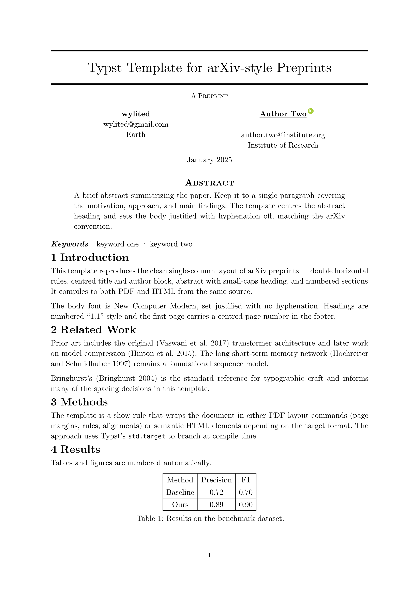

# diprint

An arXiv-style paper template for [Typst](https://typst.app).
Compile to HTML and PDF from the same source!



## Quick start

```typ
#import "@preview/diprint:0.1.0": diprint, diprint-appendices

#show: diprint.with(
  title: "The Paper Of All Time",
  authors: (
    (name: "Jane Doe", email: "jane@uni.edu",
     affiliation: "University", orcid: "0000-0000-0000-0000"),
    (name: "wylited", email: "john@uni.org",
     affiliation: "God"),
  ),
  abstract: [A short abstract.],
  keywords: ("internet", "typesetting"),
  date: "January 2025",
)

= Introduction
...

#show: diprint-appendices
= Supplementary Material
...
```

## Compiling

```bash
# PDF
typst compile paper.typ

# Standalone HTML (CSS inlined)
typst compile --features html paper.typ paper.html
```

For multi-file HTML output with an external stylesheet you can try:

```typ
// bundle.typ
#import "@preview/diprint:0.1.0": diprint, diprint-css, diprint-appendices

#asset("diprint.css", diprint-css())

#document("paper.html", title: [My Paper], [
  #show: diprint.with(use-bundle-css: true, ...)
  ...
])
```

```bash
typst compile --features html,bundle --format bundle bundle.typ out/
# out/paper.html + out/diprint.css
```

This may be updated in the future.

## Options

### `diprint`

| Parameter        | Type                | Default         |
| ---------------- | ------------------- | --------------- |
| `title`          | `str` \| `content`  | `""`            |
| `authors`        | `array` of `dict`   | `()`            |
| `abstract`       | `content` \| `none` | `none`          |
| `keywords`       | `array` of `str`    | `()`            |
| `date`           | `str` \| `none`     | `none`          |
| `header-text`    | `str`               | `"A Preprint"`  |
| `short-title`    | `str` \| `none`     | `none`          |
| `use-bundle-css` | `bool`              | `false`         |
| `font`           | `str`               | `"serif"`       |

Author dicts accept `name`, `email`, `affiliation`, and `orcid`.

For HTML output, set `font: "sans"` to use a sans-serif body font
instead of the default serif.

### `diprint-appendices`

A show rule that switches heading numbering to appendix style.
Call it after the main body:

```typ
#show: diprint-appendices
= My Appendix
== Subsection
```

### `diprint-css`

Returns the CSS as a string for use with `asset()` in bundle mode.

## HTML output

HTML output is responsive, adapts to light and dark themes via
`prefers-color-scheme`, and uses semantic `<article>` and `<figure>`
elements with MathML for equations.

## License

MIT — see [LICENSE](./LICENSE).

## Related

This template draws from a few external projects:

- [arkheion](https://github.com/mgoulao/arkheion), a Typst template
  reproducing popular arXiv layouts
- [arxiv-style](https://github.com/kourgeorge/arxiv-style), the
  original LaTeX style that shaped this look
- [arXiv's HTML papers](https://arxiv.org/html), the inspiration and reasoning.
