# distro

A pure [Typst](https://typst.app) library for common probability distributions. Each distribution module provides a constructor, PMF/PDF and CDF. Some modules also include inverse-transform sampling and `mean`/`variance` fields.

This library is still in early development, please use with caution. Typst is not designed for robust statistical use, and built-in functions like `calc.binom` overflow quickly. For any missing pieces, or feature requests, please open an Issue!

## Basic usage

```typst
#import "@preview/distro:0.1.0": normal, binomial, bernoulli
#import calc: sqrt, pi
#import "@preview:distro": normal

#{
  let Z = normal.new(mean: 0, std: 1)
  assert((Z.mean, Z.variance) == (0, 1))
  assert(normal.pdf(Z)(0) == 1 / sqrt(2 * pi))
}
```

## Sampling random variates

Provide a uniform random variate from a PRNG such as [suiji](https://typst.app/universe/package/suiji/) and `distro` will sample a random variate from your distribution of choice:

```typst
#import "@preview/distro:0.1.0": categorical
#import "@preview/suiji:0.5.1": gen-rng-f, uniform-f

#let Cat = categorical.new((0.1, 0.3, 0.2, 0.4))

// Random variate generation
#let n_samples = 1000
#let counts = (0,) * Cat.weights.len()
#let (rng, u) = (gen-rng-f(42), none)
#for _ in range(n_samples) {
  (rng, u) = uniform-f(rng)
  let result = categorical.sample(Cat, u)
  counts.at(result) += 1
}

// Frequency Table
#table(
  columns: (auto, auto, auto),
  inset: 10pt,
  align: center,
  [*Category*], [*Count*], [*%*],
  ..for (i, count) in counts.enumerate() {
    (
      [#i],
      [#count],
      [#(calc.round(count / n_samples * 100, digits: 1))%],
    )
  },
)
```

See [examples/sampling.typ](examples/sampling.typ) for further examples.

## Distributions

Click an image to see the source.

### Discrete

| | |
|:---:|:---:|
| Bernoulli | Binomial |
| [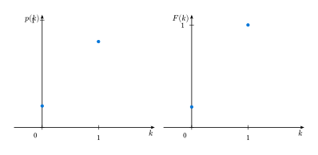](docs/gallery/bernoulli.typ) | [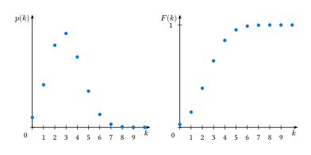](docs/gallery/binomial.typ) |
| Categorical | Geometric |
| [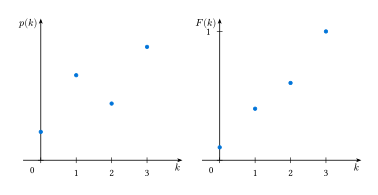](docs/gallery/categorical.typ) | [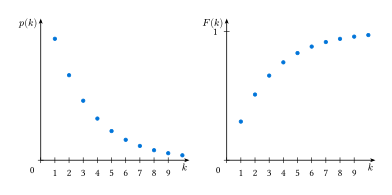](docs/gallery/geometric.typ) |
| Poisson | Discrete Uniform |
| [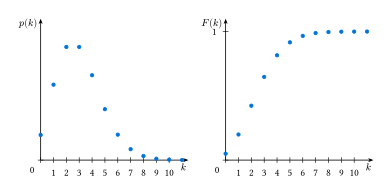](docs/gallery/poisson.typ) | [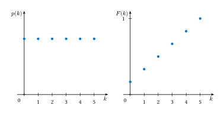](docs/gallery/discrete-uniform.typ) |


### Continuous

| | |
|:---:|:---:|
| Beta | Continuous Uniform |
| [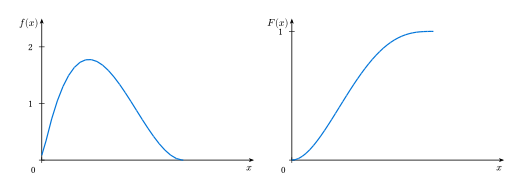](docs/gallery/beta.typ) | [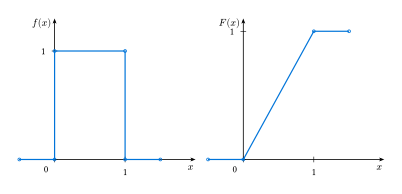](docs/gallery/continuous-uniform.typ) |
| Exponential | Gamma |
| [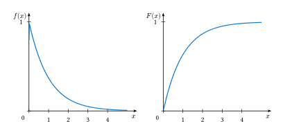](docs/gallery/exponential.typ) | [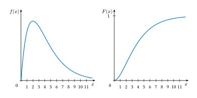](docs/gallery/gamma.typ) |
| Normal | |
| [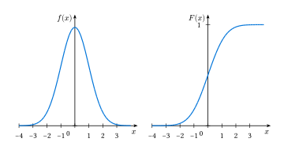](docs/gallery/normal.typ) | |

## Acknowledgements

Numerical algorithms for the gamma and beta functions are adapted from the Rust [statrs](https://github.com/statrs-dev/statrs) crate (MIT licensed).
