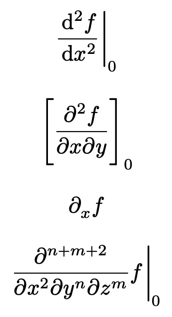

# Diverential
`diverential` is a [Typst](https://github.com/typst/typst) package simplifying the typesetting of differentials. It is the equivalent to LaTeX's `diffcoeff`, though not as mature.


## Overview
`diverential` allows normal, partial, compact, and separated derivatives with smart degree calculations.
```ts
#import "@preview/diverential:0.2.0": *

$ dv(f, x, deg: 2, eval: 0) $
$ dvp(f, x, y, eval: 0, evalsym: "[") $
$ dvpc(f, x) $
$ dvps(f, #([x], 2), #([y], [n]), #([z], [m]), eval: 0) $
```
  


## `dv`
`dv` is an ordinary derivative. It takes the function as its first argument and the variable as its second one. A degree can be specified with `deg`. The derivate can be specified to be evaluated at a point with `eval`, the brackets of which can be changed with `evalsym`. `space` influences the space between derivative and evaluation bracket. Unless defined otherwise, no space is set by default, except for `|`, where a small gap is introduced.

### `dvs`
Same as `dv`, but separates the function from the derivative.  
Example:
$$ \frac{\mathrm{d}}{\mathrm{d}x} f $$

### `dvc`
Same as `dv`, but uses a compact derivative.  
Example:
$$ \mathrm{d}_x f $$


## `dvp`
`dv` is a partial derivative. It takes the function as its first argument and the variable as the rest. For information on `eval`, `evalsym`, and `space`, read the description of `dv`.  
The variable can be one of these options:
- plain variable, e.g. `x`
- list of variables, e.g. `x, y`
- list of variables with higher degrees (type `(content, integer)`), e.g. `x, #([y], 2)`
The degree is smartly calculated: If all degrees of the variables are integers, the total degree is their sum. If some are content, the integer ones are summed (arithmetically) up and added to the visual sum of the content degrees. Example: `#([x], n), #([y], 2), z` → $\frac{\partial^{n+3}}{\partial x^n\,\partial y^2\,\partial z}$  
Specifying `deg` manually is always possible and might be required in more complicated cases.

### `dvps`
Same as `dvp`, but separates the function from the derivative.  
Example:
$$ \frac{\partial}{\partial x} f $$

### `dvpc`
Same as `dvp`, but uses a compact derivative.  
Note: If supplying multiple variables, `deg` is ignored.  
Example:
$$ \partial_x f $$
