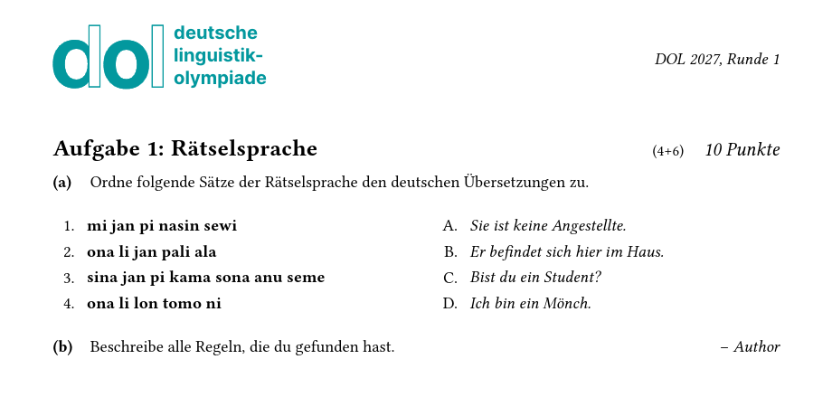

# Vorlage für Klausuraufgaben der Deutschen Linguistikolympiade (DOL)

This is a [Typst](https://github.com/typst/typst) package for layouting problem sets of the [German Linguistics Olympiad (DOL)](https://linguistikolympiade.de/).

## Usage

For each problem, initiate the template and add tasks.

```typst
#import "@preview/dol-theme:0.1.0": *
#show: dol-theme.with(
  title: [Rätselsprache],
  author: [Author],
  points: 10,
  composition: [4+6],
  year: [2027],              // optional, can also be set globally
  round: [1]                 // optional, can also be set globally
)


#task Ordne folgende Sätze der Rätselsprache den deutschen Übersetzungen zu.

#let a = counter("tokipona")
#let b = counter("tokipona2")
#show: matching-table
#table(
  numstep(a),
  [mi jan pi nasin sewi],
  letstep(b),
  [Sie ist keine Angestellte.],
  
  numstep(a),
  [ona li jan pali ala],
  letstep(b),
  [Er befindet sich hier im Haus.],
  
  numstep(a),
  [sina jan pi kama sona anu seme],
  letstep(b),
  [Bist du ein Student?],
  
  numstep(a),
  [ona li lon tomo ni],
  letstep(b),
  [Ich bin ein Mönch.],
)


#task Beschreibe alle Regeln, die du gefunden hast.
```



## Details

For further details, namely
- different table layouts,
- implementation of solutions,
- compilation of problem sets
- PDF modes designed for exams and publication

please refer to the [documentation](docs.pdf).

## Licence

MIT Licence.

