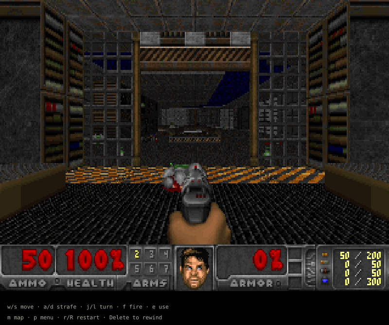

# doom-wasm

This is a port of DOOM to Typst, using DoomGeneric and a WebAssembly plugin.
You play by typing commands into the document and watching the live preview.
Freedoom: Phase 1 is included. Requires Typst 0.15.1 or later.



## How to Play

### Locally

1. Open `main.typ` from this repository in VS Code.
2. Start live preview with the [Tinymist extension](https://marketplace.visualstudio.com/items?itemName=myriad-dreamin.tinymist).
3. Type commands on the blank line at the bottom of the file. Try `wwwwjfff`.

You can also run `make play` and open
`build/doom.pdf` in a viewer that reloads when the file changes.

### Online

1. Run `make package` from the repository.
2. Unzip `build/doom-wasm-web.zip` and upload its files and folders to a Typst project.
3. Open `main.typ` and type commands below the show rule to play.

The Universe submission uses `@preview/doom-wasm:0.1.0`. Until it is accepted,
try it from this repository with:

```sh
make package
typst init --package-path build/packages @preview/doom-wasm:0.1.0 build/my-doom
```

See [package setup](docs/packaging.md) for the editor's package-path setting.
After publication, `typst init @preview/doom-wasm:0.1.0` will work without it.

Adding a character advances the game. Deleting characters rewinds it. The game
pauses when you stop typing, and saving the document keeps your input history.
Use `// comments` for notes so they aren't read as commands.

## Controls

- Move forward / backward: `w` / `s`
- Strafe left / right: `a` / `d`
- Run: uppercase `W`, `S`, `A`, `D`
- Turn left / right: `j` / `l`
- Fire: `f`
- Open a door / use / respawn: `e`
- Move forward / backward while firing: `q` / `z`
- Select weapon: `1`–`7`
- Automap: `m`
- Wait: `x`
- Restart: `r` or `R`
- Open / close menu: `p`
- Menu up / down: `i` / `k`
- Menu left / right: `h` / `o`
- Confirm / back: `c` / `b`
- Answer yes / no: `y` / `n`

Keys are case-sensitive. Type `pccc` to start a new game through the menus.
If a repeated fire or use command doesn't register, put `x` between presses.

## Changing the Level and Difficulty

Set `skill`, `episode`, and `map` in `game.with`:

```typst
#import "@preview/doom-wasm:0.1.0": game
#show: game.with(
  skill: 2,
  episode: 1,
  map: 2,
)
```

Difficulty ranges from `1` to `5`. Each command advances four game tics by default;
change `tics` to adjust this. Use `help: false` to hide the controls below the game.

To use your own DOOM IWAD instead of Freedoom, add it to the project and set
`wad: read("doom1.wad", encoding: none)`. In this repository's `main.typ`, keep
its `"lib.typ"` import; the package import above is for initialized templates.

## Changing Key Bindings

Use the `actions` parameter to change the controls. For example, this changes
fire to `v` and use to `u`:

```typst
#show: game.with(
  actions: (
    fire: ("v",),
    use: ("u",),
  ),
)
```

Other controls keep their defaults. You can give an action more than one key,
such as `forward: ("w", "↑")`, or disable it with an empty tuple: `fire: ()`.
Each key must be one non-whitespace character and can only belong to one action.
The hints below the game update to match your bindings.

Clear your old commands when changing bindings, since they will be read using
the new controls. See [game options](docs/development.md#game-options) for all
action names and settings.

## Notes

The port has no sound or multiplayer. Tests cover all 36 Freedoom level starts,
movement, firing, menus, and saving/loading. They do not cover a full campaign.
A separate test with the original DOOM shareware WAD reaches E1M2.

The original save/load menus work within the document's input history. To save
to a separate file, see [save export](docs/development.md#optional-save-export).
Build instructions, tests, and benchmarks are in the [development notes](docs/development.md).

## Credits and License

Based on [DoomGeneric](https://github.com/ozkl/doomgeneric) and id Software's DOOM.
The idea of playing through the editor comes from
[soviet-matrix](https://typst.app/universe/package/soviet-matrix/).

By [seniormars](https://github.com/SeniorMars).

- Engine, adapter, and Typst library: GPL-2.0-or-later, see [LICENSE](LICENSE).
- `assets/freedoom1.wad`: Freedoom 0.13.0, BSD-3-Clause, see
  [license](assets/FREEDOOM-LICENSE.txt) and [credits](assets/FREEDOOM-CREDITS.txt).
- Files in `template/`: MIT-0, see [template license](template/LICENSE).

Freedoom is separate game data from the [Freedoom project](https://freedoom.github.io/).
The package does not include id Software's WAD files.
