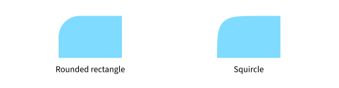
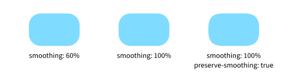

# dorodango

[](./docs/manual.pdf)
[](https://github.com/apcamargo/dorodango)

`dorodango` is a Typst package for drawing squircles.

## Background

Squircles are rounded rectangles with corners that blend smoothly into their straight edges. Unlike a standard rounded rectangle, which transitions abruptly from a straight edge to a circular arc, a squircle changes curvature gradually around each corner. As a result, a squircle reads as one unified shape, rather than a square that has simply had its corners clipped or rounded off.

# Documentation

Refer to the [manual](./docs/manual.pdf) for a full API reference and usage examples.

## Quickstart

In a Typst document, import the `dorodango` package:

```typ
#import "@preview/dorodango:0.1.0": *
```

`dorodango` provides a `squircle` function that mirrors the built-in `rect` element but adds parameters for controlling corner smoothing. The example below compares a rectangle and a squircle of the same size and corner radius, illustrating how their corner-to-edge transitions differ.

```typ
#grid(
  columns: (1fr, 1fr),
  gutter: 14pt,
  rect(width: 90pt, height: 60pt, radius: (top-left: 50%), fill: aqua),
  squircle(
    width: 90pt,
    height: 60pt,
    radius: (top-left: 50%),
    smoothing: 100%,
    fill: aqua,
  ),
)
```

<picture>
  <source
    media="(prefers-color-scheme: dark)"
    srcset="assets/rectangle-vs-squircle-dark.svg"
  />
  
</picture>

## Customize squircle corners

- `smoothing: 0%` produces an ordinary rounded rectangle.
- Higher values make the edge-to-corner transition more gradual. At `100%`, the corner has no circular arc.
- On a small shape, the default reduces smoothing until the corner fits. Set `preserve-smoothing: true` to keep the requested smoothing, which can make the corner look compressed.

The shapes below share the same size and radius. The final shape preserves its requested smoothing after it no longer fits.

```typ
#grid(
  columns: (1fr, 1fr, 1fr),
  gutter: 14pt,
  squircle(width: 85pt, height: 55pt, radius: 20pt, fill: aqua),
  squircle(
    width: 85pt,
    height: 55pt,
    radius: 20pt,
    smoothing: 100%,
    fill: aqua,
  ),
  squircle(
    width: 85pt,
    height: 55pt,
    radius: 20pt,
    smoothing: 100%,
    preserve-smoothing: true,
    fill: aqua,
  ),
)
```

<picture>
  <source
    media="(prefers-color-scheme: dark)"
    srcset="assets/smoothing-comparison-dark.svg"
  />
  
</picture>
