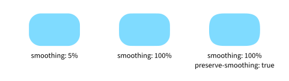
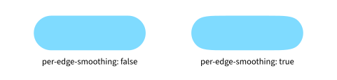

# dorodango

[](https://typst.app/universe/package/dorodango)
[](./docs/manual.pdf)
[](https://github.com/apcamargo/dorodango)

`dorodango` is a Typst package for drawing squircles with tunable corner smoothing.

## Background

Smooth-cornered rectangles blend their corners gradually into straight edges. While a standard rounded rectangle jumps abruptly from a straight edge into a circular arc, smooth corners ease into the curve with zero starting curvature.

`dorodango` provides three corner families:

- `squircle`: [Figma's](https://www.figma.com/blog/desperately-seeking-squircles/) squircle construction, combining a circular arc with cubic Bézier shoulders at either end.
- `superellipse`: cubic approximations of Lamé curves parameterized by an exponent, from a standard circular arc at 2 to squarer corners with continuous curvature.
- `clothoid`: cubic approximations of Euler-spiral blends where curvature ramps linearly along the curve.

# Documentation

Refer to the [manual](./docs/manual.pdf) for a full API reference and usage examples.

## Quickstart

In a Typst document, import the `dorodango` package:

```typ
#import "@preview/dorodango:0.3.0": *
```

`dorodango` provides a `squircle` function that mirrors Typst's built-in `rect` element, adding parameters to control corner smoothing. The comparison below shows how the corner-to-edge transitions differ for a rectangle and a squircle of the same size and radius:

```typ
#grid(
  columns: (1fr, 1fr),
  gutter: 14pt,
  rect(width: 90pt, height: 60pt, radius: (top-left: 50%), fill: aqua),
  squircle(
    width: 90pt,
    height: 60pt,
    radius: (top-left: 50%),
    smoothing: 100%,
    fill: aqua,
  ),
)
```

<picture>
  <source
    media="(prefers-color-scheme: dark)"
    srcset="assets/rectangle-vs-squircle-dark.svg"
  />
  
</picture>

## Customize squircle corners

Three parameters control how squircle corners are drawn:

- `smoothing` controls how gradually edges blend into corners. At `0%`, the shape is an ordinary rounded rectangle. At `100%`, the central circular arc disappears entirely and the two Bézier shoulders meet.
- `preserve-smoothing` determines how the corner adapts when the requested radius and smoothing exceed available edge space.
- `per-edge-smoothing` lets each edge of a corner use its own available space instead of constraining both to the shorter edge.

In the example below, all three shapes share the same size and radius. The third preserves its requested smoothing even when edge space runs out:

```typ
#grid(
  columns: (1fr, 1fr, 1fr),
  gutter: 14pt,
  squircle(
    width: 85pt,
    height: 55pt,
    radius: 20pt,
    smoothing: 5%,
    fill: aqua,
  ),
  squircle(
    width: 85pt,
    height: 55pt,
    radius: 20pt,
    smoothing: 100%,
    fill: aqua,
  ),
  squircle(
    width: 85pt,
    height: 55pt,
    radius: 20pt,
    smoothing: 100%,
    preserve-smoothing: true,
    fill: aqua,
  ),
)
```

<picture>
  <source
    media="(prefers-color-scheme: dark)"
    srcset="assets/smoothing-comparison-dark.svg"
  />
  
</picture>

On the pill shape below, the corner radius consumes the entire vertical edge, leaving no room for smoothing. By default, corners stay symmetric, so horizontal smoothing is clamped to match the vertical limit. Setting `per-edge-smoothing: true` allows the horizontal edges to use their remaining length and smooth independently:

```typ
#grid(
  columns: (1fr, 1fr),
  gutter: 14pt,
  squircle(
    width: 160pt,
    height: 50pt,
    radius: 25pt,
    smoothing: 100%,
    fill: aqua,
  ),
  squircle(
    width: 160pt,
    height: 50pt,
    radius: 25pt,
    smoothing: 100%,
    per-edge-smoothing: true,
    fill: aqua,
  ),
)
```

<picture>
  <source
    media="(prefers-color-scheme: dark)"
    srcset="assets/per-edge-smoothing-comparison-dark.svg"
  />
  
</picture>

## Alternative corner curve families

Besides `squircle`, `dorodango` also provides `superellipse` and `clothoid` to round corners using different curve families.

Note that each family is governed by different parameters, so the comparison below is not like-for-like. While `squircle` and `clothoid` corner blends can extend along adjacent edges as space allows, `superellipse` corners always stay strictly within their radius.

```typ
#grid(
  columns: (1fr, 1fr, 1fr),
  gutter: 14pt,
  row-gutter: 12pt,
  align: center + top,
  squircle(
    width: 85pt,
    height: 55pt,
    radius: 20pt,
    smoothing: 100%,
    fill: aqua,
  ),
  superellipse(
    width: 85pt,
    height: 55pt,
    radius: 20pt,
    exponent: 5,
    fill: aqua,
  ),
  clothoid(
    width: 85pt,
    height: 55pt,
    radius: 20pt,
    smoothing: 100%,
    fill: aqua,
  ),

  [Squircle \ smoothing: 100%],
  [Superellipse \ exponent: 5],
  [Clothoid \ smoothing: 100%],
)
```

<picture>
  <source
    media="(prefers-color-scheme: dark)"
    srcset="assets/corner-family-comparison-dark.svg"
  />
  
</picture>
