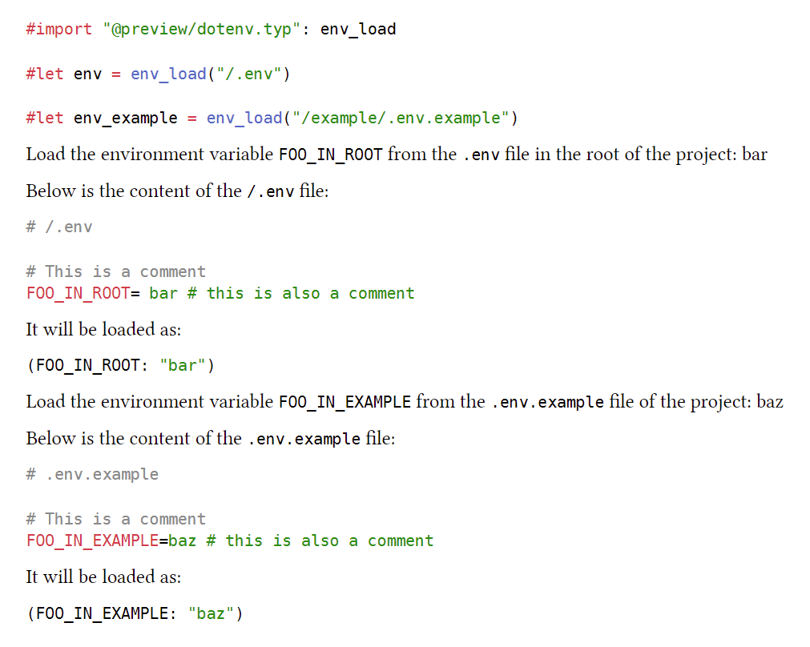

# Dotenv

Load environment variables from a .env file.

## Example



```typ
#import "@preview/dotenv.typ": env_load

#let env = env_load("/.env")

#let env_example = env_load("/example/.env.example")
```

with the following .env file:

```ini
# .env
FOO_IN_ROOT=bar

# .env.example
FOO_IN_EXAMPLE=baz
```
