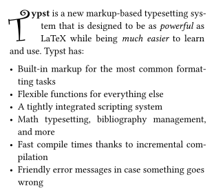
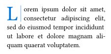

# droplet
A package for creating dropped capitals in typst.

## Usage
The package comes with a single `dropcap` function that takes content and a few optional parameters. The first letter of the content will be shown as a dropped capital, while the rest of the content will be wrapped around it. The parameters are as follows:

| Parameter        | Description                                              | Default |
|------------------|----------------------------------------------------------|---------|
| `height`         | The height of the dropped capital in lines or as length. | `2`     |
| `justify`        | Whether the text should be justified.                    | `false` |
| `gap`            | The space between the first letter and the text.         | `0pt`   |
| `hanging-indent` | The indent of lines after the first.                     | `0pt`   |
| `transform`      | A function to be applied to the first letter.            | `none`  |
| `..text-args`    | Arguments to be passed to the text function.             | `(:)`   |

> [!NOTE]
> Show and set rules applied inside the content passed to the `dropcap` function do not work!

```typ
#import "@preview/droplet:0.1.0": dropcap

#dropcap(
  height: 3,
  justify: true,
  gap: 4pt,
  hanging-indent: 1em,
  font: "Curlz MT",
)[
  *Typst* is a new markup-based typesetting system that is designed to be as
  _powerful_ as LaTeX while being _much easier_ to learn and use. Typst has:

  - Built-in markup for the most common formatting tasks
  - Flexible functions for everything else
  - A tightly integrated scripting system
  - Math typesetting, bibliography management, and more
  - Fast compile times thanks to incremental compilation
  - Friendly error messages in case something goes wrong
]
```



## Extended Customization
To further customize the appearance of the dropped capital, you can apply a `transform` function, which takes the first letter as a string and returns the content to be shown. The font size of the letter is then scaled so that the height of the transformed content matches the given height.

```typ
#import "@preview/droplet:0.1.0": dropcap

#dropcap(
  height: 2,
  justify: true,
  gap: 6pt,
  transform: letter => style(styles => {
    let height = measure(letter, styles).height

    grid(columns: 2, gutter: 6pt,
      align(center + horizon, text(blue, letter)),
      // Use "place" to ignore the line's height when
      // the font size is calculated later on.
      place(horizon, line(
        angle: 90deg,
        length: height + 6pt,
        stroke: blue.lighten(40%) + 1pt
      )),
    )
  }),
  lorem(21)
)

```


