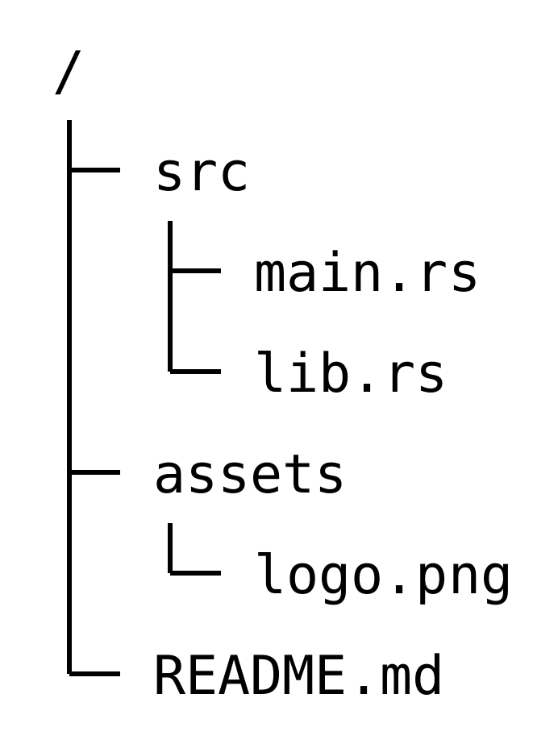
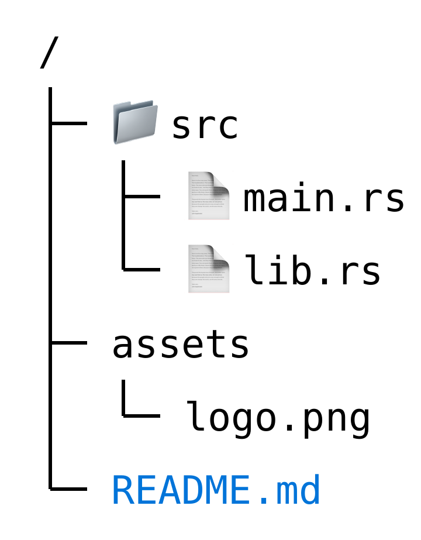

# dtree

**dtree** is a flexible and highly customizable directory tree visualization package for Typst. It renders directory structures using simple indented text, supports smart icon mapping, automatic styling rules, and vector-based connecting lines.

## Usage

### 1. Basic Usage

The simplest way to use `dtree` is to pass a raw block. By default, it uses the standard monospace font defined in your document.

````typ
#import "@preview/dtree:0.1.0": dtree

#dtree(```
/
 src
  main.rs
  lib.rs
 assets
  logo.png
 README.md
```)
````



### 2. Styling and Inline Parameters

You can customize the tree globally or per line. Use the `|` delimiter to specify an icon or parameters before the filename.

````typ
#dtree(
  stroke: 1pt + blue,
  fill: navy,
```
/
 📁 | src
  📄 | main.rs
  📄 | lib.rs
 assets
  logo.png
 fill=blue | README.md
```
)
````



### 3. Advanced: Icon Rules & Images

To use images, you must read the file as bytes using `read(..., encoding: none)` and pass it to the `icons` dictionary.

**Note:** When using `regex` patterns, `icon-rules` must be an **array of pairs** (e.g., `((key, val),)`) instead of a dictionary.

````typ
#let rust-icon = read("rust-logo.png", encoding: none)
#let config-icon = "🔒"
#let image-icon = "📷"
#let folder-icon = "📁"

#dtree(
  icons: (
    "rs": rust-icon,
    "img": image-icon,
    "dir": folder-icon,
  ),
  icon-rules: (
    (regex("/$"), "dir"),
    ("*.rs", (icon: "rs")),
    ("*.png", (icon: "img")),
    ("Cargo.toml", (icon: config-icon, fill: maroon)),
  ),
```
project/
 src/
  main.rs
  utils.rs
 assets/
  logo.png
Cargo.toml
```
)
````


## Input Syntax

Each line in the raw block is parsed as follows:

```text
[Icon Name], [Key=Value], ... | [Content]
```

1. **Icon Name** (Optional):
   - A key defined in the `icons` dictionary.
   - A raw emoji or text string (e.g., `📁`, `Rs`).
   - **Note:** Direct file paths (e.g. `image.png`) are not supported inside the raw block. Please load images via the `icons` dictionary.
2. **Parameters** (Optional): Comma-separated `key=value` pairs.
   - Supported keys: `size`, `dx`, `dy`, `fill` (or `color`), `font`.
3. **Delimiter**: The `|` character separates metadata from the content name.

**Examples:**

- `📁 | Documents` (Icon only)
- `fill=red | Important.txt` (Params only)
- `my_icon, size=1.5em, dy=2pt | image.png` (Icon + Params)
- `file.txt` (Content only)

### Icon Priority

Icons are resolved in the following order (highest to lowest priority):

1. **Inline specification** — Direct icon specified in the line (e.g., `🍣 | sushi.txt`)
2. **`icon-rules`** — Pattern-based rules that match the content name
3. **`default-icon`** — Fallback icon if no other match is found


## API Reference

### `dtree`

<table>
<thead>
<tr>
<th>Argument</th>
<th>Type</th>
<th>Default</th>
<th>Description</th>
</tr>
</thead>
<tbody>
<tr>
<td><strong><code>body</code></strong></td>
<td><code>content</code> or <code>str</code></td>
<td><strong>Required</strong></td>
<td>The directory structure text. Using a <code>raw</code> block is recommended to preserve indentation.</td>
</tr>
<tr>
<td colspan="4" align="center"><em>Layout</em></td>
</tr>
<tr>
<td><code>indent-width</code></td>
<td><code>length</code></td>
<td><code>1.5em</code></td>
<td>The horizontal width of one indentation level.</td>
</tr>
<tr>
<td><code>row-height</code></td>
<td><code>length</code></td>
<td><code>1.5em</code></td>
<td>The height of a single row.</td>
</tr>
<tr>
<td><code>spacing</code></td>
<td><code>length</code></td>
<td><code>0.5em</code></td>
<td>The space between the tree lines and the content.</td>
</tr>
<tr>
<td><code>indent-marker</code></td>
<td><code>str</code></td>
<td><code>" "</code></td>
<td>The character used to calculate indentation levels (e.g., set to <code>"\t"</code> for tabs or <code>"  "</code> for 2-space indentation).</td>
</tr>
<tr>
<td colspan="4" align="center"><em>Style</em></td>
</tr>
<tr>
<td><code>stroke</code></td>
<td><code>stroke</code></td>
<td><code>0.7pt + black</code></td>
<td>The style of the connecting lines (thickness + color).</td>
</tr>
<tr>
<td><code>font</code></td>
<td><code>str</code> or <code>array</code></td>
<td><code>none</code></td>
<td>The font family. If <code>none</code>, uses <code>raw()</code> (inherits code font). If specified, uses <code>text(font: ...)</code>.</td>
</tr>
<tr>
<td><code>size</code></td>
<td><code>length</code></td>
<td><code>10pt</code></td>
<td>The font size for filenames.</td>
</tr>
<tr>
<td><code>fill</code></td>
<td><code>color</code></td>
<td><code>black</code></td>
<td>The text color for filenames.</td>
</tr>
<tr>
<td colspan="4" align="center"><em>Icons</em></td>
</tr>
<tr>
<td><code>icons</code></td>
<td><code>dictionary</code></td>
<td><code>(:)</code></td>
<td>A dictionary mapping names to content or <strong>bytes</strong> (loaded via <code>read(..., encoding: none)</code>).</td>
</tr>
<tr>
<td><code>icon-rules</code></td>
<td><code>array</code></td>
<td><code>()</code></td>
<td>An <strong>array of pairs</strong> mapping patterns (Glob <code>*.ext</code> or <code>regex</code>) to an icon name or a style dictionary. Example: <code>( (regex("..."), val), )</code>.</td>
</tr>
<tr>
<td><code>default-icon</code></td>
<td><code>content</code></td>
<td><code>none</code></td>
<td>An icon to display if no specific icon or rule matches.</td>
</tr>
<tr>
<td><code>icon-size</code></td>
<td><code>length</code></td>
<td><code>1em</code></td>
<td>The default size for icons.</td>
</tr>
<tr>
<td><code>icon-dx</code></td>
<td><code>length</code></td>
<td><code>-1pt</code></td>
<td>Horizontal offset for icons.</td>
</tr>
<tr>
<td><code>icon-dy</code></td>
<td><code>length</code></td>
<td><code>0pt</code></td>
<td>Vertical offset for icons.</td>
</tr>
</tbody>
</table>

### Parameter Dictionary (`icon-rules` & Inline Params)

When defining `icon-rules` values or using inline syntax, the following keys are available:

- `icon`: (String) The name of the icon to use (only for `icon-rules`).
- `size`: (Length) Size of the icon/image.
- `fill` or `color`: (Color) Text color.
- `font`: (String) Font family.
- `dx`: (Length) Horizontal offset.
- `dy`: (Length) Vertical offset.

## License

This project is distributed under the MIT License. See [LICENSE](LICENSE) for details.