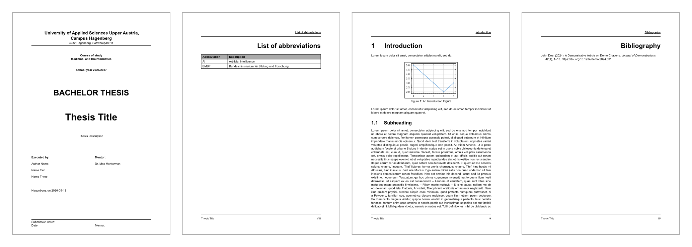

# Easy Hagenberg Thesis Template

Opinionated Typst template for bachelor and master theses (and related protocols) at FH Upper Austria, with a focus on Campus Hagenberg.

The template is designed to work in two modes:

- **Fast start via Typst package** for normal usage
- **Full source customization** when you want to adapt sections/styles deeply

## Intent

Typst makes professional-quality publishing simple and accessible for everyone. I believe more people should benefit from its power and ease of use.

I made this template because I couldn’t find a high-quality, flexible FH thesis template. My goal is to help anyone start their thesis with Typst quickly and easily, while also giving advanced users the freedom to customize the template however they need without unnecessary limitations.

Concretely, this template provides a practical, production-ready thesis layout with:

- pre-structured front matter and content flow
- sensible defaults for typography and page layout
- bilingual labels and declarations
- an extensible API for section-level and document-level styling

The package name is `@preview/easy-hgb-thesis`.

## Beware

This template is far from its finished state.
It will evolve based on user feedback and my experience with it as part of my bachelor thesis during the winter term 2026/27. Expect continous improvements during this period.

## Preview



## Quick Start

### Option A: Use as a Typst package (recommended)

In your Typst document:

```typ
#import "@preview/easy-hgb-thesis:0.1.0": full-thesis
```

Then configure metadata and wrap your content with `#show: full-thesis.with(...)` (see `template/main.typ` for a complete example).

You can get started even quicker by using the predefined template:

```bash
typst init @preview/easy-hgb-thesis
```

### Option B: Clone and customize this repository

```bash
git clone https://github.com/timerertim/hagenberg-thesis-template.git
cd hagenberg-thesis-template
mise install
```

Change the import in the `main.typ` file:

```typ
#import "../lib.typ": full-thesis
```

Build the example template document:

```bash
cd template
mise run export
```

## Styling and Customization

The core template entry point is `full-thesis` in `lib.typ` / `components/template.typ`.

You can customize styling at multiple levels through function hooks, including:

- `global-style` (fonts, page geometry, global defaults)
- `document-style` (document-wide behavior outside title page)
- `content-style` (main chapter content)
- section-specific hooks like `abstract-style`, `outline-style`, `bibliography-style`, etc.

Default style behavior lives in `components/styles.typ` (A4, Arial 11pt, page numbering and heading conventions, bibliography defaults, etc.).

## Language Support

The template currently supports **English (`en`)** and **German (`de`)** through `components/i8n.typ`.

- Set document language with Typst text language, e.g.:
  - `#set text(lang: "en")`
  - `#set text(lang: "de")`
- Localized section names and declaration page selection are handled automatically.
- If a key is missing, localization falls back to English.


## Setup with `mise.toml`

The repository includes a template project `template/` with its own `mise.toml` that configures:

- tool versions (`typst`, `typstyle`)
- Typst environment paths (`TYPST_ROOT`, font path)
- reusable tasks for formatting and exporting the document

Useful tasks:

- `mise run export` - export the main document to PDF

## Repository Structure

- `lib.typ` - public package entrypoint
- `components/` - template API, sections, i18n, and style defaults
- `template/` - runnable example thesis project

## License

This repository is released under **CC0-1.0** (public domain dedication).  
See `LICENSE` for the full legal text.

## Contributing

Issues and pull requests are very welcome.

- Open an issue for bugs, feature requests, or campus-specific adjustments.
- Open a PR for fixes, style improvements, localization updates, and docs improvements.

Feedback from real thesis usage is especially valuable to keep the template robust and practical.
