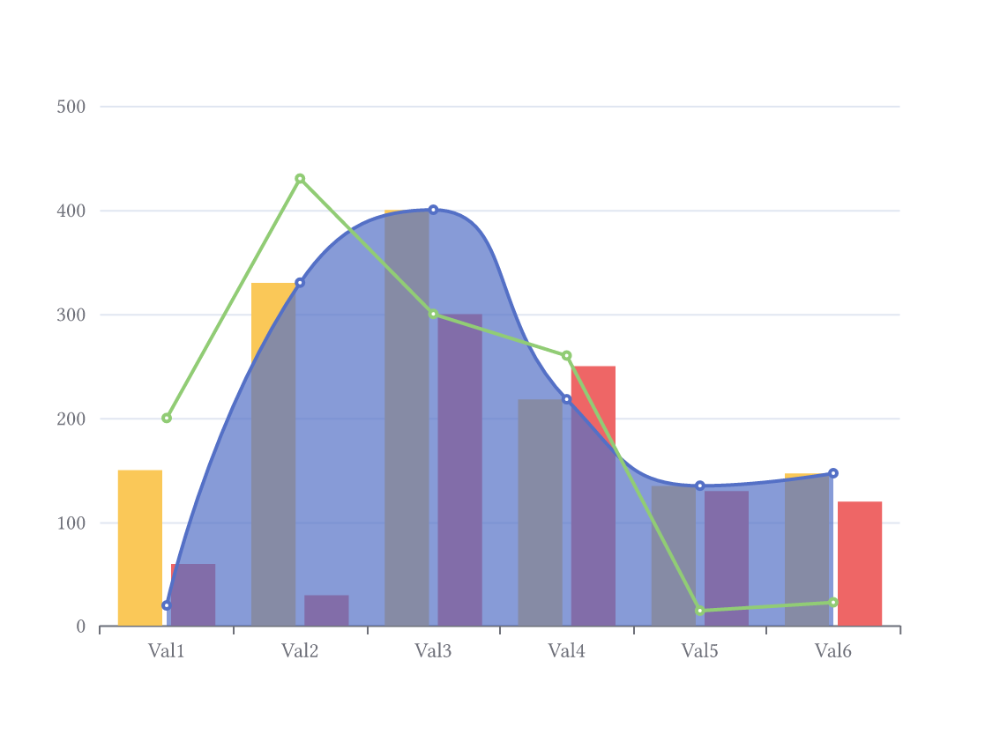
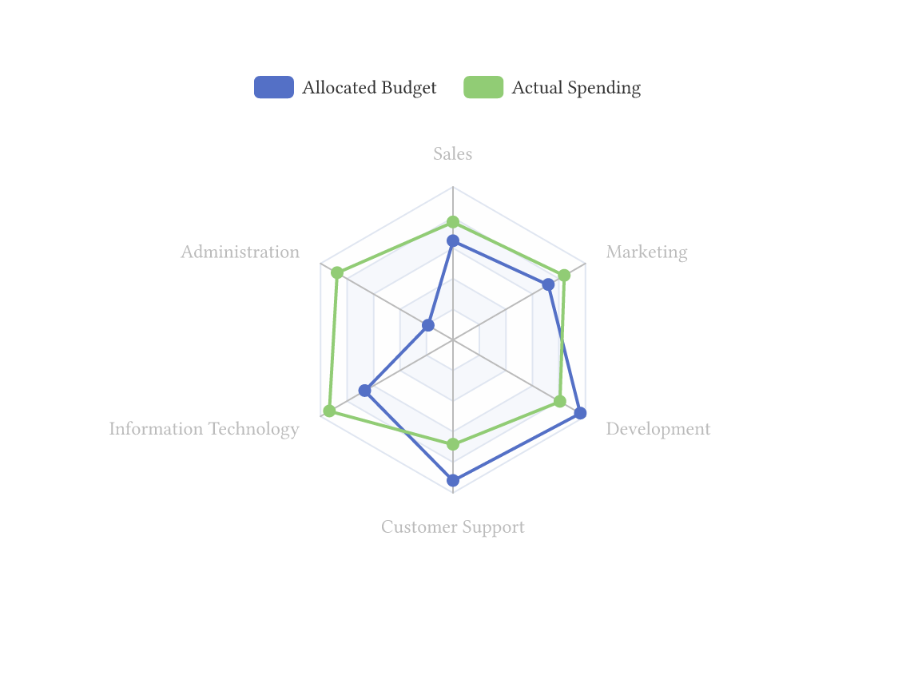
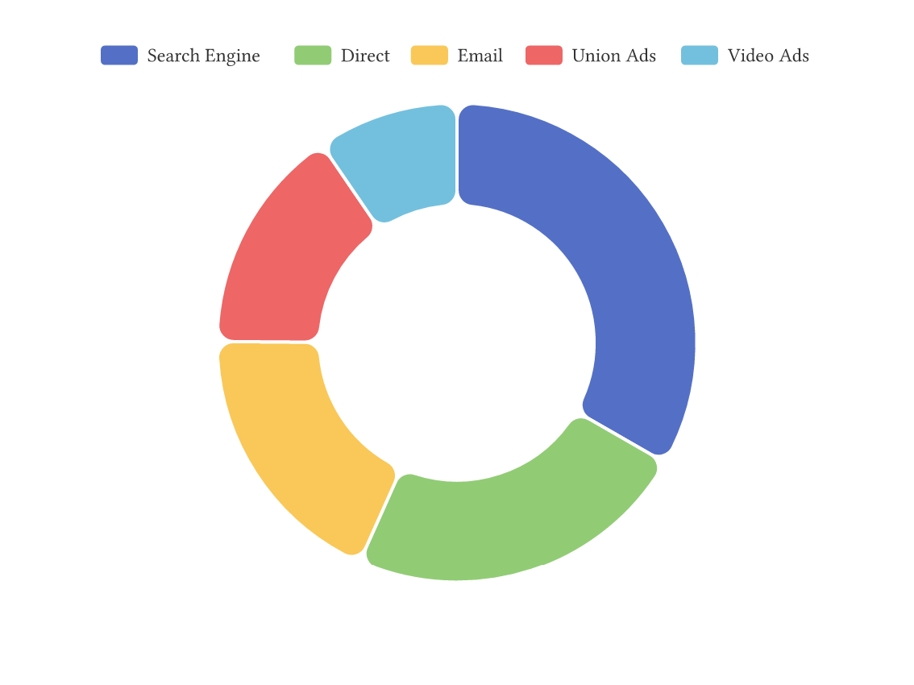
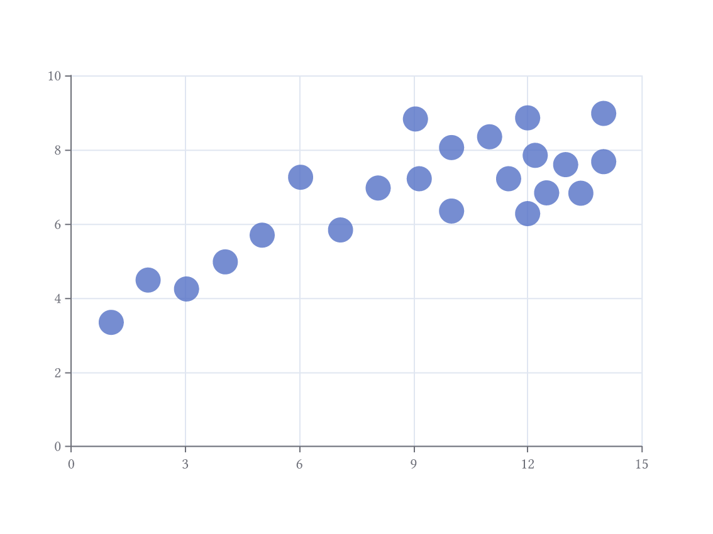
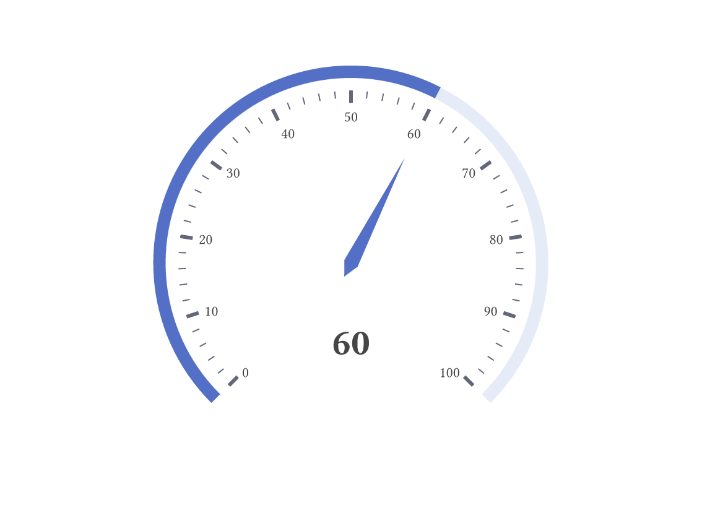
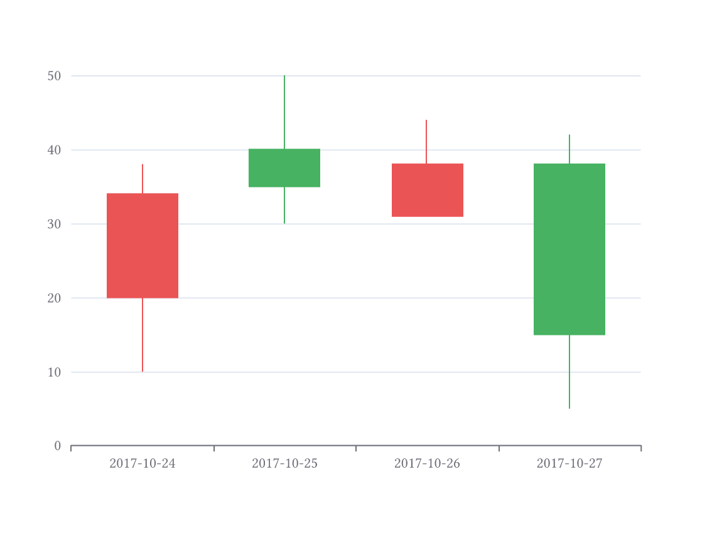

# Echarm

A typst plugin to run echarts in typst with the use of CtxJS.

## Examples

<table>
  <tr>
    <td><a href="examples/mixed_charts.typ"></a></td>
    <td><a href="examples/radar.typ"></a></td>
    <td><a href="examples/pie.typ"></a></td>
  </tr>
  <tr>
    <td><a href="examples/mixed_charts.typ">Source Code</a></td>
    <td><a href="examples/radar.typ">Source Code</a></td>
    <td><a href="examples/pie.typ">Source Code</a></td>
  </tr>
  <tr>
    <td><a href="examples/scatter.typ"></a></td>
    <td><a href="examples/gauge.typ"></a></td>
    <td><a href="examples/candlestick.typ"></a></td>
  </tr>
  <tr>
    <td><a href="examples/scatter.typ">Source Code</a></td>
    <td><a href="examples/gauge.typ">Source Code</a></td>
    <td><a href="examples/candlestick.typ">Source Code</a></td>
  </tr>
</table>

For more examples see:

https://echarts.apache.org/examples/en/index.html

For the complete documentation for the configuration of echarts, see:

https://echarts.apache.org/en/option.html


## Usage

```typst
#import "@preview/echarm:0.1.1"

// options are echart options
#echarm.render(width: 100%, height: 100%, options: (:))
```

## Infos
The version is not the same as the echart version, so that I can update independently.
Animations are not supported here!

You can find more information about CtxJS here:

https://typst.app/universe/package/ctxjs/

## Versions

| Version | Echart-Version     |
|---------|--------------------|
| 0.1.0   | 5.5.1              |
| 0.1.1   | 5.5.1<sup>1</sup> |

<sup>1</sup> new eval-later feature