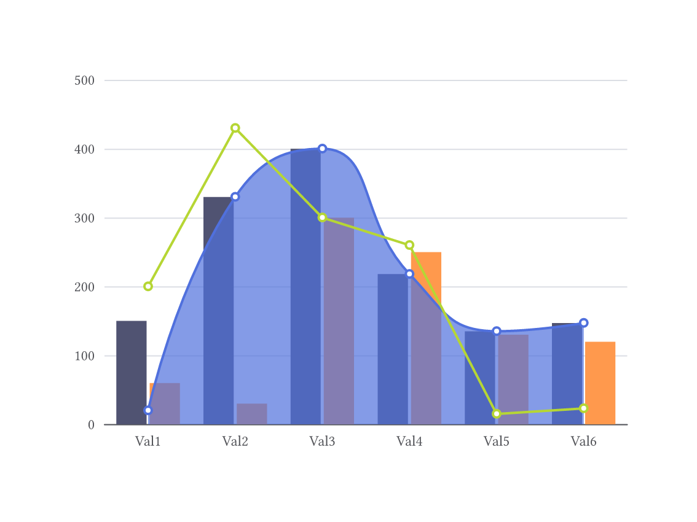
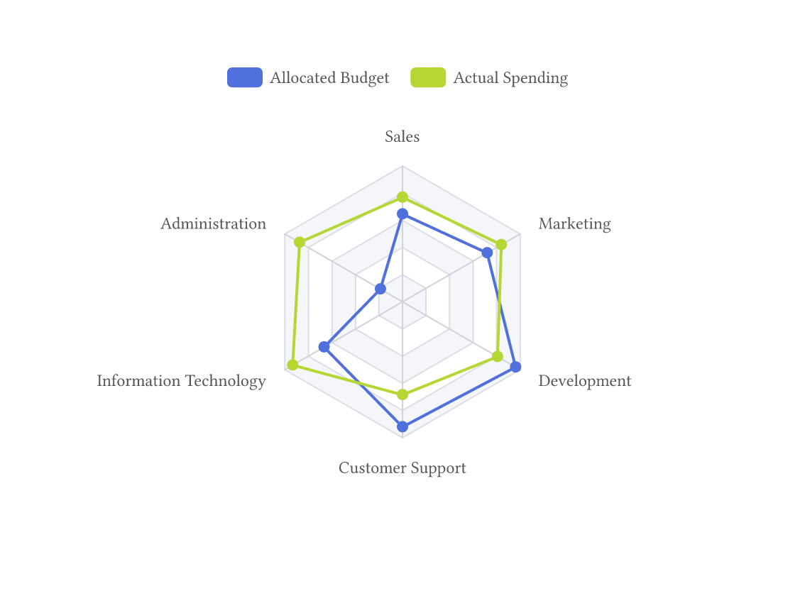
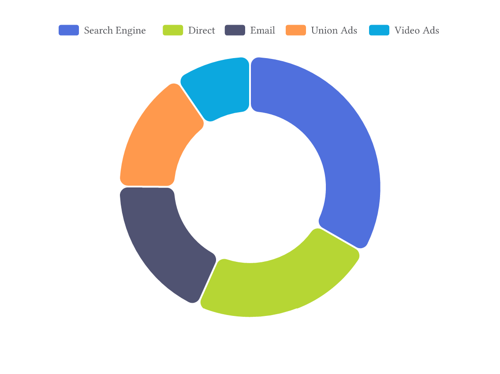
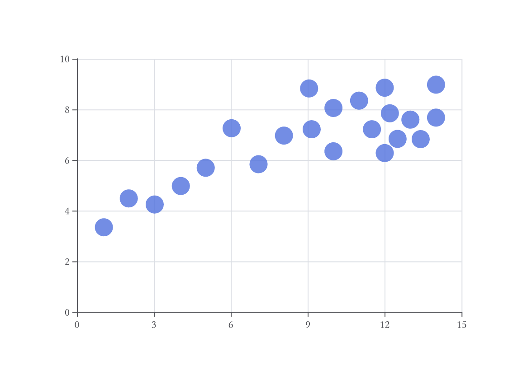
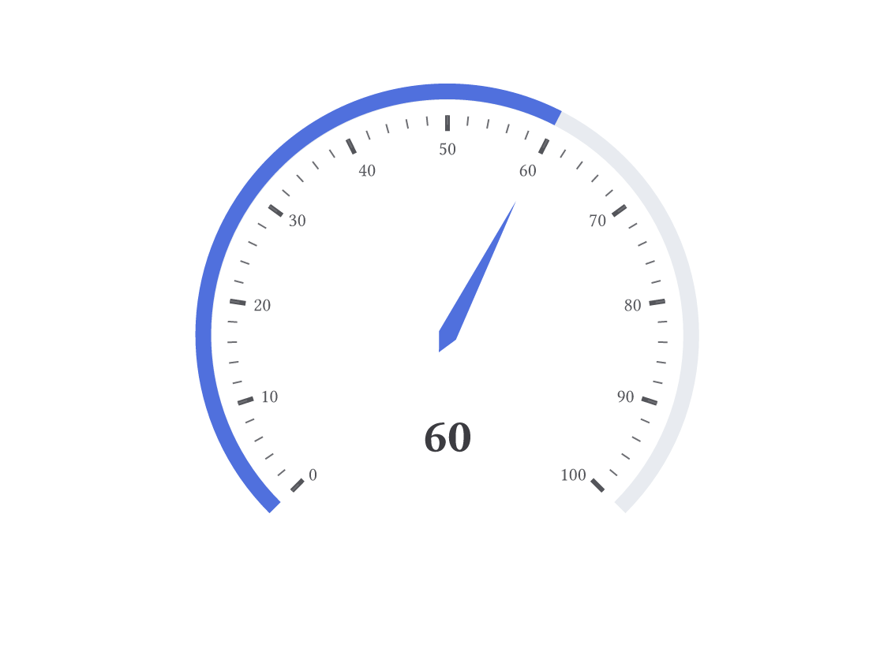
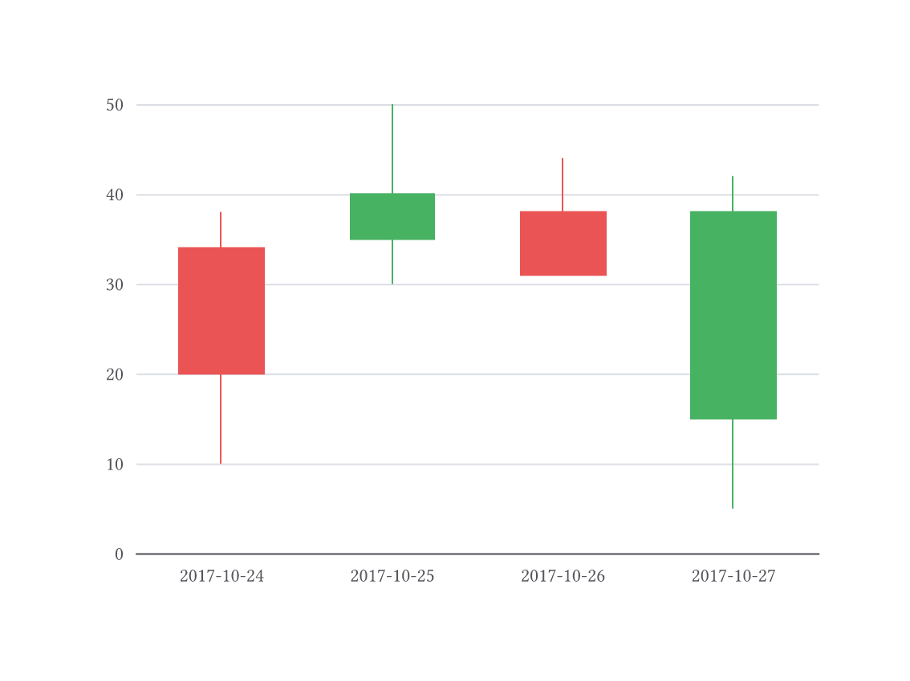
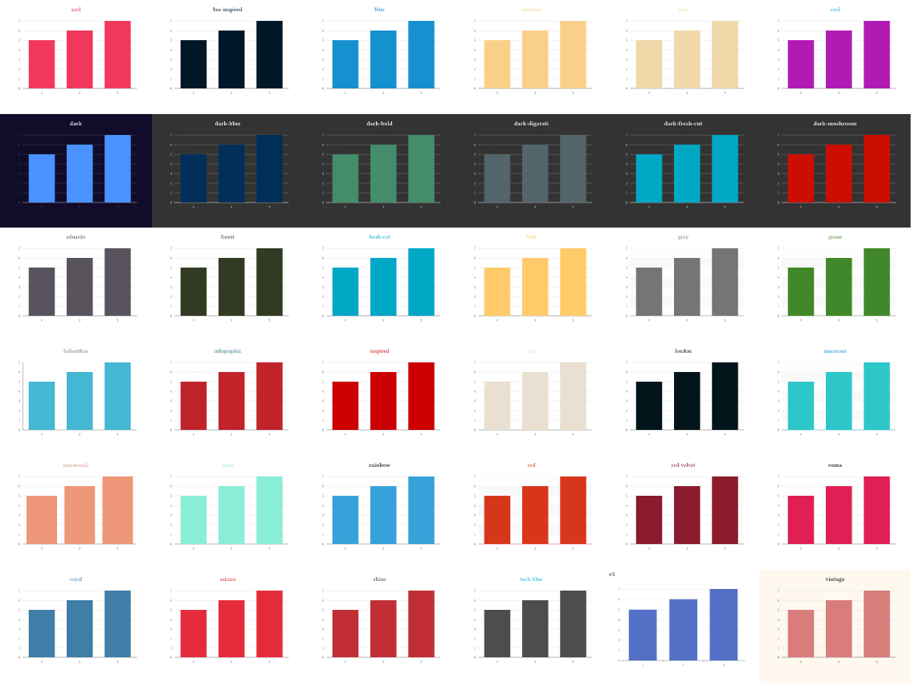

# Echarm

A typst plugin to run echarts in typst with the use of CtxJS.

## Examples

<table>
  <tr>
    <td><a href="typst-package/examples/mixed_charts.typ"></a></td>
    <td><a href="typst-package/examples/radar.typ"></a></td>
    <td><a href="typst-package/examples/pie.typ"></a></td>
  </tr>
  <tr>
    <td><a href="typst-package/examples/mixed_charts.typ">Source Code</a></td>
    <td><a href="typst-package/examples/radar.typ">Source Code</a></td>
    <td><a href="typst-package/examples/pie.typ">Source Code</a></td>
  </tr>
  <tr>
    <td><a href="typst-package/examples/scatter.typ"></a></td>
    <td><a href="typst-package/examples/gauge.typ"></a></td>
    <td><a href="typst-package/examples/candlestick.typ"></a></td>
  </tr>
  <tr>
    <td><a href="typst-package/examples/scatter.typ">Source Code</a></td>
    <td><a href="typst-package/examples/gauge.typ">Source Code</a></td>
    <td><a href="typst-package/examples/candlestick.typ">Source Code</a></td>
  </tr>
</table>

For more examples see (handpicked from https://echarts.apache.org/examples/en/index.html):

[examples.pdf](https://raw.githubusercontent.com/lublak/typst-echarm-package/refs/tags/v0.4.0/examples.pdf)


For the complete documentation for the configuration of echarts, see:

https://echarts.apache.org/en/option.html


## Usage

```typst
#import "@preview/echarm:0.4.0"

// options are echart options
#echarm.render(width: 100%, height: 100%, options: (:))
```


### Inject a javascript callback

To use a echart callback, you can use the `value.eval` function:

```typst
#import "@preview/echarm:0.4.0"

// options are echart options
#echarm.render(width: 100%, height: 100%, options: (
  series: (
    labelLayout: echarm.value.eval("your javascript callback code")
  )
))
```

### Themes

Echarm has buildin themes in `echarm.theme` but you can also provide your custom theme.
The [builder](https://echarts.apache.org/en/theme-builder.html) can be useful for this.
Instead of the themes id, you can specify the theme object as a parameter here.

<table>
  <tr>
    <td><a href="typst-package/examples/themes.typ"></a></td>
  </tr>
  <tr>
    <td><a href="typst-package/examples/themes.typ">Source Code</a></td>
  </tr>
</table>

### Languages

Echarm has buildin language support in `echarm.language`.

## Infos
The version is not the same as the echart version, so that I can update independently.
Animations are not supported here!

You can find more information about CtxJS here:

https://typst.app/universe/package/ctxjs/

## Versions

| Version | Echart-Version    |
| ------- | ----------------- |
| 0.1.0   | 5.5.1             |
| 0.1.1   | 5.5.1<sup>1</sup> |
| 0.2.0   | 5.6.0             |
| 0.2.1   | 5.6.0<sup>2</sup> |
| 0.3.0   | 6.0.0             |
| 0.3.1   | 6.0.0<sup>3</sup> |
| 0.4.0   | 6.1.0<sup>4</sup> |

<sup>1</sup> new eval-later feature\
<sup>2</sup> compatibility with typst 0.13 using ctxjs 0.3.0\
<sup>3</sup> added a tool to encode an image into an image data url using ctxjs 0.3.2\
<sup>4</sup> added theme and language support with buildins, update ctxjs 0.5.0 eval-later is now `value.eval`