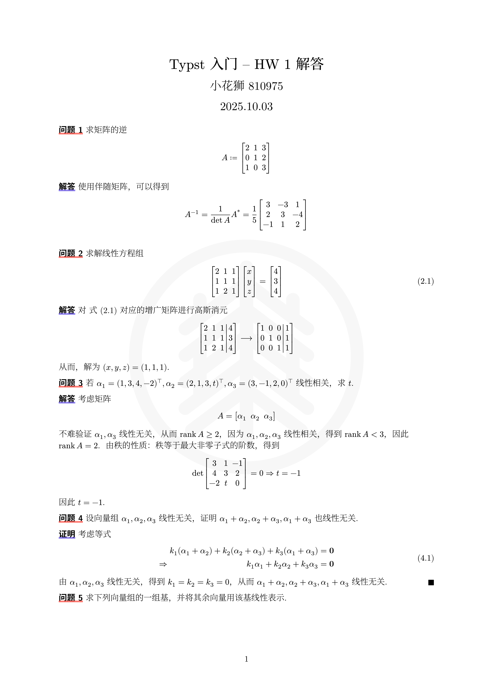
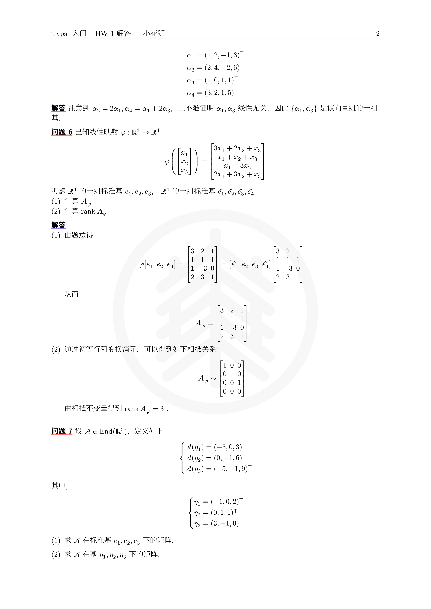
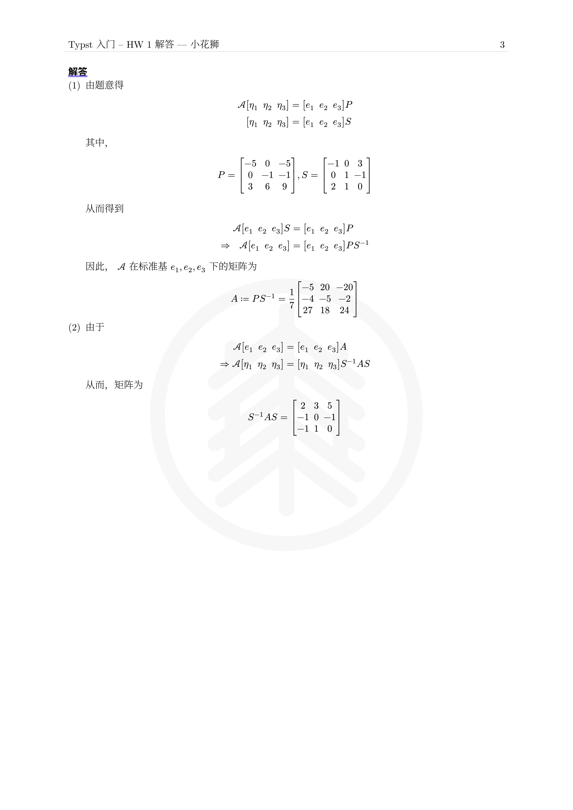

# ECNU Math Homework 

为华东师范大学写的作业模板，主要针对 问题-解答/证明的形式。

## 特点
- 支持中英文
- 格式简约美观
- 为每个问题中的行间公式进行编号，可以直接引用。
- 大大的校徽水印

适用于提交 问题-解答/证明 类型的 pdf 作业

## 预览
| 1                    | 2                  | 3                |
| ----------------------- | --------------------- | --------------------- |
|  |  |  |

可见仓库中的 `template/hw.typ` 文件。

注意：中英文语言的设置要在 `show: hwk` 之前。

## 使用


可使用 Typst Universe 源导入：

```typ
#import "@preview/ecnu-math-hwk:0.1.0": *
```

也可克隆仓库到工作目录下进行导入。

```typ
#import "ecnu-math-hwk/lib.typ": *
```

字体没有内置，您可能需要安装以下字体：

```typ
#let needed-font = (
    "Source Han Serif SC",
    "New Computer Modern",
    "Source Han Sans SC",
    "New Computer Modern Sans"
)
```

注意：在一般情况下使用校徽，应尽量使用提供的光盘电子文件，不建议重绘，尽量避免在重.绘中出现误差。

---

## Features
- Supports both Chinese and English
- Simple and elegant format
- Each display formula in a problem is numbered and can be referenced directly.
- Large ECNU watermark

Suitable for submitting pdf homework in the form of problem-solution/proof.

## Preview
| 1                    | 2                  | 3                |
| ----------------------- | --------------------- | --------------------- |
|  |  |  |

source codes can be found at the `template/hw.typ` file in the repository.

Note: The language setting must be set before `show: hwk`.

## Usage
You can import it using the Typst Universe source:

```typ
#import "@preview/ecnu-math-hwk:0.1.0": *
```
Or clone the repository to your working directory for import.

```typ
#import "ecnu-math-hwk/lib.typ": *
```

The fonts are not built-in, you may need to install the following fonts:

```typ
#let needed-font = (
    "Source Han Serif SC",
    "New Computer Modern",
    "Source Han Sans SC",
    "New Computer Modern Sans"
)
```

Note: In general, when using the school emblem, try to use the electronic files provided on the CD. Redrawing is not recommended, and try to avoid errors in redrawing.

