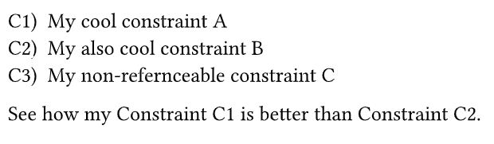

# Typst efilrst
A simple referenceable list library for Typst. If you ever wanted to reference elements in a list by a key, this library is for you. The name comes from "reflist" but sorted alphabetically because we are not allowed to use descriptive names for packages in Typst 🤷🏻‍♂️.

## Example

```typst

#import "@preview/efilrst:0.1.0" as efilrst
#show ref: efilrst.show-rule

#efilrst.reflist(
  [My cool constraint A],<c:a>,
  [My also cool constraint B],<c:b>,
  [My non-refernceable constraint C],
  list_style: "C1)",
  ref_style: "C1",
  name: "Constraint"
)

See how my @c:a is better than @c:b.
```

This generates the following output:




## License

This project is licensed under the MIT License - see the [LICENSE](LICENSE) file for details.

## Changelog

### 0.1.0

- Initial release


