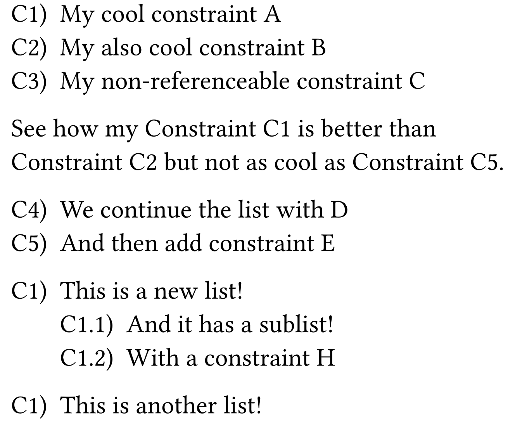

# Typst efilrst
A simple referenceable list library for Typst. If you ever wanted to reference elements in a list by a key, this library is for you. The name comes from "reflist" but sorted alphabetically because we are not allowed to use descriptive names for packages in Typst 🤷🏻‍♂️.

## Example

```typst

#import "@preview/efilrst:0.1.0" as efilrst
#show ref: efilrst.show-rule

#let constraint = efilrst.reflist.with(
  name: "Constraint", 
  list-style: "C1.1.1)", 
  ref-style: "C1.1.1")

#constraint(
  counter-name: "continuable",
  [My cool constraint A],<c:a>,
  [My also cool constraint B],<c:b>,
  [My non-referenceable constraint C],
)

See how my @c:a is better than @c:b but not as cool as @c:e.

#constraint(
  counter-name: "continuable",
  [We continue the list with D],<c:d>,
  [And then add constraint E],<c:e>,
)

#constraint(
  [This is a new list!],<c:f>,
  (
    [And it has a sublist!],<c:g>,
    [With a constraint H],<c:h>,
  )
)

#constraint(
  [This is another list!],<c:i>,
)
```

This generates the following output:




## License

This project is licensed under the MIT License - see the [LICENSE](LICENSE) file for details.

## TODO

- [x] Add continuation of lists through the `counter` function
- [x] Add support for nested lists

## Changelog

### 0.1.0

- Initial release

### 0.2.0

- Add continuation of lists through the `counter` function

### 0.3.0

- Add support for nested lists
