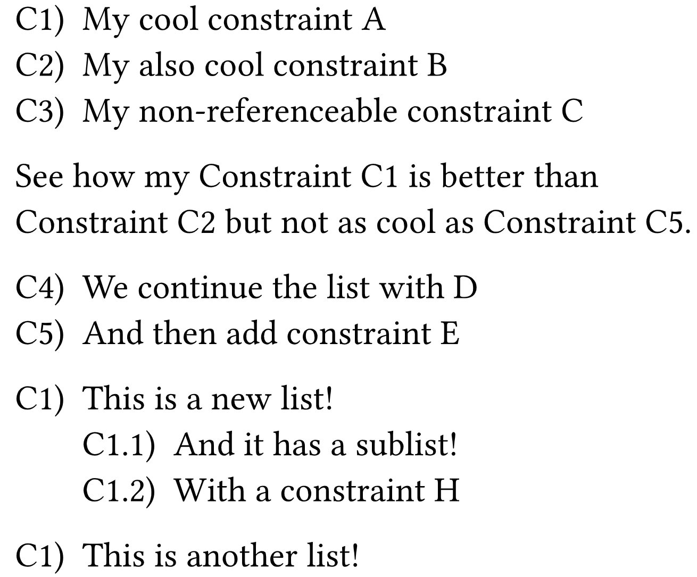

# Typst efilrst
A simple referenceable list library for Typst. If you ever wanted to reference elements in a list by a key, this library is for you. The name comes from "reflist" but sorted alphabetically because we are not allowed to use descriptive names for packages in Typst 🤷🏻‍♂️.

## Example

```typst

#import "@preview/efilrst:0.1.0" as efilrst
#show ref: efilrst.show-rule

#let constraint = efilrst.reflist.with(
  name: "Constraint", 
  list-style: "C1.1.1)", 
  ref-style: "C1.1.1")

#constraint(
  counter-name: "continuable",
  [My cool constraint A],<c:a>,
  [My also cool constraint B],<c:b>,
  [My non-referenceable constraint C],
)

See how my @c:a is better than @c:b but not as cool as @c:e.

#constraint(
  counter-name: "continuable",
  [We continue the list with D],<c:d>,
  [And then add constraint E],<c:e>,
)

#constraint(
  [This is a new list!],<c:f>,
  (
    [And it has a sublist!],<c:g>,
    [With a constraint H],<c:h>,
  )
)

#constraint(
  [This is another list!],<c:i>,
)
```

This generates the following output:



## Reference

```typst
reflist(
  ..children,
  name: "",
  list-style: "1.1.1)",
  ref-style: "1.1.1",
  counter-name: auto,
  start: 1,
  full: true,
  ref-joiner: sym.space.nobreak,
)
```

- `children`: Elements that will be part of the list. They can be given as a `content` followed by a `label` to reference them. If the `label` is not provided, it cannot be referenced. If an array is provided (e.g., `([Content], <label1>, [Content], <label2>)`), the elements will be part of a sublist. Sublists can be nested but they will always require at least one parent element where the sublist will be attached to.
- `name`: Name of the list. This will be used to reference the list.
- `list-style`: Style of the list. It will be used to generate the list numbers.
- `ref-style`: Style of the references. It will be used to generate the numbers of the references.
- `counter-name`: Name of the counter that will be used to generate the numbers. If `auto` is provided, `efilrst` will choose a non-colliding name. If a name is provided and is the same as the name of a previous list, the counter will continue from the last number of the previous list.
- `start`: Number from which the list will start.
- `full`: If `true`, the full reference will be shown. If `false`, only the number will be shown.
- `ref-joiner`: Symbol used to join the name of the reference and the reference itself. By default, a non-breaking space is added to mimic the default behaviour of typst for references. E.g., for a reference named `Constraint` and a reference `C1` it generates `[Constraint~C1]`. To disable it, pass `none`.


## License

This project is licensed under the MIT License - see the [LICENSE](LICENSE) file for details.

## Changelog

### 0.1.0

- Initial release

### 0.2.0

- Add continuation of lists through the `counter` function

### 0.3.0

- Add support for nested lists

### 0.3.1

- Fix bad numbering [#1](https://github.com/jmigual/typst-efilrst/issues/1)
- Add option to have a non-breaking space between the name of the reference and the reference itself [#2](https://github.com/jmigual/typst-efilrst/issues/2)
