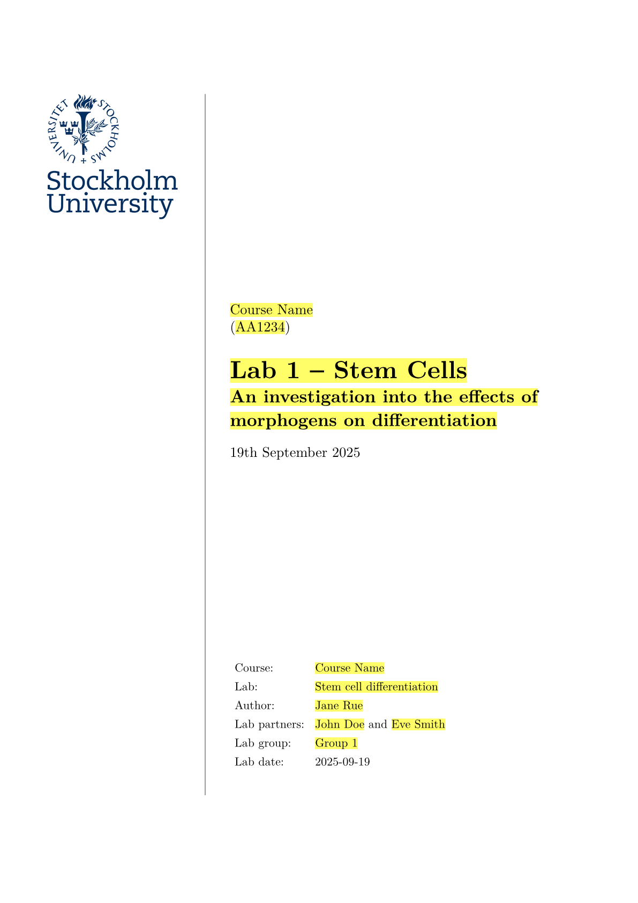

# Lab report, essay and exam template for Typst

## Example document

```bash
# Generate new report based on template.
typst init @preview/efter-plugget
```



## Logo

The default logo used in the template is the [Stockholm University logotype](https://medarbetare.su.se/en/our-su/communicate-su/graphic-profile/logotype). It is goverened by copyright. Replace it with the logo of your University.

## Etymology

The package is named _"Efter plugget"_ in tribute of a Swedish song about finishing Uni.
