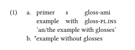

# Typeset linguistic examples with the Simplest Syntax possible

This is a [Typst](https://github.com/typst/typst) package that provides linguistic examples and interlinear glossing. It is a heavily modified fork of [neunenak's typst-leipzig-glossing](https://github.com/neunenak/typst-leipzig-glossing).

# Usage

Below is an example of how to typeset an example.

```typst
#import "@preview/eggs:0.1.0": *
#import abbreviations: pl, ins
#show: eggs

#example[
  + - primer   s     gloss-ami
    - example  with  gloss-#pl.#ins
    'an/the example with glosses' #ex-label(<gl>)
  + #judge[\*]example without glosses
  #ex-label(<pex>)
]
```



- Numbered lists are treated as subexamples, and bullet lists — as glosses. This can be toggled off with passing `auto-subexamples: false` and `auto-glosses: false` to `example`;
- `judge` typesets text without taking up space;
- `ex-label` adds a label to the example;
- Customization is done via the global show rule: `#show eggs.with()`.

See [documentation.pdf](https://github.com/retroflexivity/typst-eggs/blob/main/documentation.pdf) for more info.

# Contributing

Please submit an issue for any bug you find and any suggestion you have.

Contributions are much welcome, too.

TODO:
- Automatic numbering in footnotes;
- Smarter gloss line styling;
- Figure out how to modify spacing between examples specifically;
- `\trailingcitation`.

## License
MIT License.

## Special thanks

- [Thumus](https://github.com/Thumuss), [bluss](https://github.com/bluss), and especially [Laurenz](https://github.com/laurmaedje) for an important discussion on row splitting functionality.
- [Greg Shuflin](https://github.com/neunenak) and contributors for creating the original leipzig-glossing.
