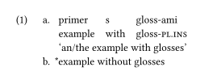

# Typeset linguistic examples with the Simplest Syntax possible

This is a [Typst](https://github.com/typst/typst) package that provides linguistic examples and interlinear glossing.

See it on [Typst Universe](https://typst.app/universe/package/eggs).

## Usage

Below is an example of how to typeset an example.

```typst
#import "@preview/eggs:0.9.0": *
#import abbreviations: pl, ins
#show: eggs

#example[
  + - primer  s    gloss-ami
    - example with gloss-#pl.#ins
    'an/the example with glosses' #ex-label(<gl>)
  + \*example without glosses
  #ex-label(<pex>)
]
```



### Basics

Start with applying the global show rule: `#show: eggs`.

The central function is `example`, which typesets an example. Inside it, enumerated lists (`+`) are treated as subexamples, and bullet lists (`-`) as interlinear gloss lines.

This automatic conversion can be toggled off by passing `auto-subexamples: false` and `auto-glosses: false` to `example`. Then, use `subexample` and `gloss` to explicitly typeset subexamples and glosses.


```typst
#example(auto-subexamples: false, auto-glosses: false)[
  + This is a proper numbered item
  - And this is a proper bullet item
  #subexample[But this is a subexample]
  #gloss[i gloss-y][and gloss-#pl]
]
```

### Numbering

Examples are numbered following [a counter](https://typst.app/docs/reference/introspection/counter/) `counter("eggsample")`. Individual exceptions to the numbering can be made by passing `number: ` to `example` or `subexample`.

### Labels and refs

Examples (and subexamples) can be labeled by putting `ex-label(<label-name>)` somewhere inside them or passing a `label: <label-name>` argument. Automatic codly-style labels are added to subexamples, too.

References are clever, bracketed and with support for two-example references via supplements. `ex-ref` is even more powerful.

```typst
@gl[@pex:b] // (1a-b)
#ex-ref(<gl>, <pex:b>) // same
#ex-ref(left: "e.g. ", <pex>, right: " etc.") // (e.g. 1 etc.)
#ex-ref(1) // (2) --- relative numbering like expex's nextx
```

### Judges

Common judges are recognized automatically at the beginning of an example or a gloss word, and are typeset without taking space. `judge()` does it automatically.

### Abbreviations

The `abbreviations` submodule provides `leipzig`-style abbreviation commands. They are kept track of and can be printed with `print-abbreviations`.

### Trailing citations

The function `trailing` aligns the content on the right. Use it to add sources to your examples.

### Customization

Customization is done via the global show rule: `#show eggs.with(...)`.

## HTML

Eggs' fully custom richly inline-styled HTML output looks almost as good as the PDF one. [Check it out](https://html-preview.github.io/?url=https://github.com/retroflexivity/typst-eggs/blob/0.9.0/assets/example.html).

## More stuff

See [documentation.pdf](documentation.pdf) for more info.

<!-- exclude -->
## Installing locally
On Linux, run `just` in the directory to install the package to ~/.local/typst/packages/local.

## Contributing

Please submit an issue for any bug you find and any suggestion you have.

Contributions are much welcome, too.

TODO:
- Smarter gloss line styling;
- Figure out how to modify spacing between examples specifically.

## License

MIT License.

## Special thanks

- [JJ](https://github.com/omentic) for various improvements.
- [PgBiel](https://github.com/PgBiel) for creating elembic.
- [Greg Shuflin](https://github.com/neunenak) and contributors for creating the original leipzig-glossing.
