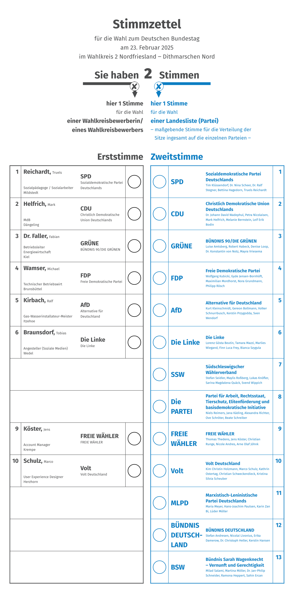

# German Ballot Paper



## Code Example

```typst
#import "@preview/ballot-paper-de:0.1.0": ballot-paper

#show: ballot-paper(
  type: "zum Deutschen Bundestag",                             // Type of election 
  date: datetime(year: 2025, month: 2, day: 23),               // Date of election
  constituency: "2 Nordfriesland \u{2012} Dithmarschen Nord",  // Constituency of the Ballot Paper
  parties: (                                                   // Party list on the Ballot Paper
    (
      name: "Partei der Parteien Deutschlands",                // Party full name
      abbrevation: "PDPD",                                     // Party abbrevation
      top_candidate: (                                         // (First Vote) Party top candidate
        first_name: "Max",                                     // (First Vote) First Name of the top candidate
        last_name: "Mustermann",                               // (First Vote) Last Name of the top candidate
        profession: "Musterarbeiter",                          // (First Vote) Profession of the top candidate
        place: "Musterstadt"                                   // (First Vote) Work place of the top candidate
      ),
      candidates: (                                            // (Second Vote) Candidates of the party
        "Max Mustermann", "Erika Musterfrau"
      )
    ),
    (
      name: "Die Neue Union der Parteien",
      abbrevation: "NUP",
      top_candidate: none,                                     // `none` if the party has no top candidate in this constituency
      candidates: (
        "Max Mustermann", "Erika Musterfrau"
      )
    ),
    (
      name: "Unabhängig für Deutschland",
      abbrevation: "",
      top_candidate: (
        first_name: "Erika",
        last_name: "Musterfrau",
        profession: "Musterberuf",
        place: "Musterort"
      ),
      candidates: none                                         // `none` if the candidate has no party (independent or association)
    )
  )
)
```

## Dependencies

- typst 0.12.0
- datify 0.1.3 (a Typst package for improved date formatting)

## License

This template is licensed according to the MIT license (see `LICENSE`)
