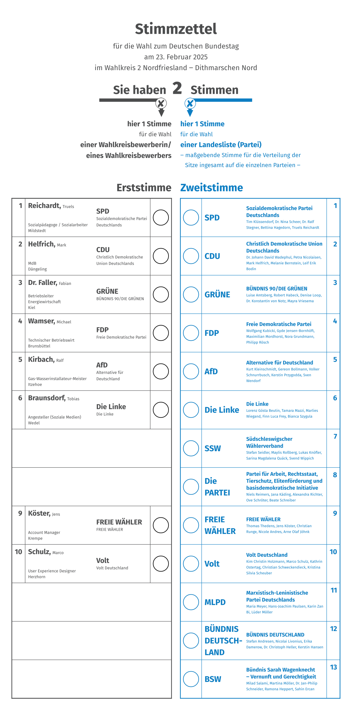
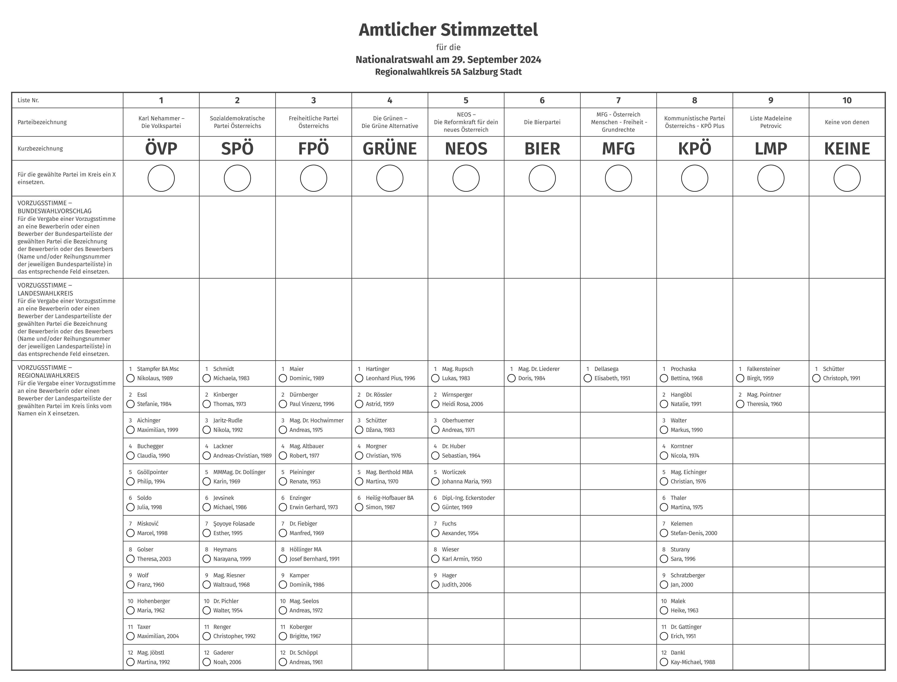

# Electify




## Code Example

### Germany

```typst
#import "@preview/electify:0.2.0": ballot-paper-de

#show: ballot-paper-de(
  type: "zum Deutschen Bundestag",                             // Type of election 
  date: datetime(year: 2025, month: 2, day: 23),               // Date of election
  constituency: "2 Nordfriesland \u{2012} Dithmarschen Nord",  // Constituency of the Ballot Paper
  parties: (                                                   // Party list on the Ballot Paper
    (
      name: "Partei der Parteien Deutschlands",                // Party full name
      abbrevation: "PDPD",                                     // Party abbrevation
      top_candidate: (                                         // (First Vote) Party top candidate
        first_name: "Max",                                     // (First Vote) First Name of the top candidate
        last_name: "Mustermann",                               // (First Vote) Last Name of the top candidate
        profession: "Musterarbeiter",                          // (First Vote) Profession of the top candidate
        place: "Musterstadt"                                   // (First Vote) Work place of the top candidate
      ),
      candidates: (                                            // (Second Vote) Candidates of the party
        "Max Mustermann", "Erika Musterfrau"
      )
    ),
    (
      name: "Die Neue Union der Parteien",
      abbrevation: "NUP",
      top_candidate: none,                                     // `none` if the party has no top candidate in this constituency
      candidates: (
        "Max Mustermann", "Erika Musterfrau"
      )
    ),
    (
      name: "Unabhängig für Deutschland",
      abbrevation: "",
      top_candidate: (
        first_name: "Erika",
        last_name: "Musterfrau",
        profession: "Musterberuf",
        place: "Musterort"
      ),
      candidates: none                                         // `none` if the candidate has no party (independent or association)
    )
  )
)
```

### Austria

```typst
#import "@preview/electify:0.2.0": ballot-paper-at

#show: ballot-paper-at(
  type: "Nationalratswahl",                                    // Type of election
  date: datetime(year: 2024, month: 9, day: 29),               // Date of election
  constituency: "5A Salzburg Stadt",                           // Constituency of the Ballot Paper
  candidates-count: 12,                                        // Number of maximum candidates per party (12 default)
  parties: (
    (
      name: "Karl Nehammer –\nDie Volkspartei",                // Party full name
      abbrevation: "ÖVP",                                      // Party abbrevation
      candidates: (
        ( "Stampfer BA Msc", "Nikolaus",   1989 ),             // (Last Name, First Name, Year of Birth)
        ( "Essl",            "Stefanie",   1984 ), 
        ( "Aichinger",       "Maximilian", 1999 ), 
        ( "Buchegger",       "Claudia",    1990 ), 
        ( "Gsöllpointer",    "Philip",     1994 ), 
        ( "Soldo",           "Julia",      1998 ), 
        ( "Misković",        "Marcel",     1998 ), 
        ( "Golser",          "Theresa",    2003 ), 
        ( "Wolf",            "Franz",      1960 ), 
        ( "Hohenberger",     "Maria",      1962 ), 
        ( "Taxer",           "Maximilian", 2004 ), 
        ( "Mag. Jöbstl",     "Martina",    1992 ), 
      )
    ),
    (
      name: "Sozialdemokratische Partei Österreichs",
      abbrevation: "SPÖ",
      candidates: (
        ( "Schmidt",              "Michaela",          1983 ), 
        ( "Kinberger",            "Thomas",            1973 ), 
        ( "Jaritz-Rudle",         "Nikola",            1992 ), 
        ( "Lackner",              "Andreas-Christian", 1989 ), 
        ( "MMMag. Dr. Dollinger", "Karin",             1969 ), 
        ( "Jevsinek",             "Michael",           1986 ), 
        ( "Şoyoye Folasade",      "Esther",            1995 ), 
        ( "Heymans",              "Narayana",          1999 ), 
        ( "Mag. Riesner",         "Waltraud",          1968 ), 
        ( "Dr. Pichler",          "Walter",            1954 ), 
        ( "Renger",               "Christopher",       1992 ), 
        ( "Gaderer",              "Noah",              2006 ), 
      )
    ),
    (
      name: "Freiheitliche Partei Österreichs",
      abbrevation: "FPÖ",
      candidates: (
        ( "Maier",               "Dominic",        1989 ), 
        ( "Dürnberger",          "Paul Vinzenz",   1996 ), 
        ( "Mag. Dr. Hochwimmer", "Andreas",        1975 ), 
        ( "Mag. Altbauer",       "Robert",         1977 ), 
        ( "Pleininger",          "Renate",         1953 ), 
        ( "Enzinger",            "Erwin Gerhard",  1973 ), 
        ( "Dr. Fiebiger",        "Manfred",        1969 ), 
        ( "Höllinger MA",        "Josef Bernhard", 1991 ), 
        ( "Kamper",              "Dominik",        1986 ), 
        ( "Mag. Seelos",         "Andreas",        1972 ), 
        ( "Koberger",            "Brigitte",       1967 ), 
        ( "Dr. Schöppl",         "Andreas",        1961 ), 
      )
    ),
    (
      name: "Die Grünen –\nDie Grüne Alternative",
      abbrevation: "GRÜNE",
      candidates: (
        ( "Hartinger",          "Leonhard Pius", 1996 ), 
        ( "Dr. Rössler",        "Astrid",        1959 ), 
        ( "Schütter",           "Džana",         1983 ), 
        ( "Morgner",            "Christian",     1976 ), 
        ( "Mag. Berthold MBA",  "Martina",       1970 ), 
        ( "Heilig-Hofbauer BA", "Simon",         1987 ), 
      )
    ),
    (
      name: "NEOS –\nDie Reformkraft für dein neues Österreich",
      abbrevation: "NEOS",
      candidates: (
        ( "Mag. Rupsch",            "Lukas",         1983 ), 
        ( "Wirnsperger",            "Heidi Rosa",    2006 ), 
        ( "Oberhuemer",             "Andreas",       1971 ), 
        ( "Dr. Huber",              "Sebastian",     1964 ), 
        ( "Worliczek",              "Johanna Maria", 1993 ), 
        ( "Dipl.-Ing. Eckerstoder", "Günter",        1969 ), 
        ( "Fuchs",                  "Aexander",      1954 ), 
        ( "Wieser",                 "Karl Armin",    1950 ), 
        ( "Hager",                  "Judith",        2006 ), 
      )
    ),
    (
      name: "Die Bierpartei",
      abbrevation: "BIER",
      candidates: (
        ( "Mag. Dr. Liederer", "Doris", 1984 ), 
      )
    ),
    (
      name: "MFG - Österreich\nMenschen - Freiheit - Grundrechte",
      abbrevation: "MFG",
      candidates: (
        ( "Dellasega", "Elisabeth", 1951 ), 
      )
    ),
    (
      name: "Kommunistische Partei Österreichs - KPÖ Plus",
      abbrevation: "KPÖ",
      candidates: (
        ( "Prochaska",      "Bettina",      1968 ), 
        ( "Hangöbl",        "Natalie",      1991 ), 
        ( "Walter",         "Markus",       1990 ), 
        ( "Korntner",       "Nicola",       1974 ), 
        ( "Mag. Eichinger", "Christian",    1976 ), 
        ( "Thaler",         "Martina",      1975 ), 
        ( "Kelemen",        "Stefan-Denis", 2000 ), 
        ( "Sturany",        "Sara",         1996 ), 
        ( "Schratzberger",  "Jan",          2000 ), 
        ( "Malek",          "Heike",        1963 ), 
        ( "Dr. Gattinger",  "Erich",        1951 ), 
        ( "Dankl",          "Kay-Michael",  1988 ), 
      )
    ),
    (
      name: "Liste Madeleine Petrovic",
      abbrevation: "LMP",
      candidates: (
        ( "Falkensteiner", "Birgit",   1959 ), 
        ( "Mag. Pointner", "Theresia", 1960 ),
      )
    ),
    (
      name: "Keine von denen",
      abbrevation: "KEINE",
      candidates: (
        ( "Schütter", "Christoph", 1991 ), 
      )
    ),
  )
)
```

## Dependencies

- typst 0.14.2 
- datify 0.1.3 (a Typst package for improved date formatting)

## License

This template is licensed according to the MIT license (see `LICENSE`)
