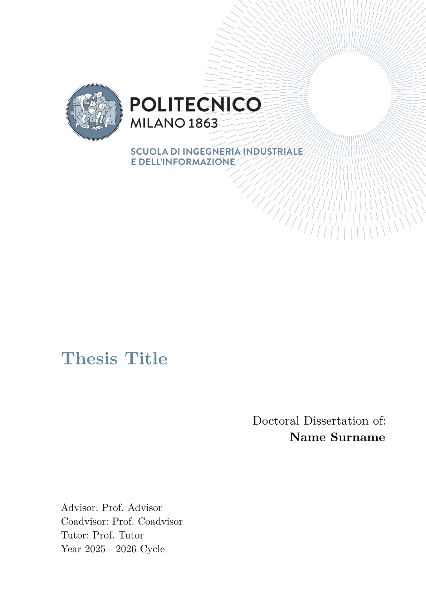

# elegant-polimi-thesis 🎓

Elegant and simple thesis template for [Typst](https://typst.app/), a modern typesetting program alternative to LaTeX. I based the design of the document on the following two templates:

- [PhD Thesis Template](https://www.overleaf.com/latex/templates/phd-thesis-template/nwjkggvhrzmz)
- [DEIB PhD Thesis Template](https://www.overleaf.com/latex/templates/politecnico-di-milano-deib-phd-thesis-template/ydsvtyzwxfdk)

They are rather similar. The main difference is the PoliBlu colour spread across the headings. I recommend to check them out.

> [!NOTE]
> See the [manual](https://victuarvi.github.io/PoliMi-PhD-Thesis/docs/manual.pdf) for more informations.

## Preview ✨

<p align="center">
  
</p>

## Usage 🖋

Compile with:

```shell
typst c main.typ --pdf-standard a-3b
```

A very simple document:

```typ
#import "@preview/elegant-polimi-thesis:0.1.0": *

#show: polimi_thesis.with(
  title: "Thesis Title",
  author: "Vittorio Robecchi",
  advisor: "Prof. Donatella Sciuto",
  coadvisor: "Prof. Antonio Capone",
  tutor: "Prof. Marco Bramanti",
  colored-headings: true
)

#show: frontmatter

// abstract in English

// sommario in Italian

#show: acknowledgements

// acknowledgements

#toc
#list_of_figures
#list_of_tables

#let nomenclature_ = (
  "key" : "value"
)
#nomenclature(
  nomenclature_,
  indented: true
)

#show: mainmatter

// main section of the thesis

#show: backmatter

// backmatter

#show: appendix

// appendix

#show: backmatter

// bibliography

#show: acknowledgements

// acknowlegments
```

The full list of options is as follows:

- `title`: title of the thesis
- `author`: name and surname of the author
- `advisor`: name and surname of the advisor
- `coadvisor`: name and surname of the coadvisor (can be empty)
- `tutor`: name and surname of the tutor
- `phdcycle`: PhD cycle of the thesis (defaults to current year)
- `language`: language of the thesis
- `colored-headings`: whether to use colored headings or not
- `main-logo`: main logo of the thesis

See the `docs/` folder for a thorough example on how to style the thesis.

# Contributing 🚀

If you happen to have suggestions, ideas or anything else feel free to open issues and pull requests.
