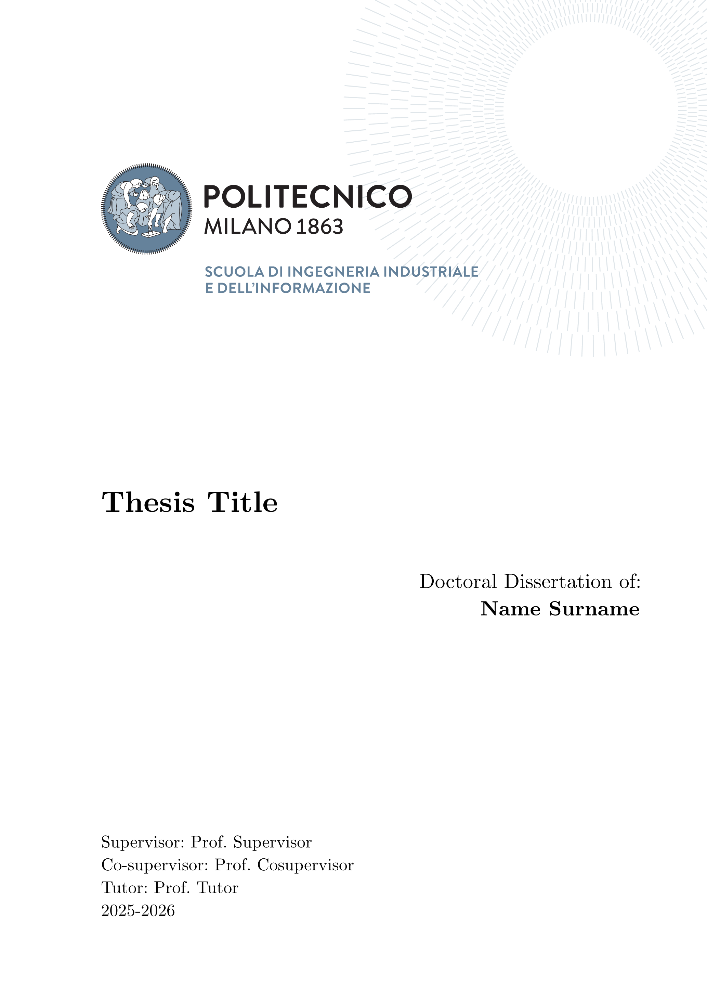
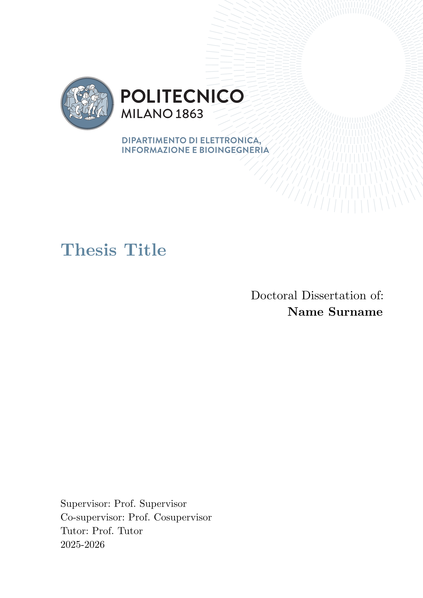
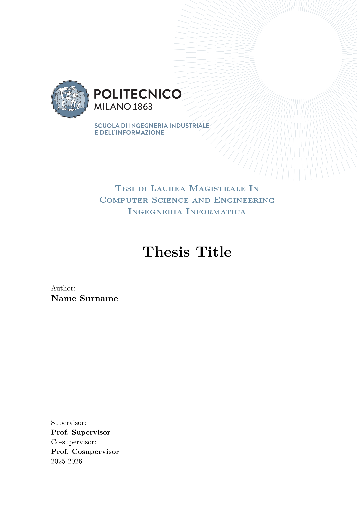
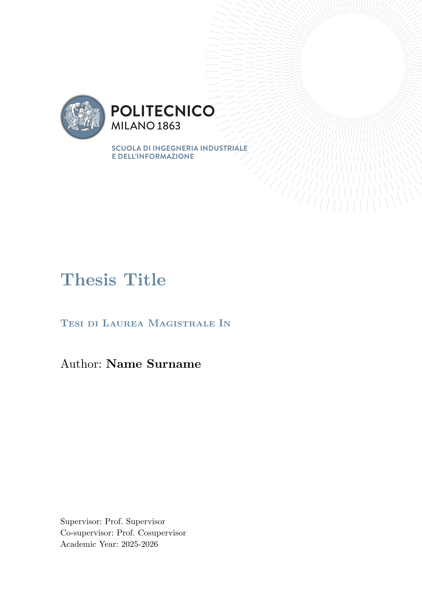
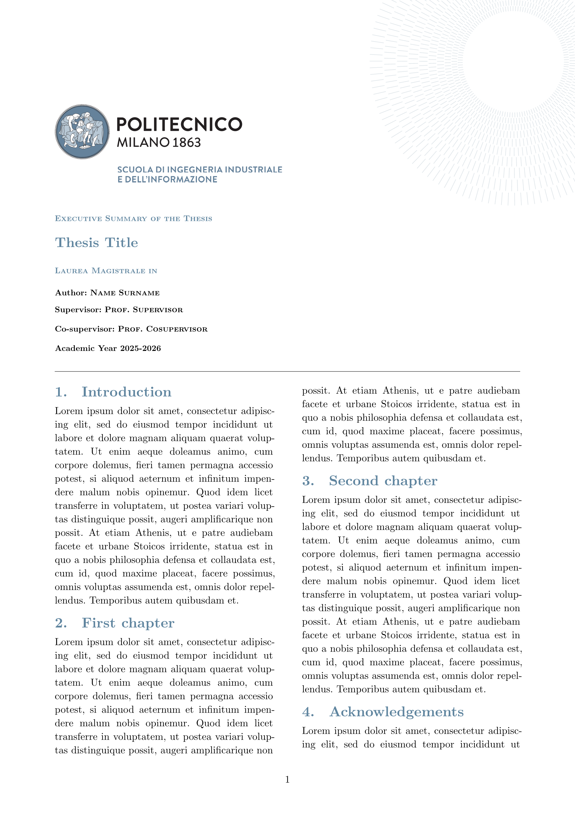
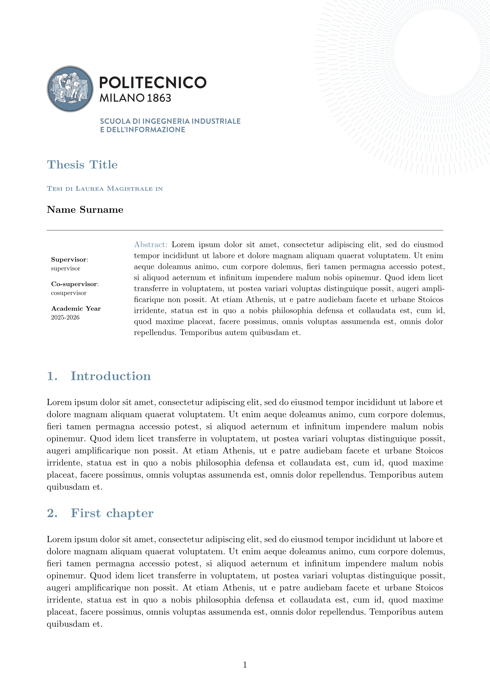
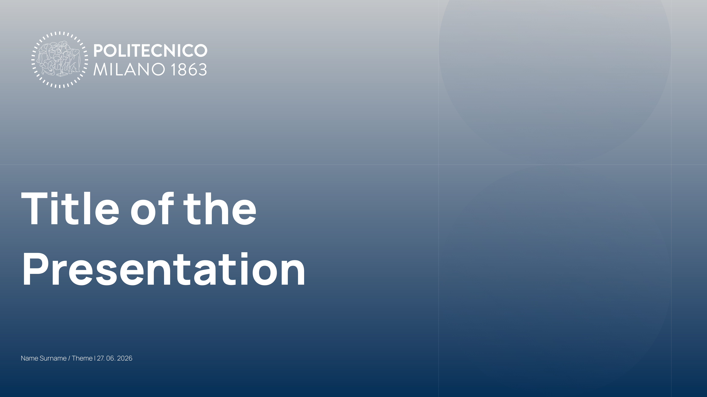

# elegant-polimi-thesis 🎓


[](https://github.com/VictuarVi/PoliMi-PhD-Thesis)

[](https://github.com/VictuarVi/PoliMi-PhD-Thesis/blob/v0.2.1/docs/docs.pdf?raw=true)

[Typst](https://typst.app/) theses and summaries templates for the [Polytechnic University of Milan](https://www.polimi.it/). The package supports all the templates that can be found on [this page](https://www.overleaf.com/latex/templates/tagged/polimi).

It also supports the presentation. It is loosely based on the templates that can be found [here](https://drive.google.com/drive/folders/1PJUOglX63IjCMPYhZXAoPIVuH_-DmsPR) while also taking into account the [Digital Brand Manual](https://www.polimi.it/en/the-politecnico/communication/brand-identity-manual).

See the [examples](https://github.com/VictuarVi/PoliMi-PhD-Thesis/tree/v0.2.1/examples) directory and [documentation](https://github.com/VictuarVi/PoliMi-PhD-Thesis/blob/v0.2.1/docs/docs.pdf?raw=true) for more information.

## Preview ✨

<table width=100% align="center">
  <tr>
    <td>
      
      <br />
      <div align="center"><em>PhD</em></div>
    </td>
    <td>
      
      <br />
      <div align="center"><em>DEIB PhD</em></div>
    </td>
  </tr>
  <tr>
    <td>
      
      <br>
      <div align="center"><em>Computer Science and Engineering</em></div>
    </td>
    <td>
      
      <br>
      <div align="center"><em>Classical Master</em></div>
    </td>
  </tr>
  <tr>
    <td>
      
      <br>
      <div align="center"><em>Executive Summary</em></div>
    </td>
    <td>
      
      <br>
      <div align="center"><em>Article Format</em></div>
    </td>
  <tr>
  <tr>
    <td colspan=2>
      <p align="center">
        
      </p>
      <div align="center"><em>Title page of presentation</em></div>
    </td>
  <tr>
</table>

## Usage 🖋

You can either use this template in the webapp by clicking on "Create project in webapp" or, from the CLI, run:

```shell
typst init @preview/elegant-polimi-thesis:0.2.1
```

I'd also recommend to export with the `a-3u` PDF standard flag ([see more](https://typst.app/docs/reference/pdf/#pdf-standards)).

To get started:

```typ
#import "@preview/elegant-polimi-thesis:0.2.1": *

#show: polimi-thesis.with(
  title: "Thesis Title",
  author: "Vittorio Robecchi",
  supervisor: "Prof. Donatella Sciuto",
  cosupervisor: "Prof. Antonio Capone",
  tutor: "Prof. Marco Bramanti",
  academic-year: [2026 --- 2027],
  frontispiece: "phd",
)

#show: frontmatter

// abstract in English

// sommario in Italian

#show: acknowledgements

// acknowledgements

#toc
#list-of-figures
#list-of-tables

#let _nomenclature = (
  "key" : "value"
)
#nomenclature(
  _nomenclature,
  indented: true
)

#show: mainmatter

// main section of the thesis

#show: backmatter

// backmatter

#show: appendix

// appendix

#show: backmatter

// bibliography

#show: acknowledgements

// acknowledgements
```

Depending on the **thesis template** you need change the `frontispiece` argument accordingly:

- `phd` for "PhD Thesis Template"
- `deib-phd` for "DEIB PhD Thesis"
- `classical-master` for "Classical Format Thesis"
- `cs-eng-master` for "Computer Science and Engineering"

The template also offers the Executive Summary and the Article Format; in order to use them show the respective functions:

```typ
#import "@preview/elegant-polimi-thesis:0.2.1": *

// For the article format
#show: polimi-article-format.with(
  title: "Thesis Title",
  author: "Vittorio Robecchi",
  supervisor: "Prof. Donatella Sciuto",
  cosupervisor: "Prof. Antonio Capone",
  academic-year: [2026 --- 2027],
  abstract: include "../sections/abstract.typ"
)

// For the executive summary
#show: polimi-executive-summary.with(
  title: "Thesis Title",
  author: "Vittorio Robecchi",
  supervisor: "Prof. Donatella Sciuto",
  cosupervisor: "Prof. Antonio Capone",
  academic-year: [2026 --- 2027],
)
```

The templates are **three distinct documents**, however they share _most_ of the arguments:

- `title`: title of the document
- `author`: name and surname of the author
- `supervisor`: name and surname of the supervisor
- `cosupervisor`: name and surname of the cosupervisor(s) (can be empty)
- `course`: the course you are graduating in
- `academic-year`: the corresponding academic year
- `custom-logo`: logo of the thesis (the logos provided by the template are distributed with NC-BY 4.0 license)

I recommend to import all the library anyway in order to access all the functions (`*matter`, theorems-related among others).

The following are exclusive to `polimi-thesis`:

- `tutor`: name and surname of the tutor
- `cycle`: the cycle of the thesis
- `chair`: the chair of the thesis
- `student-id`: your student ID
- `frontispiece`: the specific type of frontispiece to be used (default: `phd`; supported: `deib-phd`, `cs-eng-master`, `classical-master`)

Depending on the selected frontispiece, not all these attributes may be needed.

The following are exclusive to `polimi-article-format-thesis`:

- `abstract`: the abstract
- `keywords`: keywords (that will also appear in the document metadata)

### Presentation

In regards to the presentation, **you'll have to download on your own** the [Manrope](https://fonts.google.com/specimen/Manrope) font.

Built on [Touying](https://typst.app/universe/package/touying/), the structure is quite standard:

```typ
#import "@preview/elegant-polimi-thesis:0.2.1": *

#show: polimi-digital-presentation.with(
  config-info(
    title: "Title of the Presentation",
    author: "Name Surname",
    subtitle: "Subtitle",
    theme: "Theme",
    date: datetime.today(),
  ),
  ..args
)

#title-slide()

#make-outline()

= First Section

== Slide in first section

#lorem(50)

#lorem(40)

== Split slide

#split-slide(
  left: [
    #lorem(30)

    #lorem(30)
  ],
  right: [
    === Paragraph title
    #lorem(120)

    === Paragraph title
    #lorem(120)
  ],
)

= Second Section

== Slide in second section

#lorem(20)

#lorem(20)

#lorem(20)

#focus-slide[Thanks for listening]
```

Do note `..args` are all valid Touying arguments, as can be seen in all Touying-based presentation templates.

## Recommended packages

Useful packages for a thesis include:

- [equate](https://typst.app/universe/package/equate), [physica](https://typst.app/universe/package/physica) for mathematical expressions
- [unify](https://typst.app/universe/package/unify), [zero](https://typst.app/universe/package/zero) to correctly format numbers
- [cetz](https://typst.app/universe/package/cetz), [fletcher](https://typst.app/universe/package/fletcher) for drawing diagrams, [lilaq](https://typst.app/universe/package/lilaq) to plot data
- [zebraw](https://typst.app/universe/package/zebraw), [codly](https://typst.app/universe/package/codly) for syntax highlighting in code blocks
- [frame-it](https://typst.app/universe/package/frame-it), [showybox](https://typst.app/universe/package/showybox) to display formatted blocks
- [meander](https://typst.app/universe/package/meander/) to wrap text around images and such

The [smartaref](https://typst.app/universe/package/smartaref) and [hallon](https://typst.app/universe/package/hallon) packages have been integrated to provide subfigures ([currently unsupported](https://github.com/typst/typst/issues/246)), while [great-theorems](https://typst.app/universe/package/great-theorems) and [headcount](https://typst.app/universe/package/headcount) to handle theorems implementations.

|                      Typst package                      |             LaTeX equivalent              |
| :-----------------------------------------------------: | :---------------------------------------: |
|   [equate](https://typst.app/universe/package/equate)   |             ams\*, mathtools              |
|  [phisica](https://typst.app/universe/package/physica)  |             ams\*, mathtools              |
|    [unify](https://typst.app/universe/package/unify)    |  [siunitx](https://ctan.org/pkg/siunitx)  |
|     [zero](https://typst.app/universe/package/zero)     |  [siunitx](https://ctan.org/pkg/siunitx)  |
|     [cetz](https://typst.app/universe/package/cetz)     |         [TikZ](https://tikz.dev/)         |
| [fletcher](https://typst.app/universe/package/fletcher) |         [TikZ](https://tikz.dev/)         |
|    [lilaq](https://typst.app/universe/package/lilaq)    |         [TikZ](https://tikz.dev/)         |
|   [zebraw](https://typst.app/universe/package/zebraw)   | [listings](https://ctan.org/pkg/listings) |
|    [codly](https://typst.app/universe/package/codly)    | [listings](https://ctan.org/pkg/listings) |
| [frame-it](https://typst.app/universe/package/frame-it) | [mdframed](https://ctan.org/pkg/mdframed) |
| [showybox](https://typst.app/universe/package/showybox) | [mdframed](https://ctan.org/pkg/mdframed) |
| [lovelace](https://typst.app/universe/package/lovelace) |   [pseudo](https://ctan.org/pkg/pseudo)   |
|     [algo](https://typst.app/universe/package/algo)     |   [pseudo](https://ctan.org/pkg/pseudo)   |
| [meander](https://typst.app/universe/package/meander/)  |  [wrapfig](https://ctan.org/pkg/wrapfig)  |

The complete list of packages can be found on the [Typst Universe](https://typst.app/universe/search/?kind=packages).

## Contributing 🚀

If you happen to have suggestions, ideas or anything else feel free to open issues and pull requests or contact me.
