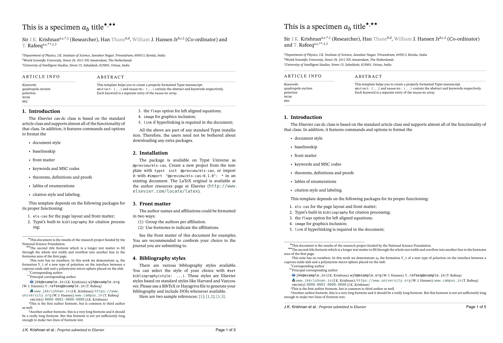

# elsevier-cas-unofficial

A Typst port of Elsevier's CAS LaTeX classes, `cas-sc.cls` (single column) and `cas-dc.cls` (double column), version 2.4. It is not affiliated with or endorsed by Elsevier. It reproduces the page geometry, front matter, first-page notes, running heads and body styles of the LaTeX output. The design takes cues from [`elsearticle`](https://github.com/maucejo/elsearticle), the Typst port of `elsarticle.cls`.



## Usage

```typ
#import "@preview/elsevier-cas-unofficial:0.1.0": *

#show: article.with(
  layout: "dc", // "dc" = cas-dc (double column), "sc" = cas-sc (single column)
  title: [Title of the article],
  short-title: [Running head],
  authors: (
    (name: "Ada Lovelace", affiliations: 1, corresponding: true, email: "ada@example.org"),
    (name: "Charles Babbage", affiliations: (1, 2), orcid: "0000-0002-0000-0000"),
  ),
  affiliations: (
    "1": (organization: [Analytical Engine Laboratory], city: [London], country: [UK]),
    "2": [University of Cambridge, Cambridge, UK],
  ),
  abstract: [...],
  keywords: ([engines], [computation]),
)

= Introduction
...
#bibliography("refs.bib")
```

`typst init @preview/elsevier-cas-unofficial` starts a new project from [`template/main.typ`](template/main.typ), a short skeleton with placeholders and comments. [`examples/sample.typ`](examples/sample.typ) is a port of Elsevier's `cas-dc-sample.tex` that uses every feature. Change `layout: "dc"` to `"sc"` in either file to get the single-column version.

Until the package is on Typst Universe, install it locally. Clone this repository to `~/.local/share/typst/packages/local/elsevier-cas-unofficial/0.1.0` on Linux, or `~/Library/Application Support/typst/packages/local/elsevier-cas-unofficial/0.1.0` on macOS, then import `@local/elsevier-cas-unofficial:0.1.0`.

## Options of `article`

| Option | Default | Description |
| --- | --- | --- |
| `layout` | `"dc"` | `"dc"`: 210×280 mm, two columns. `"sc"`: 192×262 mm, one column. |
| `title` | `none` | Article title. |
| `alt-title`, `subtitle`, `trans-title`, `trans-subtitle` | `none` | The other `\title[mode=...]` variants. |
| `short-title` | `auto` | Running head from page 2 on; defaults to `title`. |
| `short-authors` | `auto` | Author part of the footer; defaults to "A. Author et al.". |
| `authors` | `()` | Array of author dictionaries (see below). |
| `affiliations` | `(:)` | Dictionary from id to content or to a structured address (see below). |
| `title-notes` | `()` | Notes attached to the title, marked ⋆, ⋆⋆, … |
| `corresponding-notes` | `auto` | Texts for the marks ∗, ∗∗, …; defaults to "Corresponding author". |
| `author-notes` | `()` | Numbered author footnotes 1, 2, …; referenced by an author's `footnotes`. |
| `nonum-notes` | `()` | First-page notes without a mark. |
| `abstract`, `abstract-title` | `none`, `[Abstract]` | Abstract and its heading. |
| `keywords`, `keywords-title` | `()`, `[Keywords]` | Keywords, one per line in the "Article info" box. |
| `msc`, `jel`, `pacs` | `none` | Classification codes, also shown in the "Article info" box. `msc` accepts `(year: 2020, codes: [...])`. |
| `graphical-abstract` | `none` | Content of a graphical-abstract page placed before the article. |
| `highlights` | `()` | Research highlights, printed on their own page before the article. |
| `journal` | `[Elsevier]` | Footer text: "Preprint submitted to *journal*". |
| `blind` | `false` | Double-blind review: hides authors, affiliations, author notes, CRediT roles and biographies. |
| `review` | `false` | Double line spacing. |
| `long-title` | `false` | Allows front matter longer than one page (`longmktitle`). Without it, a double-column front matter that does not fit on the first page is an error. In the double-column layout the body then starts below it, set in a `columns` container: `#pagebreak()` is turned into column breaks, and `#set page(...)` or `#page(...)` cannot be used in the body. |
| `logos` | `true` | Icons in front of emails, URLs and social links; `false` writes "Email address:", "URL:" and so on instead. |
| `fleqn` | `true` | Display equations aligned left and indented. |
| `line-numbers` | `false` | Line numbers restarting on each page. |
| `paper` | `auto` | Paper size; `auto` uses the CAS trim size of `layout`. |
| `fonts` | `(:)` | Overrides of `serif`, `sans`, `mono` and `math`. |
| `lang` | `"en"` | Document language. |

### Authors

Each author is a dictionary. Only `name` is required.

| Key | Description |
| --- | --- |
| `name` | A string is split at the last space into given names (printed grey, as in CAS) and surname. `(given: "William", family: "J. Hansen")` sets the split explicitly. |
| `style` | `"chinese"`: surname first, split at the first space. |
| `affiliations` | One id or an array of ids from `affiliations`, printed as letters a, b, … An id missing from `affiliations` is an error, except a number `n`, which is printed as the `n`-th letter, as in LaTeX. |
| `corresponding` | `true` or `n`: corresponding-author mark with `n` asterisks. The mark refers to the `n`-th entry of `corresponding-notes`; it is an error if there is no such entry. |
| `footnotes` | Number or array of numbers of `author-notes`. |
| `email`, `url`, `orcid` | Strings or arrays of strings. They are collected into first-page notes. |
| `twitter`, `facebook`, `linkedin`, `gplus` | Account names or full URLs. |
| `credit` | CRediT contribution roles, printed by `print-credits()`. |
| `prefix`, `suffix`, `degree`, `role` | For example `[Sir]`, `[Jr]`, `[PhD]`, `[Researcher]`. |
| `deceased` | Adds the ✠ mark and a "Deceased author." note. |

### Affiliations

An affiliation is either plain content or a dictionary like the keys of `\affiliation`. The entries are printed in the given order, each followed by a comma. The exceptions are `country` and the last entry, which get no separator. Add `<key>sep` to change the separator after an entry:

```typ
"2": (organization: [World Scientific University], addressline: [Street 29],
      postcode: [1011 NX], postcodesep: none, city: [Amsterdam], country: [The Netherlands]),
```

## Other functions

| Function | LaTeX equivalent |
| --- | --- |
| `new-theorem("theorem", [Theorem])` | `\newtheorem{theorem}{Theorem}`: bold heading, italic body. Pass `counter: "theorem"` to share numbering. Theorems can be labelled and referenced. |
| `new-definition("rmk", [Remark])` | `\newdefinition{rmk}{Remark}`: same as a theorem, with an upright body. |
| `new-proof("pf", [Proof])` | `\newproof{pf}{Proof}`: small-caps heading, no number. Use `qed` for the end-of-proof box. |
| `#show: appendix` | `\appendix`: sections are numbered A, B, … |
| `#print-credits()` | `\printcredits` |
| `#bio(image("photo.jpg"))[...]` | `\bio{photo} ... \endbio`. The photo is optional. |
| `toprule`, `midrule`, `bottomrule` | booktabs rules, for use inside `table(...)`. |

The environments defined by `new-theorem` and `new-definition` take an optional title:

```typ
#let theorem = new-theorem("theorem", [Theorem])
#theorem(title: [Fermat])[No three positive integers satisfy ...] <thm:fermat>
```

### Figures and tables

Figures and tables are captioned in a small sans-serif font: "**Figure 1:** …" below the figure, and "**Table 1**" on its own line above the table. Figures stay where they are written, as usual in Typst. Use `placement: auto` to let a figure float, and add `scope: "parent"` for a figure or table spanning both columns (`figure*`, `table*`):

```typ
#figure(image("wide.png"), caption: [...], placement: top, scope: "parent")
```

Tables have no strokes, and rows are spaced as in LaTeX. Draw booktabs rules with `toprule`, `midrule` and `bottomrule`; like booktabs, they leave some space above and below them:

```typ
#figure(caption: [...], table(columns: 3, toprule, [A], [B], [C], midrule, [1], [2], [3], bottomrule))
```

A table caption spans the column. To make it narrower, put the table in a block with a width, the equivalent of `\begin{table}[width=.9\linewidth]` with a `tabular*` of `\tblwidth`:

```typ
#figure(caption: [...], block(width: 90%, table(columns: (1fr, 1fr), [...], [...])))
```

### Bibliography

The default style is `elsevier-harvard` (author–year), the scheme of `cas-model2-names.bst`. For numbered references, pass `#bibliography("refs.bib", style: "elsevier-with-titles")`.

## Fonts

The LaTeX classes use STIX Two for text and math, Computer Modern Sans for the running head, footer and captions, and Inconsolata for code. The template looks for "STIX Two Text", "STIX Two Math" and "New Computer Modern Sans". If they are missing, it falls back to New Computer Modern, Helvetica or Arial, and DejaVu Sans Mono. Typst prints a warning for each font family it cannot find. To pick other fonts:

```typ
#show: article.with(
  fonts: (sans: "Latin Modern Sans", mono: "Inconsolata"),
  // ...other options
)
```

## Differences from the LaTeX classes

- Author groups (`augroup`, `collaboration`) and affiliations printed as footnotes (`\address[..][foot=true]`) are not ported.
- Biography text runs beside the photo; it does not wrap below it.
- First-page notes always sit at the bottom of the first page or column.
- A structured affiliation gets no comma after its last entry. LaTeX prints one unless that entry is `country`.
- Monospace text (code, URLs, email addresses and ORCIDs) is set at 0.8em, the size Typst gives `raw` text. LaTeX sets it at the text size.
- In the double-column layout, a front matter too tall for the first page is an error unless `long-title: true` is set. LaTeX lets it run off the page.

## License

The package is released under three licenses, depending on the file:

- The code in `src/` is under the [MIT license](LICENSE).
- The starter project in `template/`, which `typst init` copies into new projects, is under [MIT-0](https://spdx.org/licenses/MIT-0.html), so you can use and redistribute the files it creates without attribution.
- The icons in `assets/`, and the sample article in `examples/` (text, figures and bibliography), come from or are adapted from Elsevier's CAS LaTeX bundle, distributed under the [LaTeX Project Public License 1.3c](https://www.latex-project.org/lppl/lppl-1-3c/). The `examples/` folder is not part of the downloaded package.
