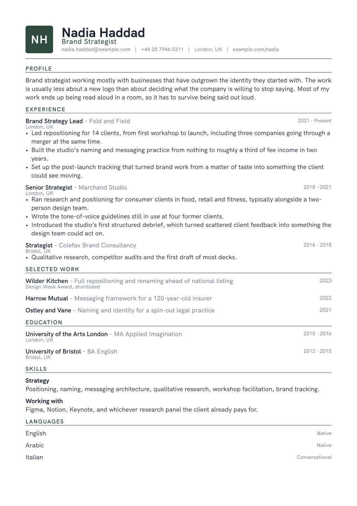

# Emblem CV

Two initials, set white in a filled block, in the top corner. That block does
what a logo does on stationery: it gives the page one dark shape for the eye to
land on, so the header reads as designed, not as a name in bigger type.

Everything under it is a plain single column. The monogram only works while it
is the one thing on the page asking for attention.

The same slot takes a portrait if that suits your field better.

<div align="center">
  
</div>

## Getting started

**In the Typst app**, open
[the package page](https://typst.app/universe/package/emblem-cv) and choose
*Create project in app*.

**On the command line:**

```sh
typst init @preview/emblem-cv:0.1.0 my-cv
typst compile my-cv/main.typ
```

Emblem is set in **HK Grotesk**, which the Typst web app has. Locally you will
need it installed, or set `font` to something else. Only the monogram really
cares which family: two wide letters in a condensed face sit differently in the
block.

## Using it as a package

```typ
#import "@preview/emblem-cv:0.1.0": *

#let accent = "#2f4a3f"

#show: resume.with(
  author: "Nadia Haddad",
  font: "HK Grotesk",
)

#masthead(
  author: "Nadia Haddad",
  profession: "Brand Strategist",
  initials: "NH",
  accent-color: accent,
  contact: [nadia.haddad\@example.com #h(0.6em) | #h(0.6em) London, UK],
)

#cv-section("Experience", accent-color: accent)

#emblem-entry(
  title: "Brand Strategy Lead",
  subtitle: "Fold and Field",
  dates: "2021 - Present",
  location: "London, UK",
)[
  - Something you did, with the number that makes it land.
]
```

The package exports `resume`, `masthead`, `cv-section`, `emblem-entry` and
`emblem-language`.

`emblem-entry` takes `title`, `subtitle`, `dates`, `location` and `meta`, all
optional, followed by the body. Anything you leave out is simply not
drawn. Worth knowing for a selected-work list, where a title, one line of
description and a year is usually the whole entry.

## The monogram

`initials` is the whole feature. Two letters is the intended case; one works,
three starts to crowd the block.

```typ
#masthead(author: "Nadia Haddad", initials: "NH", accent-color: accent)
```

To use a portrait instead, pass `photo` and leave `initials` off. `photo` takes image bytes, not a path. Typst resolves a bare path string
relative to the file holding the `image()` call, which here is inside the
package, so a string would be looked for in the package directory and not
beside your document. `read` sidesteps that:

```typ
#masthead(
  author: "Nadia Haddad",
  photo: read("portrait.jpg", encoding: none),
  photo-size: 46pt,
  photo-radius: 4pt,
)
```

`photo-radius: 50%` gives a circle. With neither `initials` nor `photo`, the
header falls back to the name and contact line alone.

## Customising

| Parameter | Default | Notes |
|---|---|---|
| `accent-color` | `"#2f4a3f"` | The monogram fill and the section labels. Pass it to `masthead` and `cv-section`, as the sample does. |
| `font` | `"HK Grotesk"` | Any installed family. |
| `font-size` | `10.5pt` | The rest of the scale is derived from this. |
| `paper` | `"a4"` | `"us-letter"` also works. |
| `margin` | `1.5cm` | Applied on all four sides. |

## License

The package source is MIT. Everything under `template/`, which is the part you
edit and publish as your own CV, is MIT-0, so nothing has to travel with it.

Maintained by [JobSprout](https://jobsprout.ai), where this design is also
available as a [hosted CV builder](https://jobsprout.ai/resume-templates/emblem).
