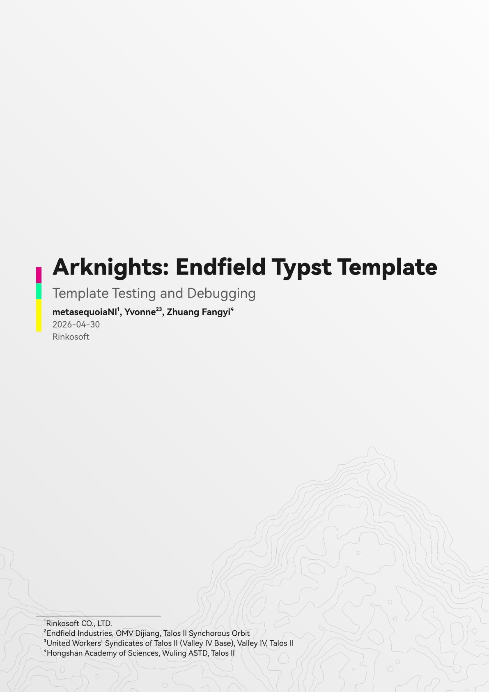
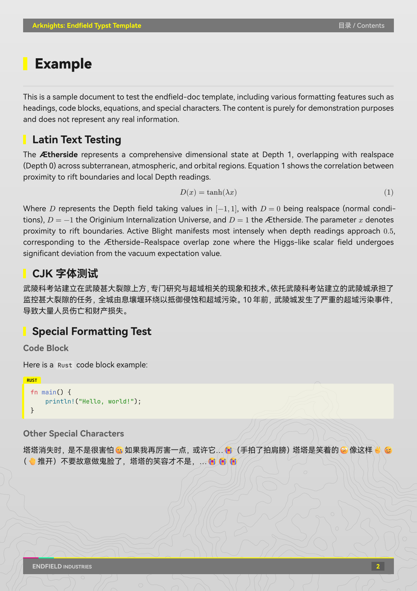

A Typst document template styled after [*Arknights: Endfield*](https://endfield.gryphline.com/en-us#operator) by Hypergryph. Produces flowing A4 documents with a characteristic dark-bar header/footer, tri-color accent stripe, gradient page background, and a styled cover page — without requiring Touying or any presentation framework.

## Preview




## Usage

Initialize a new project from the template:

```raw
typst init @preview/endfield-doc:0.1.1
```

Or import the template directly in an existing file:

```typst
#import "@preview/endfield-doc:0.1.1": endfield-doc

#show: endfield-doc.with(
  title:       [Document Title],
  subtitle:    [Subtitle],
  author:      [Author Name],
  date:        datetime.today().display("[year]-[month]-[day]"),
  institution: [Institution],
  doc-footer:  [Your Organization],
  lang:        "en",
  region:      "us",
)

= Introduction

Your document begins here. Text flows automatically across pages.

== A subsection

Level-2 and level-3 headings are also supported.

=== A third-level heading

Inline `code` and block code are styled automatically.

Math equations work out of the box:

$ E = m c^2 $
```

## Parameters

All parameters of `endfield-doc` are optional and have sensible defaults.

| Parameter | Type | Default | Description |
|---|---|---|---|
| `title` | content | `[Document Title]` | Document title — shown on the cover page and in every page header. |
| `subtitle` | content / `none` | `none` | Subtitle shown below the title on the cover page. |
| `author` | content / `none` | `none` | Author(s) shown on the cover page. Footnotes are supported. |
| `date` | content / `none` | `none` | Date shown on the cover page. |
| `institution` | content / `none` | `none` | Institution shown on the cover page. |
| `paper` | string | `"a4"` | Paper size passed to Typst's `page()`. Any Typst-supported value is accepted (e.g. `"a5"`, `"b5"`, `"us-letter"`). See [Known Limitations](#known-limitations). |
| `doc-footer` | content | `[ENDFIELD INDUSTRIES]` | Text shown on the left side of the footer bar. |
| `lang` | string | `"zh"` | Document language (passed to `set text`). |
| `region` | string | `"cn"` | Document region (passed to `set text`). |
| `font-cjk` | array | `("HarmonyOS Sans SC", "HarmonyOS Sans Italic")` | CJK font fallback list. |
| `font-latin` | array | `("HarmonyOS Sans", "HarmonyOS Sans Italic")` | Latin font fallback list. |
| `font-code` | array | `("JetBrains Mono", "Consolas")` | Monospace font fallback list for code blocks. |
| `font-emoji` | array | `("Segoe UI Emoji", "Noto Emoji")` | Emoji font fallback list. |

## Features

- **Cover page** — gradient background with a contour-map watermark, multi-color accent bar, and title block. No header or footer on the cover.
- **Page header** — dark bar with the document title (yellow, left) and current level-1 section name (light, right).
- **Page footer** — tri-color accent stripe (pink / green / yellow) above a dark bar with custom footer text (left) and the page number in a highlighted box (right).
- **Heading styles** — three styled levels: level-1 triggers a page break and renders with a yellow accent bar and a rule; level-2 uses a smaller bar; level-3 is plain bold in a muted color.
- **Code blocks** — language tab (yellow), left accent stroke, and a tinted background. Inline code uses a semi-transparent pill style.
- **Table of contents** — generated automatically before the body with the title *目录 / Contents*.
- **Emoji routing** — emoji Unicode ranges are always rendered through the emoji font stack to avoid CJK font override.
- **Math** — standard Typst math is unstyled and works normally.

## Known Limitations

- **Page size**: the template is designed and visually tuned for A4. Passing a different `paper` value (e.g. `"a5"`) is supported but margins, font sizes, and spacing are not automatically rescaled. Manual adjustments are recommended for non-A4 sizes.
- **Italic fonts**: due to the font stack configuration, italic text is currently rendered as regular (upright) text. Proper italic support requires either a dedicated italic font file in the stack or a workaround in the show rules, and is not yet implemented.

## License

MIT License. See [LICENSE](LICENSE) for details.

## Acknowledgements

- *Arknights: Endfield* by Hypergryph
- *typst-touying-theme-endfield* by [@leostudiooo](https://github.com/leostudiooo/typst-touying-theme-endfield)